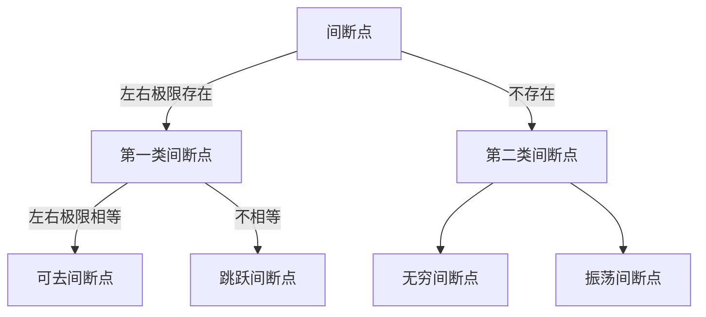

# 函数与极限

- [函数与极限](#函数与极限)
  - [第一节 映射与函数](#第一节-映射与函数)
  - [第二节 数列的极限](#第二节-数列的极限)
  - [第三节 函数的极限](#第三节-函数的极限)
    - [一、函数极限的定义](#一函数极限的定义)
    - [二、函数的性质](#二函数的性质)
  - [第四节 无穷小与无穷大](#第四节-无穷小与无穷大)
  - [第五节 极限运算法则](#第五节-极限运算法则)
  - [第六节 极限存在准则](#第六节-极限存在准则)
  - [第七节 无穷小的比较](#第七节-无穷小的比较)
  - [第八节 函数的连续性与间断点](#第八节-函数的连续性与间断点)
  - [第九节 连续函数的运算与初等函数的连续性](#第九节-连续函数的运算与初等函数的连续性)

函数关系: 变量之间的依赖关系

极限方法: 研究变量的一种基本方法

---
question:

how to get sinθ in a round

what is Dirichlet

定理1用在哪里

---
1.理解函数的概念，掌握函数的表示法，会建立应用问题的函数关系.
2.了解函数的有界性、单调性、周期性和奇偶性.
3.理解复合函数及分段函数的概念，了解反函数及隐函数的概念.
4.掌握基本初等函数的性质及其图形，了解初等函数的概念
5.理解极限的概念，理解函数左极限与右极限的概念以及函数极限存在与左极限、右极限
之间的关系.
6.掌握极限的性质及四则运算法则.
7.掌握极限存在的两个准则，并会利用它们求极限，掌握利用两个重要极限求极限的方法.
8.理解无穷小量、无穷大量的概念，掌握无穷小量的比较方法，会用等价无穷小量求极限.
9.理解函数连续性的概念(含左连续与右连续)，会判别函数间断点的类型.
10.了解连续函数的性质和初等函数的连续性，理解闭区间上连续函数的性质(有界性、最
大值和最小值定理、介值定理)，并会应用这些性质

## 第一节 映射与函数

- 函数的有界性、单调性、周期性和奇偶性.

有界性:

- 初等函数图像

$y = sin^{-1}x$ $y = cos^{-1}x$

$y = tan^{-1}x$ $y = cot^{-1}x$

## 第二节 数列的极限

绝对值不等式:||a|-|b|| ≤ |a±b| ≤ |a|+|b|

**理解极限的概念**:

数列极限的概念:

## 第三节 函数的极限

${\displaystyle \delta \ >0}$

${\displaystyle |x_{n}-x_{0}|<\epsilon }$

### 一、函数极限的定义

函数极限的定义:

- 自变量趋于有限值时函数的极限

理解函数左极限与右极限的概念以及函数极限存在与左极限、右极限之间的关系：

- 自变量趋于无穷大时函数的极限

⭐⭐⭐例7
⭐⭐例5
⭐:例子1234

✨✨*例12

### 二、函数的性质

- 掌握极限的性质<code style="color:#ea4335">未知如何使用</code>

## 第四节 无穷小与无穷大

理解无穷小/大量的概念

定理1 2

✨✨:例2

习题1-4

⭐⭐:1 6 8

## 第五节 极限运算法则

掌握四则运算法则

定理1: 两个无穷小的和是无穷小

定理2: 有界函数与无穷小的乘积是无穷小

推论1: 常数与无穷小的乘积是无穷小
推论2: 有限个无穷小的乘积是无穷小

定理3:

推论12：

定理4（数列）

定理5

定理6

例67解法：

---
⭐⭐ 1-5,10,12,13,14 2-3,4-3,4

⭐:例子2345689 1-11 5

---

## 第六节 极限存在准则

**掌握极限存在的两个准则，并会利用它们求极限:**

---
⭐⭐⭐例子2
⭐⭐例子3
⭐例子14

⭐⭐⭐⭐ 4-5
⭐⭐4-34
⭐1-3,5,6 /4-12

---

1. 准则1

    

    夹逼准则

    

2. 准则2<code style="color:#ea4335">证明看不懂 牛二</code>

    单调有界数列必有极限

    准则II'

    

## 第七节 无穷小的比较

⭐⭐⭐⭐例1 5
⭐⭐⭐例3
⭐⭐

⭐⭐⭐⭐
⭐⭐⭐1 2 4-1 5-2,3,4 6
⭐⭐

掌握无穷小量的比较方法，会用等价无穷小量求极限

无穷小的比较:

一些等价无穷小:

定理12

<code style="color:#ea4335">例1</code>证明看不懂

## 第八节 函数的连续性与间断点

⭐⭐⭐⭐:图1证明

⭐⭐⭐4
⭐⭐例4 ,3,5-1
⭐2

理解函数连续性的概念(含左连续与右连续)，会判别函数间断点的类型.

函数连续:

左连续和右连续:

间断点:

## 第九节 连续函数的运算与初等函数的连续性
