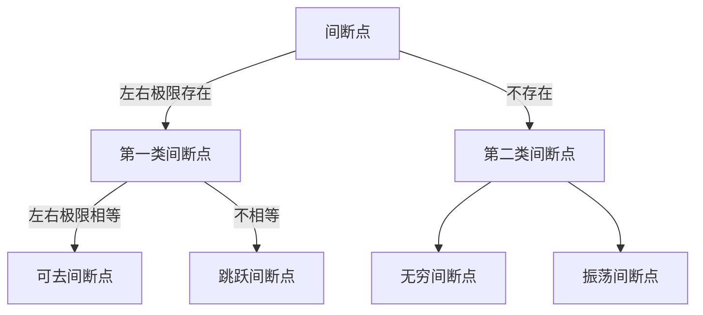

# 第一章

- [第一章](#第一章)
  - [函数](#函数)
    - [题型1](#题型1)
    - [题型2](#题型2)
  - [极限](#极限)
    - [题型1(极限)](#题型1极限)
    - [题型2(求极限)](#题型2求极限)
  - [求极限常见题型](#求极限常见题型)
    - [0/0](#00)
    - ['∞/∞'](#)
    - [∞ - ∞](#---)
    - [0·∞](#0)
    - [1^∞](#1)
    - [∞^0 and 0^0](#0-and-00)
  - [数列的极限](#数列的极限)
    - [不定式](#不定式)
    - [n项和的极限](#n项和的极限)
    - [n项连乘数列极限](#n项连乘数列极限)
    - [递推关系](#递推关系)
  - [题型三 确定极限式中的参数](#题型三-确定极限式中的参数)
  - [题型4 无穷小量阶的比较](#题型4-无穷小量阶的比较)
  - [题型1 讨论连续性及间断点类型](#题型1-讨论连续性及间断点类型)
  - [题型2 介值定理 最值定理和零点定理的证明题](#题型2-介值定理-最值定理和零点定理的证明题)
    - [Review](#review)
    - [习题错题](#习题错题)

⭐

1. 拆项要两项都存在

## 函数

### 题型1

⭐

例子1

例子3 值域是定义域 问题很大!

周期 原函数

### 题型2

⭐

例子1

例子2

例子4 1 方法2 2 方法2 3

## 极限

### 题型1(极限)

⭐

f(x)是奇函数, $\int_{0}^{x}f(t)dt是偶函数$

例子4B

方法2

### 题型2(求极限)

⭐⭐⭐⭐

方法4 g'(x)!=0 是指g'(x)!=0 还是 lim x-> x0 g'(x)!=0;

⭐

方法4 例1 洛必达的使用

方法5 泰勒公式的熟悉使用

方法8 利用单调有界求极限

方法9

∞-∞补充例

## 求极限常见题型

### 0/0

1. 洛必达
2. 等价无穷小代换
3. 泰勒公式

⭐

1. 考虑再用洛必达
2. 分项可拆
3. $\displaystyle a^t b^t = (a b)^t; a^t=(\frac{1}{a})^\frac{1}{t}$
4. 选择题有特殊参数, 可用排除法
5. $\displaystyle(x^{\frac{1}{2}})' = \frac{1}{2\sqrt{x}}$; $\displaystyle (x^{-1})' = -\frac{1}{x^2}$
6. sinx e^x出现考虑加项减项
7. 上下洛
8. 幂函数 试 改写成指数
9. 不要一昧洛必达

⭐

例子1 方法2 $1-cosx ~ 1/2x^2$

例子2 方法2

例子4 new method

例子5 等价代换法

例子6 洛必达法+等价代换

### '∞/∞'

1. 洛必达
2. 同除高阶无穷大

⭐

例子3 拆项

例子1 计算

例子2 短路

### ∞ - ∞

1. 通分化成0/0
2. 根式有理化
3. 提无穷因子

⭐

1. 指数不能随便换
2. 变量代换时注意都换

⭐=⭐

例子4 传统方法 [ln(1+t)-t]/t -> 0?

x->∞, t=1/x, t->0;

⭐

例子2 3.

例子3 泰勒公式

### 0·∞

1. 化成0/0 或 ∞/∞

⭐

ln|1-x|求导

### 1^∞

1. 减号求导, 加括号

⭐=⭐

例子4 不是任何时候都可以等价无穷小!

1. 凑基本极限
2. 改写成指数
3. 利用结论(1方法的结论)
   1. 写标准型
   2. 求极限
   3. 写结果

⭐

例子3 直接法 换指数时是换-x!

例子4 标准答案 洛洛洛 sin cos 第6次算错

### ∞^0 and 0^0

1. 将其改写成指数, 化成0×∞极限

⭐

1. $\lim_{x \to 0^+} x^a ln^bx = 0 (a>0,b>0)$

⭐

x ln^2 x = 0

## 数列的极限

### 不定式

1. 方法同极限, 但要用极限方法时需先改写为函数极限

⭐

例1 arctanx导数 x^2/x^2

例子2 标准的零分

### n项和的极限

1. 夹逼(次量级)
2. 定积分(同量级)

⭐

例子2 arctanx导数

例子3 积分计算

例子4 先看量级

例子6 审题

### n项连乘数列极限

1. 夹逼
2. 取对数化为n项和

⭐

例子1

### 递推关系

1. 证收敛,然后$\lim_{n \to \infty} x_n = A$
   1. 常用单调有界准则
      1. $x_{n+1}-x_n \ge 0$,单增
      2. $x_n$不变号
         1. $x_n>0$,则当$\displaystyle \frac{x_{n+1}}{x_n} \ge 1$,单增
         1. $x_n<0$,则当$\displaystyle \frac{x_{n+1}}{x_n} \le 1$,单增
      3. $x_1=a, x_{n+1} = f(x_n)$
         1. f(x)单增
            1. $x_1 \le x_2$,单增
            1. $x_1 \ge x_2$,单减
         2. f(x)单减
            1. 无单调性
   2. 证有界
      1. 基本不等式
      2. 归纳法
2. 先令$\lim_{n \to \infty} x_n = a$
   1. 证明$|x_n - a| = |f(x_{n-1}) - a| \le A|x_{n-1} -a|$
   2. 简单代数, 复杂代关系式🦁

⭐

1. 1-f(xn)/xn: 可联想导数定义
2. 1+x < e^x
3. 单调有上下界, 收敛
4. 求完极限要验证唯一解

⭐⭐⭐⭐

例子5 反常积分

⭐=⭐

例子1 为什么 0 < x1 <= xn <3, 有0 < x1 <= a <=3

f(x)<0 || f(x)<=0, 有a<=0;

⭐

例子2 目标的由来; 方法2的证明

例子3 1.未证明下有界 2.第三种方法的证明

例子4 保号性的crucial and grave effect;

例子5 导数和其原函数的联系 微积分基本定理(牛顿莱布尼兹公式)

## 题型三 确定极限式中的参数

⭐

例子1 洛必达和等价代换

例子2 方法2 1. 提出来要提-x 2. 同除x, 除x时不能放进去, 否则可能导致符号错误(进去要平方)

例子3 看老大

例子4 注意符号

## 题型4 无穷小量阶的比较

⭐=⭐

例子2 错误?

使用洛必达求了一次导, 而底下未求导, 如果/x^3就可以多出常数4, 从而使结果相同

⭐

变上限积分求导技巧

1. 代入f(x)
2. 上限函数求导

⭐

例子1

例子2 A⭐

B 错在?

⭐C 积分中值定理 x是常数 提出即可

1. 定义法⭐
2. 无穷小方法⭐
   1. 看是x的几阶无穷小
   2. 洛
   3. 等价无穷小
3. 2的结论⭐

例子3 方法1

例子4 泰勒公式法

例子5 代入法

## 题型1 讨论连续性及间断点类型

间断点:

⭐

1. 间断点: f(x)在x0的去心领域有定义, 但在x0不连续

⭐

例子1 注意题干条件

例子4 x=-1细节

例子5 先将带参数的函数化为普通函数

例子6 幂函数的运用

## 题型2 介值定理 最值定理和零点定理的证明题

⭐⭐⭐

例子2

⭐

例子4 正确表达

例子3 反证法

---

### Review

⭐=⭐

P6 P47

f(x+1)是复合函数, x的定义域依然是指x, 而不是{x+1}

⭐

2023补充例

### 习题错题

⭐⭐⭐

⭐⭐

36(2) 🏀$x^x = e^{xlnx}$可随时用

⭐

7 g(x)条件

8 注意sin1/x趋于0和趋于无穷的区别

9 two methods;

16 非零因子不可先求出!

17 求间断点分子的作用🏀下面趋向0, 上面必须趋向0 左右极限才可以存在

18 🏀根据e^x范围 讨论x范围, 再确认f(x)范围🏀左右极限求法 🏀 x>0时的表达 利用x^n和e^n结论🏀 例子6派生题

19

20 加减部分换

21 🏀拆存在的极限不影响极限的存在性 公式用错

22 最后一步🏀相减可以考虑括号去掉使用等价无穷小

23 🏀1^∞ 型的运用 🏀n, 但是是x->∞

24 $\frac{1}{\sqrt{1+x^2}}$求导求措

25 🏀基本不等式的熟悉 🏀为何换k 🏀二种方法和基本不等式的一同运用

26 🏀定积分的意义

27 🏀1+bx 不减少阶数🏀是x的n阶无穷小,n-1阶之前系数需为0, 对应题型4例子4

29 🏀基本式子指数判断趋于0, 求基本式子后,有三种方法

1. 泰勒🍭
   1. 🏀$sin^2x不能用, but sin2x^2 可用$
2. 洛🍭
   1. 🏀"决定无穷小阶数是低阶"在应用题的应用
3. 等价🍭

30 1.证被积函数恒大于0 2.填空题结论不能直接用

31 可用拉格朗日🏀$sin^2x-x^2$不可以直接用, 要化成sinx-x 🏀泰勒公式$sin^2x and sin x^2的区别$

32 两种方法🏀泰勒要凑出和等式上下一样的阶数

33 🏀lna + lnb 可以化为ln ab, lng(x)求导时不要忘记g'(x)🏀两式相减 try to use 拉格朗日の正确使用

34 🏀another way 变量代换

35(3) 🏀无穷 × 0, 化乘为除

35(4) 🏀1 = tan Π/4

37 🏀方法1:利用已知极限凑出想要的形式 方法2:泰勒

38 🏀常用公式
