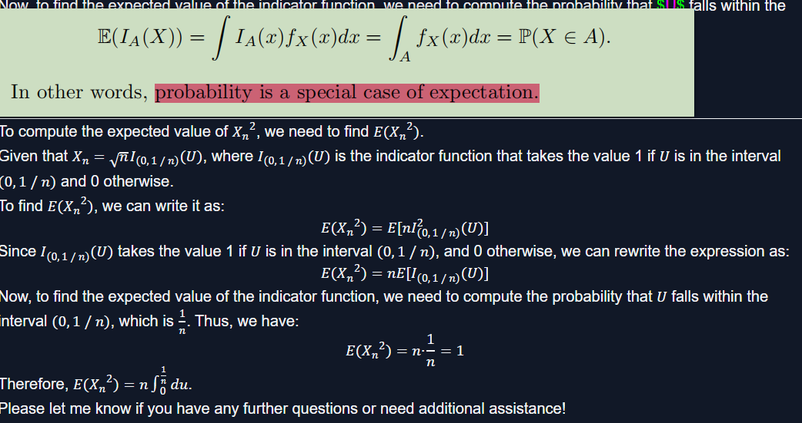

# 5 Convergence of Random Variables

- [5 Convergence of Random Variables](#5-convergence-of-random-variables)
  - [words](#words)
  - [5.1 Introduction](#51-introduction)
  - [5.2 Types of Convergence](#52-types-of-convergence)
  - [5.3 The Law of Large Numbers](#53-the-law-of-large-numbers)
  - [5.4 The Central Limit Theorem](#54-the-central-limit-theorem)
  - [5.5 The Delta Method](#55-the-delta-method)
  - [question](#question)

## words

- uniformly integrable

    A family of random variables $(X_i)$ is said to be uniformly integrable if for any $\varepsilon > 0$, there exists a finite constant $K_{\varepsilon}$ such that for every random variable $X$ in the family and any event $A$ with $P(A) \leq \varepsilon$, we have:

    $$
    \int_{A} |X| \, dP \leq K_{\varepsilon}
    $$

    In simpler terms, a family of random variables is uniformly integrable if the tails of their distribution are sufficiently well-behaved. This means that no individual random variable in the family dominates the others in terms of their tail behavior, and there are no extreme outliers in terms of integrability.

    Uniform integrability is a useful concept in probability theory because it allows for the application of certain convergence theorems, such as the dominated convergence theorem and the martingale convergence theorem, which require uniform control over the integrability properties of a sequence of random variables.

## 5.1 Introduction

- definition for convergence

## 5.2 Types of Convergence

- definition1
- definition2

- 5.4 Theorem
- 5.5 Theorem

## 5.3 The Law of Large Numbers

- Theorem

## 5.4 The Central Limit Theorem

- CLT
- 5.10 Theorem
- 5.11 how accurate

- MCLT💚

## 5.5 The Delta Method

- Theorem

## question

- $Let X_n ∼ N(0, 1/n)$,when $n \to \infty$,$F$ is the distribution function, why$F_n(0) = \frac{1}{2}$
  - due to the symmetry of the standard normal distribution.

- Let $U ∼ Unif(0, 1)$ and let $X_n = \sqrt{n}I_{(0,1/n)}(U)$, what is the $I_{(0,1/n)}(U)$$ denotes?
  - the indicator function $I_{(0,1/n)}(U)$ evaluates whether the random variable $U$ falls within the interval $(0, 1/n)$.

- Let $U ∼ Unif(0, 1)$ and let $X_n = \sqrt{n}I_{(0,1/n)}(U)$,why $E({x_n}^2 = n\int_0^\frac{1}{n})du$
- 

- The wrong of book
  - $P(|X_n| < \epsilon) = P(X_n = 0) = 1 − (1/n) \to 1.$Hence, $X_n\xRightarrow{P}0.$ why$P(|X_n| < \epsilon) \to 1$ can prove $X_n\xRightarrow{P}0.$
  - In fact, it only shows that the probability $P(|X_n| < \epsilon)$ approaches 1 as $n$ goes to infinity, which means that $X_n$ approaches 0 in probability, but it doesn't necessarily imply convergence in probability.

- The law of large numbers says that the sample average $X_n$ converges in probability to the expectation $\mu = E(X_i)$
  - $x$ close $\mu = E(X_i)$, i是多少，是1~n中的任意一个吗？？
  - Note that µ = E(Xi) is the same for all i so we can define µ = E(Xi) for any i. By convention, we often write µ = E(X1).

- $X_n$ is a sample mean, why $\displaystyle E(X_n) = µ and V(X_n) = \frac{σ^2}{n}$, $µ = E(X_1),σ^2 = V(X_1)$

    Now, let's discuss the properties of $X_n$:

    Expected Value (or mean): The expected value of $X_n$ is given by:
    $$ E(X_n) = E\left(\frac{X_1 + X_2 + \ldots + X_n}{n}\right) $$

    Since the random variables $X_1, X_2, \ldots, X_n$ are assumed to be identically distributed, we denote their common expected value as μ. Therefore,

    $$ E(X_n) = \frac{1}{n}\left(E(X_1) + E(X_2) + \ldots + E(X_n)\right) = \frac{n \cdot \mu}{n} = \mu $$

    So, the expected value of the sample mean $X_n$ is equal to the population mean μ.

    Variance: The variance of $X_n$ is given by:
    $$ V(X_n) = V\left(\frac{X_1 + X_2 + \ldots + X_n}{n}\right) $$

    Since the random variables $X_1, X_2, \ldots, X_n$ are assumed to be independent and have the same variance, denoted as $σ^2$, their covariance terms are zero. Therefore,

    $$ V(X_n) = \frac{1}{n^2}\left(V(X_1) + V(X_2) + \ldots + V(X_n)\right) = \frac{n \cdot \sigma^2}{n^2} = \frac{\sigma^2}{n} $$

⭐⭐⭐⭐

- 
  - X只等于0，倘若X不是取单点值呢？
    - $P(|Xn − X| > \epsilon)$ → 0怎么算

- (use Latex to display the content which inside the $$)
