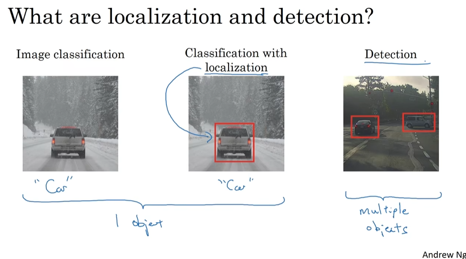
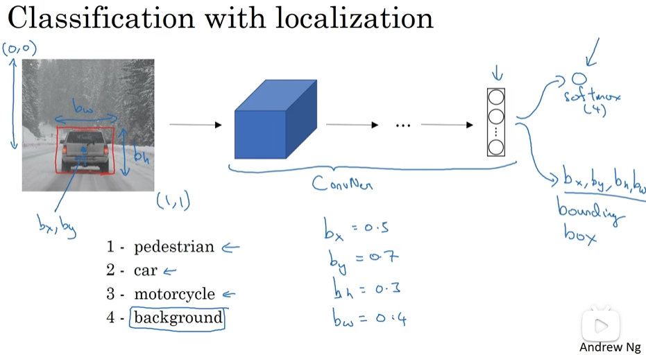
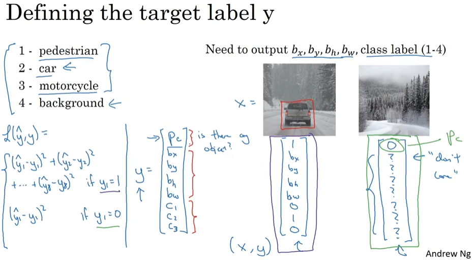

# Object Detection

- [Object Detection](#object-detection)
  - [Object localization](#object-localization)
  - [Landmark detection](#landmark-detection)

## Object localization

- What are localization and detection
  - 
- Classification with localization
  - 
- Defining the target label y
  - 

## Landmark detection