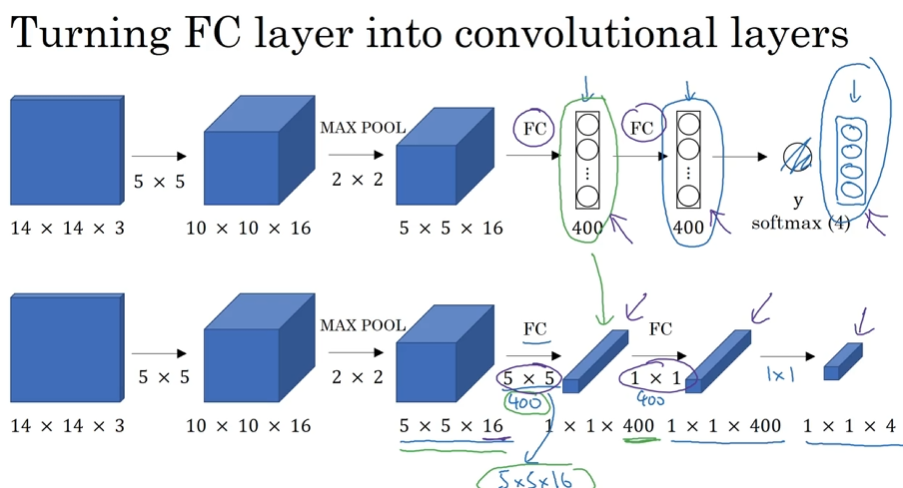
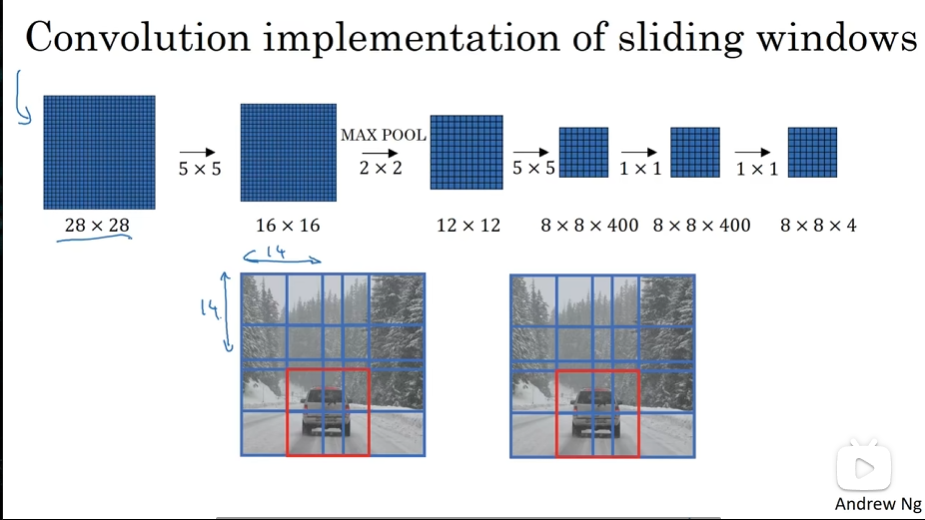

# Object Detection

- [Object Detection](#object-detection)
  - [Object localization](#object-localization)
  - [Landmark detection](#landmark-detection)
  - [Object detection](#object-detection-1)
  - [Convolutional implementation of sliding windows](#convolutional-implementation-of-sliding-windows)
  - [Bounding box predictions](#bounding-box-predictions)
  - [Intersection over union](#intersection-over-union)
  - [Non-max suppression](#non-max-suppression)
  - [Anchor boxes](#anchor-boxes)
  - [Putting it together: YOLO algorithm](#putting-it-together-yolo-algorithm)
  - [Region proposals (Optional)](#region-proposals-optional)

## Object localization

- What are localization and detection
  - 
- Classification with localization
  - 
- Defining the target label y
  - 

## Landmark detection

- 

## Object detection

- Car detection example, use it in sliding windows detection
  - 
- Sliding windows detection
  - 

## Convolutional implementation of sliding windows

- Turning FC layer into convolutional layers
  - 
- Convolution implementation of sliding windows
  - ⭐对应关系？
    - 
  - 

## Bounding box predictions

- Output accurate bounding boxes
  - 
- YOLO algorithm
  - 
- Specify the bounding boxes
  - 

## Intersection over union

- Evaluating object localization
  - 

## Non-max suppression

- Non-max suppression example
  - 
- Non-max suppression algorithm
  - (three types, independently carry out non-max suppression three times
    - 

## Anchor boxes

- Overlapping objects:
  - 
- Anchor box algorithm
  - that object then then gets assigned not just to a grid cell, but to a pair (cell,Anchor box)
  - 
- Anchor box example
  - that're two cases that this algorithm doesn't handle it well
    - two anchor boxes but 3 objects in the same grid cell
    - both of them have you know the same achor box shape
  - 

## Putting it together: YOLO algorithm

- Training
  - 
- Making predictions
  - 
- Outputting the non-max supressed outputs
  - then for each of the nine grid cells you get two predicted bounding boxes, some of them will have very low probability very low p_c
  - 

## Region proposals (Optional)

- Region proposal: R-CNN
  - 
- Faster algorithms(quite a bit slower than the YOLO algorithm)
  - 