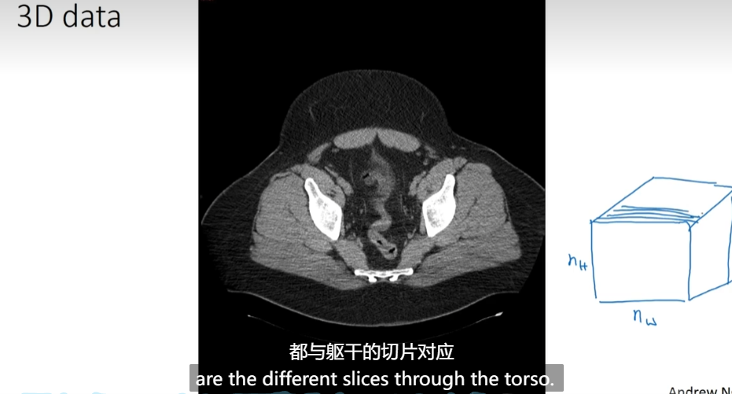

# Face recognition

- [Face recognition](#face-recognition)
  - [What is face recognition](#what-is-face-recognition)
  - [One-shot learning](#one-shot-learning)
  - [Siamese network](#siamese-network)
  - [Triplet loss](#triplet-loss)
  - [Face verification and binary classification](#face-verification-and-binary-classification)
  - [What is neural style transfer?](#what-is-neural-style-transfer)
  - [What are deep ConvNets learning](#what-are-deep-convnets-learning)
  - [Neural Style Transfer Cost function](#neural-style-transfer-cost-function)
  - [Content cost function](#content-cost-function)
  - [Style cost function](#style-cost-function)
  - [Convolutions in 1D and 3D](#convolutions-in-1d-and-3d)

## What is face recognition

- Face verification vs.face recognition
  - 

## One-shot learning

- One-shot learning
  - 6: new person joins your team
  - 
- Learning a "similarity" function
  - 

## Siamese network

- Siamese network
  - 
- Goal of learning
  - 

## Triplet loss

- Learning Objective
  - 
- Triplet loss function
  - 
- Choosing the triplets A,P,N
  - 
- Training set using triplet loss
  - 

## Face verification and binary classification

- Learning the similarity function(has parameters that are the **same**)
  - 

## What is neural style transfer?

- 

## What are deep ConvNets learning

- Pick a unit in layer 1. Find the nine image patches that maximize the unit's activation. 上面是卷积网络学习的sentence, what's the "maximize" in the sentence denotes?
  - 找到9个激活值是最大值的图像块
  - 本质是寻找能够强烈激活特定神经元的输入

- visualizing what a deep network is learning
  - 
- Visualizing deep layers
  - 

## Neural Style Transfer Cost function

- Neural style transfer cost function
  - 
- Find the generated image G
  - 

## Content cost function

- Content cost function
  - 

## Style cost function

- Meaning of the "style"  of an image
  - 

- Intuition about style of an image
   - 
 - Style matrix
   - 
 - Style cost function
   - 

## Convolutions in 1D and 3D

- Convolutions in 1D
  - 
- 3D data
  - 
  - 