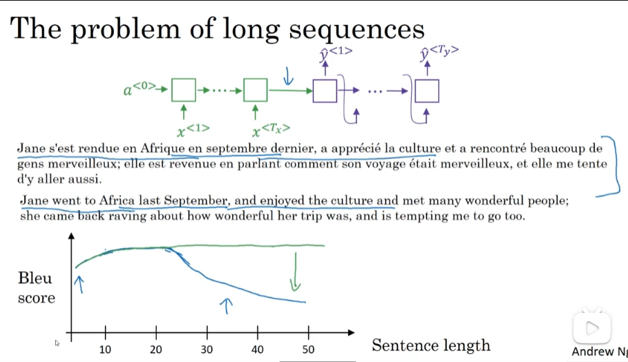

# Sequence to sequence models

- [Sequence to sequence models](#sequence-to-sequence-models)
  - [Basic models](#basic-models)
  - [Picking the most likely sentence](#picking-the-most-likely-sentence)
  - [Beam search](#beam-search)
  - [Refinements to beam search](#refinements-to-beam-search)
  - [Error analysis on beam search](#error-analysis-on-beam-search)
  - [Bleu score - bilingual evaluation understudy(optional)](#bleu-score---bilingual-evaluation-understudyoptional)
  - [Attention model intuition](#attention-model-intuition)
  - [Attention model](#attention-model)
  - [Speech recognition](#speech-recognition)
  - [Trigger word detection](#trigger-word-detection)

## Basic models

- Sequence to sequence model
  - 
- Image captioning
  - 

## Picking the most likely sentence

- Machine translation as building a conditional language model
  - 
- Finding the most likely translation
  - 
- Why not a greedy search
  - 

## Beam search

- Beam search algorithm
  - Step1
    - 
  - Step2
    - 
  - Step3
    - 

## Refinements to beam search

- Length normalization
  - 
- Beam search discussion
  - 

## Error analysis on beam search

- Example
  - 
- Error analysis on beam search
  - 
- Error analysis process
  - 

## Bleu score - bilingual evaluation understudy(optional)

- pretty good single real number evaluation metric

- Evaluating machine translation
  - 
- Bleu score on bigrams
  - 
  - 
- Bleu details
  - 

## Attention model intuition

- The problem of long sequences
  - 
- Attention model intuition
  - 

## Attention model

- Attention model
  - 
- Computing attention $\alpha$
  - So for every fix value of t, $a^{<t,t'>}$
  - 
- Attention examples
  - ⭐?visualization
  - 

## Speech recognition

- Speech recognition problem
  - 
- Attention model for speech recognition
  - 
- CTC cost for speech recognition
  - 

## Trigger word detection

- ⭐？Trigger word detection algorithm
