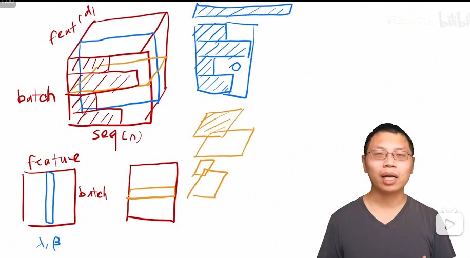
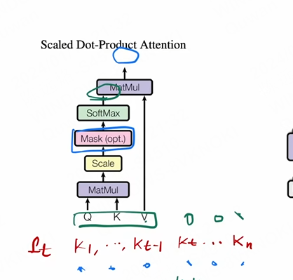
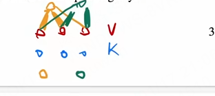
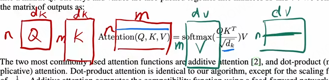
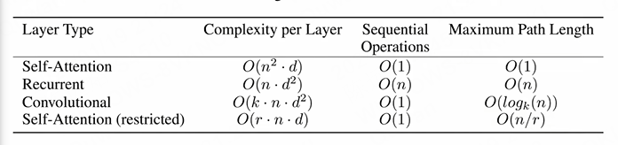

# 15

## layerform

- 为什么不应该看到t时刻后的输入
  - output use auto-regressive model
- ⭐在计算kt时，是怎么知道kn的
  - 

## attention

- 
- 矩阵并行
  - 

## 效率

- ⭐Recurrent Complexity per Layer

- 
- ⭐学embedding时把每一个向量L2long学成比较小的？

## words

- auto-regressive model
  - An auto-regressive model is a statistical model for analyzing time-series data. **It predicts future data points by making them a function of past values in the series** — that is, the future value is regressed on the past values (hence "auto-regressive"). 