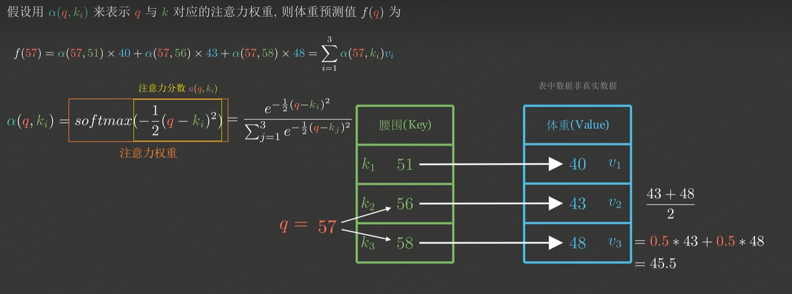

# 15

## layerform

- 为什么不应该看到t时刻后的输入
  - output use auto-regressive model
- ⭐在计算kt时，是怎么知道kn的
  - 

## attention

- 
- 矩阵并行
  - 

## 效率

- ⭐Recurrent Complexity per Layer

- 
- ⭐学embedding时把每一个向量L2long学成比较小的？

## words

- auto-regressive model
  - An auto-regressive model is a statistical model for analyzing time-series data. **It predicts future data points by making them a function of past values in the series** — that is, the future value is regressed on the past values (hence "auto-regressive"). 
- MLP
  - In deep learning, "MLP" stands for Multi-Layer Perceptron. An MLP is a class of feedforward artificial neural network (ANN) that consists of at least three layers of nodes: an input layer, one or more hidden layers, and an output layer. Each node, or neuron, in one layer connects with a certain weight to every node in the following layer, making the network fully connected. MLPs use a supervised learning technique called backpropagation for training the network.
- 权重
  - query和key的相似度

## Question:

- 输出的输入，是以前的一些输出
- 自回归不能看到之后的输出
- 注意力机制每一次能看到完整的输入
- 保证你训练和预测的时候行为是一致的
- QKV怎么取
  - 怎么收敛？

- 一维
- 二维