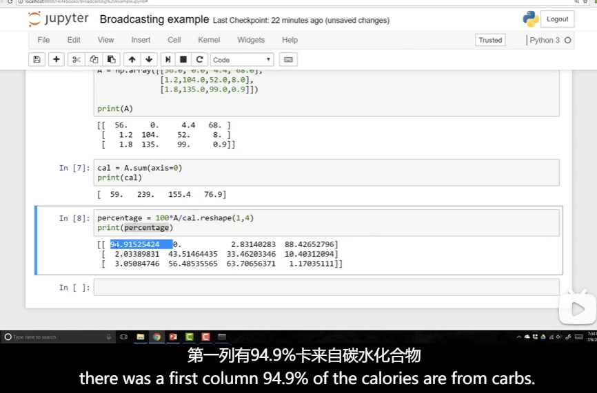

# Basics of Neura Network Programming

- [Basics of Neura Network Programming](#basics-of-neura-network-programming)
  - [Binary Classification](#binary-classification)
  - [Logistic Regression](#logistic-regression)
  - [Logistic Regression cost function](#logistic-regression-cost-function)
  - [Computing derivatives](#computing-derivatives)
  - [Logistic regression derivatives](#logistic-regression-derivatives)
  - [vectorization](#vectorization)
  - [Broadcasting in Python](#broadcasting-in-python)
  - [A note on python](#a-note-on-python)
  - [Logistic regression cost function(optional)](#logistic-regression-cost-functionoptional)

## Binary Classification

- dimension
- Notation

## Logistic Regression

- 

## Logistic Regression cost function

- 

## Computing derivatives

- 

## Logistic regression derivatives

- 
- Logistic regression on m examples
  - 

## vectorization

- What is vectorization?
  - 
- Vectors and matrix valued functions
  - 
- Logistic regression derivatives
  - 
  - dw = np.zeros((n_x, 1))

```py
dw = np.zeros((n_x, 1))
dw += x^i*(dz)^i # x^i表示x的第i个特征
dw/m
# 为什么上述代码就可以计算dw梯度
# 因为每次都会把对应的w_i加到对应的行上
```

- Vectorizing Logistic Regression
  - 
  - 
  - 

## Broadcasting in Python

- 
- 
- 

## A note on python

- Not a rank 1 aaray

## Logistic regression cost function(optional)

- y hat
- Logistic regression cost function
- Maximum likelihood estimation
  - which just means to choose the parameters that maximizes this thing
- m example loss function, got to rid of the minus sign.
  - 