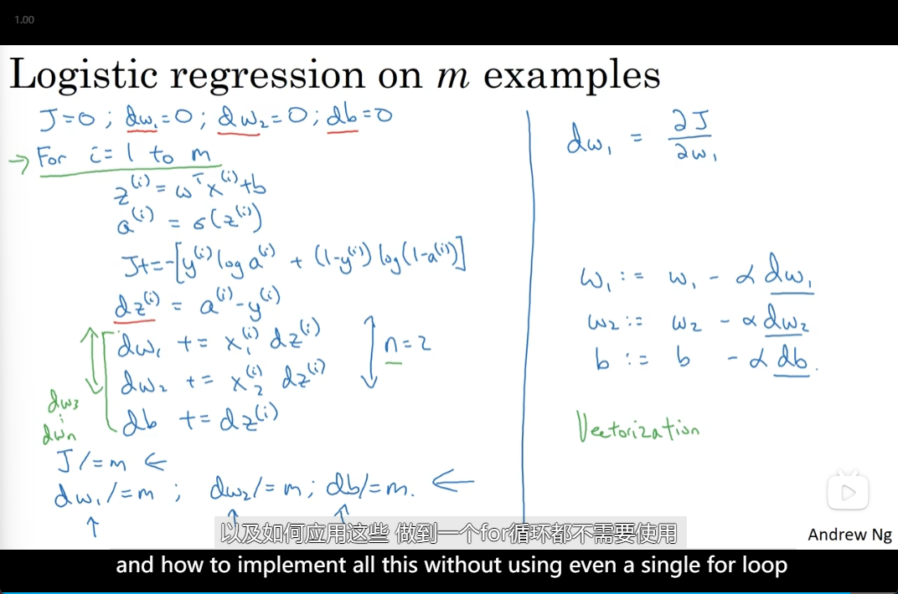

# Basics of Neura Network Programming

- [Basics of Neura Network Programming](#basics-of-neura-network-programming)
  - [Binary Classification](#binary-classification)
  - [Logistic Regression](#logistic-regression)
  - [Logistic Regression cost function](#logistic-regression-cost-function)
  - [Computing derivatives](#computing-derivatives)
  - [Logistic regression derivatives](#logistic-regression-derivatives)
  - [vectorization](#vectorization)

## Binary Classification

- dimension
- Notation

## Logistic Regression

- 

## Logistic Regression cost function

- 

## Computing derivatives

- 

## Logistic regression derivatives

- 
- Logistic regression on m examples

## vectorization

- What is vectorization?
  - 
- Vectors and matrix valued functions
  - 
- Logistic regression derivatives
  - 
- Vectorizing Logistic Regression
  - 
  - 
  - 
