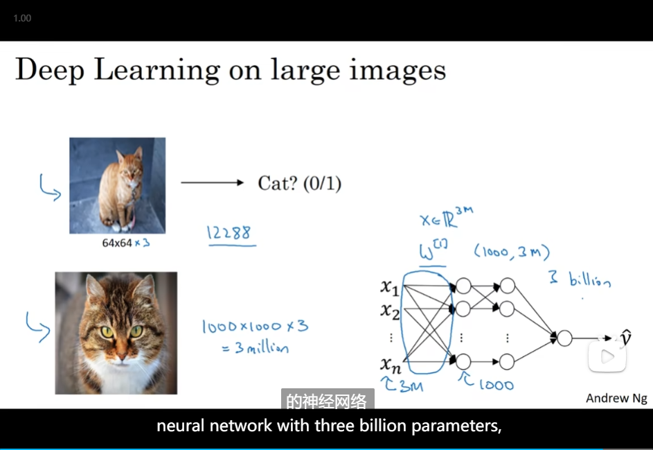
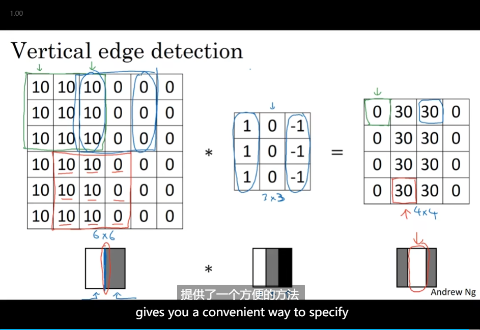
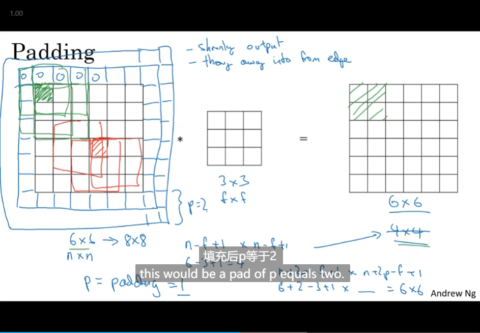
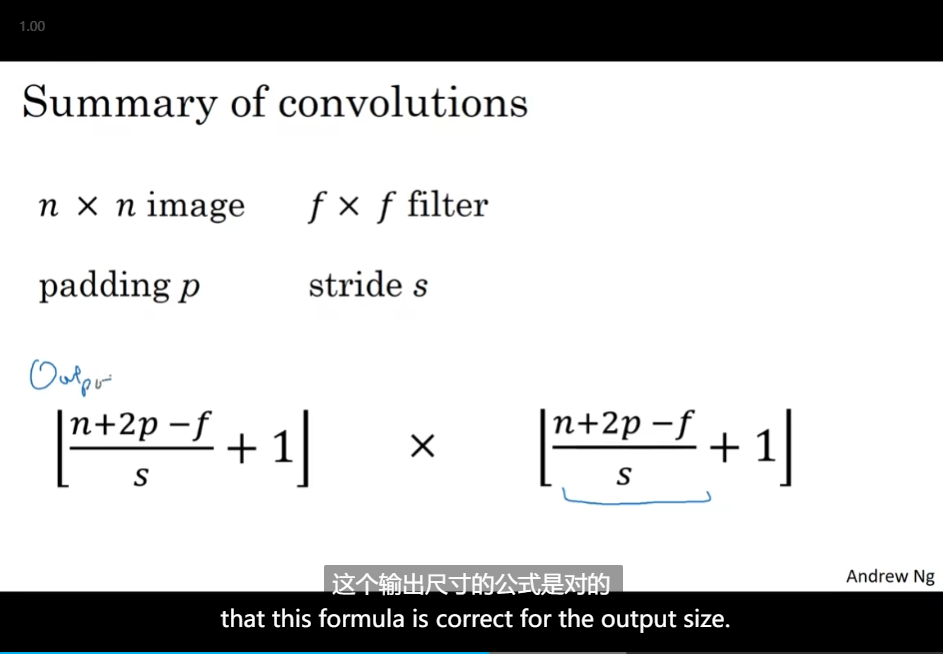
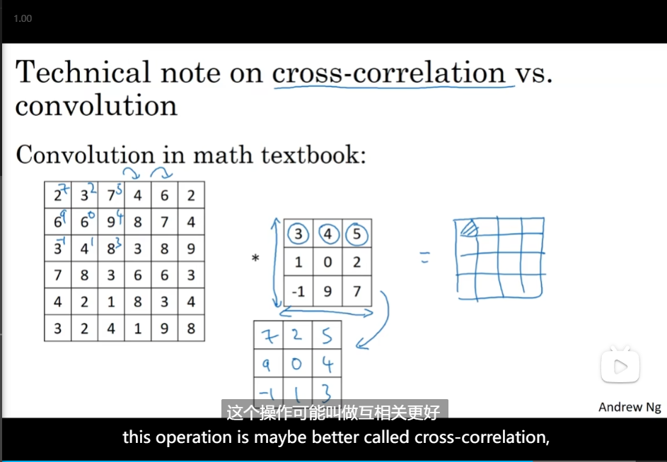
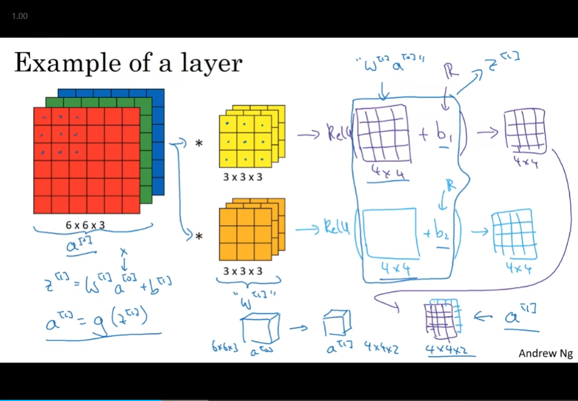
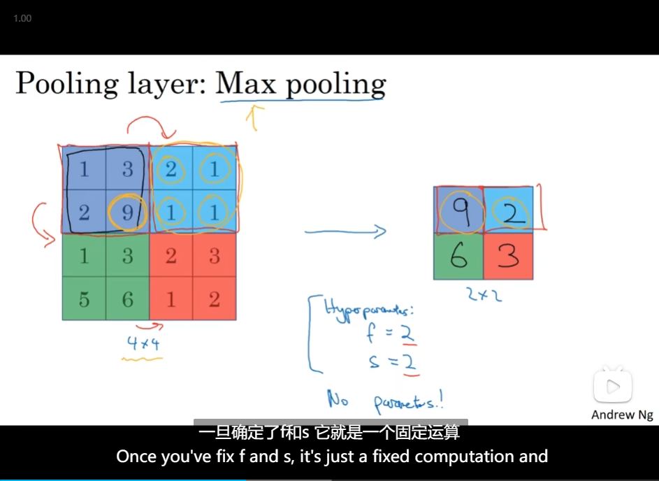
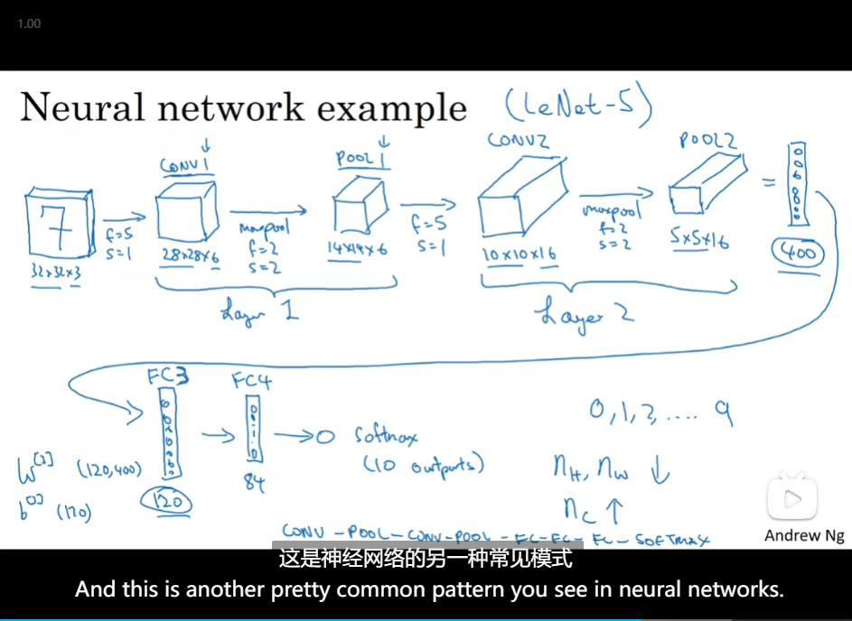

# Convolutional Neural Networks

- [Convolutional Neural Networks](#convolutional-neural-networks)
  - [Computer vision](#computer-vision)
  - [Edge detection example](#edge-detection-example)
  - [More edgedetection](#more-edgedetection)
  - [Padding](#padding)
  - [Strided convolutions](#strided-convolutions)
  - [Convolutions over volumes](#convolutions-over-volumes)
  - [One layer of a convolutional network](#one-layer-of-a-convolutional-network)
  - [A simple convolution network example](#a-simple-convolution-network-example)
  - [Pooling layers](#pooling-layers)
  - [Convolutional neural network example](#convolutional-neural-network-example)
  - [Why convolutions?](#why-convolutions)

## Computer vision

- infeasible

## Edge detection example

- Vertical edge detection
  - 
  - 

## More edgedetection

- 
- ⭐？
- Learning to detect edges

## Padding

- 
- odd-number

## Strided convolutions

- 
- Summary
- cross-correlation

## Convolutions over volumes

- RGB
- channels or depth

## One layer of a convolutional network

- b is bias?⭐
- Example of a layer
- Number of parameters in one layer
- Notation

## A simple convolution network example

- example convolution network
  - 
- Types of layer in a convolutional network
  - 

## Pooling layers

- Max pooling
  - 
  - 
- Summary of pooling
  - 

## Convolutional neural network example

- 
- 

## Why convolutions?

- ⭐translation invariance.?
- 
- 