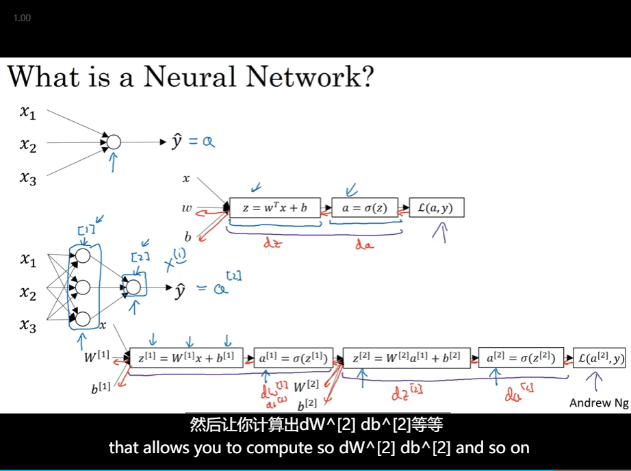
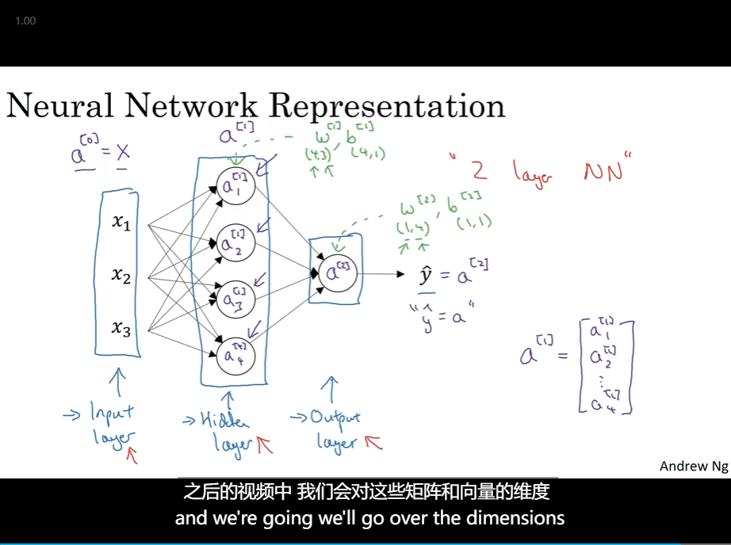

# 3. Neural Network

- What is a Neural Network?
- 

## Neural Network Representation

- 
- 

## Vectorizing acrossmultiple examples

- So the **horizontal**, the matrix A goes over our different training examples.
- and vertically, the different **indices** in the matrix A, correspond to different hidden layer.
- 

## Explanation for vectorized implementation

- Justification for vectorized implementation
- Recap of vectorizing across multiple examples

## Activation functions

- and the advantage of both the ReLU and the leaky ReLU is that for a lot of the space of z the derivative of the activation function the slope of the activation function is **very different from zero**
- 

## Why does neural network need a nonlinear activation function

- 

## Derivatives of activation functions

- Sigmoid activation function
  - 
- tanh
  - 
- Relu
  - 

## Gradient descent for neural networks

- 
- back⭐⭐

## Random lnitialization