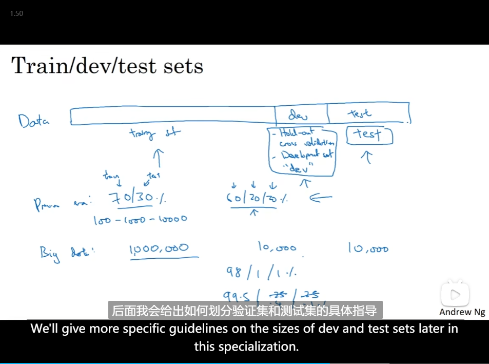

# 3. Neural Network

- [3. Neural Network](#3-neural-network)
  - [Neural Network Representation](#neural-network-representation)
  - [Vectorizing across multiple examples](#vectorizing-across-multiple-examples)
  - [Explanation for vectorized implementation](#explanation-for-vectorized-implementation)
  - [Activation functions](#activation-functions)
  - [Why does neural network need a nonlinear activation function](#why-does-neural-network-need-a-nonlinear-activation-function)
  - [Derivatives of activation functions](#derivatives-of-activation-functions)
  - [Gradient descent for neural networks](#gradient-descent-for-neural-networks)
  - [Backpropagation intuition(Optional)](#backpropagation-intuitionoptional)
  - [Random lnitialization](#random-lnitialization)
  - [Deep L-layer Neural network](#deep-l-layer-neural-network)
  - [Forward Propagation in a Deep Network](#forward-propagation-in-a-deep-network)
  - [Getting your matrix dimensions right](#getting-your-matrix-dimensions-right)
  - [Why deep representations?](#why-deep-representations)
  - [Building blocks of deep neural networks](#building-blocks-of-deep-neural-networks)
  - [Parameters VS Hyperparameters](#parameters-vs-hyperparameters)

## Neural Network Representation

- 
- 

## Vectorizing across multiple examples

- So the **horizontal**, the matrix A goes over our different training examples.
- and vertically, the different **indices** in the matrix A, correspond to different hidden layer.
- 

## Explanation for vectorized implementation

- Justification for vectorized implementation
- Recap of vectorizing across multiple examples

## Activation functions

- "万能逼近定理"（Universal Approximation Theorem）是深度学习和神经网络领域的一个重要数学结果，它表明具有足够数量的**神经元（节点）的前馈神经网络**（feedforward neural network）能够以任意精度来逼近任何连续函数
- 通过多个层的叠加，网络可以学习将多个简单的非线性函数组合成更复杂的非线性函数

- and the advantage of both the ReLU and the leaky ReLU is that for a lot of the space of z, the derivative of the activation function the slope of the activation function is **very different from zero**
- 

## Why does neural network need a nonlinear activation function

- 

## Derivatives of activation functions

- activation梯度下降和梯度下降的關係？
  - 某些激活函数的导数可以影响梯度下降的表现。例如，Sigmoid激活函数在输入非常大或非常小的情况下，其导数接近于零，这可能导致**梯度消失**问题(链式法则要求将各层的导数相乘。
  - 在神经网络中，梯度表示了损失函数关于每个参数的变化率。梯度的计算通常涉及到链式法则，其中包括各层激活函数的导数

- Sigmoid activation function
  - 
- tanh
  - 
- Relu
  - 

## Gradient descent for neural networks

- 
- back

## Backpropagation intuition(Optional)

- 
- 
- 
- ⭐$dw^{[2]} = dz[2]a^{[1]T}$
- ${dz}^{[1]} = W^T{dz}^{[2]} *g'(z)$
  - 因为${dz}^{[1]} = da *g'(z)$

## Random lnitialization

- there's really no point to having more than one hidden unit
  - 
- a relatively small number

## Deep L-layer Neural network

- Forward propagation for layer l
- back
- Summary

## Forward Propagation in a Deep Network

- 

## Getting your matrix dimensions right

- 
- Vectorized implementation

## Why deep representations?

- 

## Building blocks of deep neural networks

- Forward and backward functions
- ⭐b在计算的时候有什么用？

## Parameters VS Hyperparameters

- that control the ultimate parameters W and b, so we call all of these things below hyper parameters
  - 
- 
- Make sure dev and test come from same distribution
  - 
