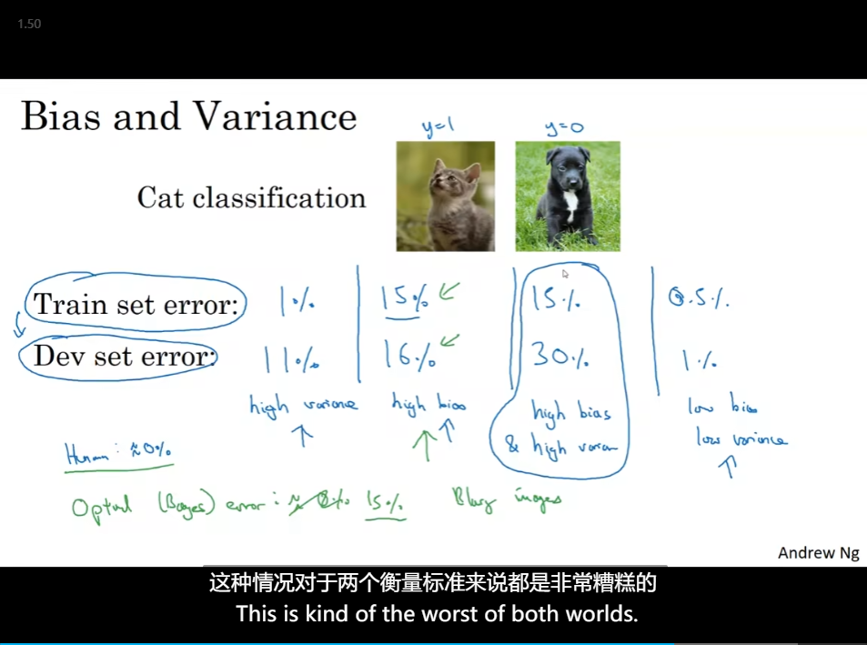
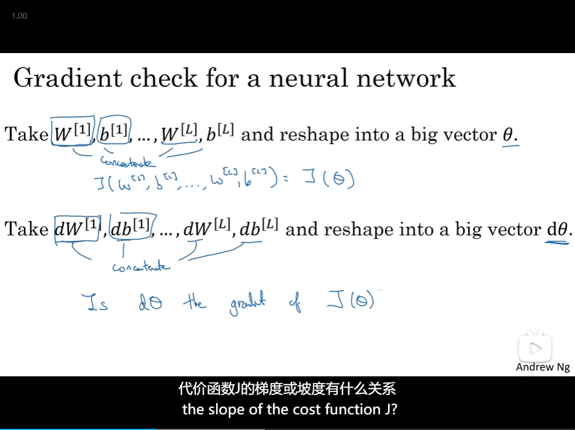

# 4

- [4](#4)
  - [Train/dev/test sets](#traindevtest-sets)
  - [Bias/Variance](#biasvariance)
  - [Basic "recipe" for machine learning](#basic-recipe-for-machine-learning)
  - [Regularization](#regularization)
  - [Why regularization reduces overfitting](#why-regularization-reduces-overfitting)
  - [Dropout regularization](#dropout-regularization)
  - [how Dropout work](#how-dropout-work)
  - [Other regularization methods](#other-regularization-methods)
  - [Normalizing inputs](#normalizing-inputs)
  - [Vanishing/exploding gradients](#vanishingexploding-gradients)
  - [Weight initialization for deep networks](#weight-initialization-for-deep-networks)
  - [Numerical approximation of gradients](#numerical-approximation-of-gradients)
  - [Gradient Checking](#gradient-checking)

## Train/dev/test sets

- Applied ML is a highly iterative process
  - 

## Bias/Variance

- Bias/Variance
  - 
  - 

## Basic "recipe" for machine learning

- 

## Regularization

- Logistic regression
  - 
- Neural network
  - 

## Why regularization reduces overfitting

- How does regularization prevent overfitting
  - 
- And so the activation function if is tanh, will be **relatively linear**.
  - 

## Dropout regularization

- set some probability of eliminating a node in neural network
  - 
- on different process through the training set, you should randomly zero out different hidden units
  - Inverted dropout
    - 
- At the test time you're not using dropout

## how Dropout work

- the effect of implementing dropout is that it shrinks the weights
- even more adaptive to the scale of different inputs
  - 

## Other regularization methods

- Data augmentation
  - 
- Early stopping
  - 
  - without needing to try a lot of values of the L2 regularization hyperparameter lambda.

## Normalizing inputs

1. subtract mean
2. Normalize the variances 

- scale your test set in exactly the same way
  - 
- why
  - 

## Vanishing/exploding gradients

- 当梯度爆炸发生时，权重更新的幅度非常大。这意味着每次迭代都会导致模型参数的巨大变化，而不是渐进式的优化。这样的情况下，算法很难找到合适的参数值，因为参数值的摆动范围太大。
  - 

## Weight initialization for deep networks

- ⭐高斯？
  - 
- a reasonable scaling
  - 

## Numerical approximation of gradients

- 

## Gradient Checking

- 
- 
  - 欧几里得范数

- Gradient Checking implementation notes
  - 
