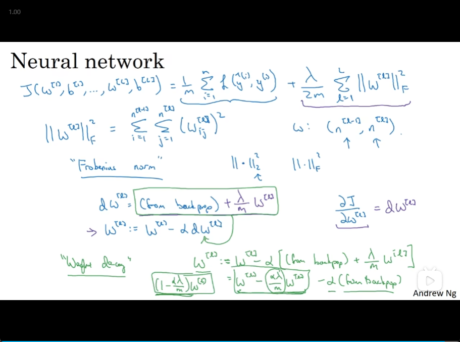

# 4

- [4](#4)
  - [Train/dev/test sets](#traindevtest-sets)
  - [Dropout regularization](#dropout-regularization)
  - [how Dropout work](#how-dropout-work)
  - [Other regularization methods](#other-regularization-methods)
  - [Normalizing inputs](#normalizing-inputs)
  - [Vanishing/exploding gradients](#vanishingexploding-gradients)
  - [Weight initialization for deep networks](#weight-initialization-for-deep-networks)
  - [Numerical approximationf gradients](#numerical-approximationf-gradients)
  - [Gradient Checking](#gradient-checking)

## Train/dev/test sets

- Applied ML is a highly iterative process
  - 

## Dropout regularization

- set some probability of eliminating a node in neural network
  - 
- on different pauses through the training set, you should randomly zero out different hidden units
  - Inverted dropout
- At the test time you're not using dropout

## how Dropout work

- the effect of implementing dropout is that it shrinks the weights
- even more adaptive to the scale of different inputs
- 
  

## Other regularization methods

- Data augmentation
  - 
- Early stopping
  - 
  - without needing to try a lot of values of the L2 regularization hyperparameter lambda.

## Normalizing inputs

1. subtract mean
2. Normalize the variances 

- scale your test set in exactly the same way
  - 
- why
  - 

## Vanishing/exploding gradients

- 

## Weight initialization for deep networks

- ⭐高斯？
- a reasonable scaling

## Numerical approximation of gradients

- 

## Gradient Checking

- 
- 
  - 欧几里得范数

- Gradient Checking implementation notes
  - 
