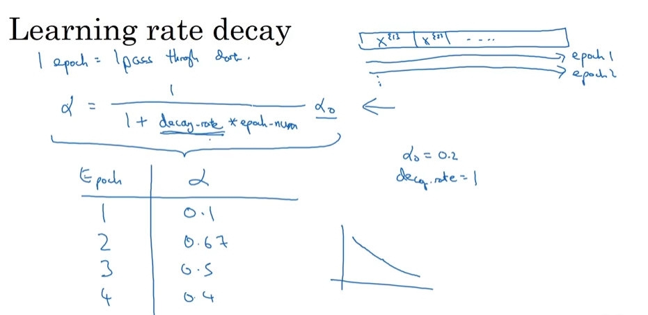
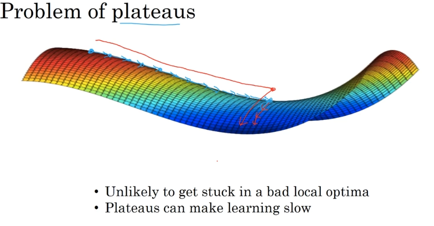

## batch

- [Mini-batch gradient descent](#mini-batch-gradient-descent)
  - [Understanding mini-batch gradient descent](#understanding-mini-batch-gradient-descent)
  - [Exponentially weighted averages](#exponentially-weighted-averages)
  - [Bias correction in exponentially weighted average](#bias-correction-in-exponentially-weighted-average)
  - [Gradient descentwith momentum](#gradient-descentwith-momentum)
  - [RMSprop(Root Mean Square prop)](#rmsproproot-mean-square-prop)
  - [Adam optimization algorithm(Adaptive Moment estimation)](#adam-optimization-algorithmadaptive-moment-estimation)
  - [Learning rate decay](#learning-rate-decay)
  - [The problem of local optima](#the-problem-of-local-optima)

# Mini-batch gradient descent

- 
- 

## Understanding mini-batch gradient descent

- Training with mini batch gradient descent

- One is that you do get a lot of vectorization
- make progress without needing to wait till you process the entire training set
  - 

- 探索与利用的平衡：
  
  - 在优化理论中，存在探索（Exploration）与利用（Exploitation）之间的平衡。大Batch Size倾向于“利用”，沿着明确的下降方向快速前进，而较小的Batch Size则增加了“探索”的成分，允许模型探索参数空间中的不同区域

- 太大的Batch Size

  内存要求高：更大的Batch Size需要更多的内存。在有限的硬件资源下，过大的Batch Size可能导致内存溢出错误。

  泛化能力可能下降：大批量大小可能导致**泛化能力下降**。小批量带来的噪声可以帮助模型跳出局部最小值，提高泛化能力。

  训练速度：虽然大Batch Size可以加速每个周期（epoch）的训练时间，但可能需要更多的周期才能收敛，总体训练时间可能更长

## Exponentially weighted averages

- 0.98 绿线; 0.9 红线; 0.5 黄线
  - 
- 
- 

## Bias correction in exponentially weighted average

- 

## Gradient descentwith momentum

- Gradient descent example
  - 
- But both versions having Beta equal 0.9 is a common choice of hyperparameter
  - 

## RMSprop(Root Mean Square prop)

- allowing you to maybe use a larger learning rate alpha, And certainly speeding up the learning speed of your algorithm.
  - your updates in the vertical direction are divided by a much larger number
  - 

## Adam optimization algorithm(Adaptive Moment estimation)

- 
- Hyperparameters choice

## Learning rate decay

- 
- exponential decay and so on
  - 

## The problem of local optima

- Local optima in neural networks
- It turns out that plateaus can really slow down learning