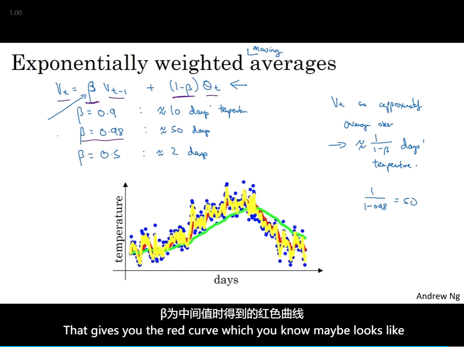

## batch

- [Mini-batch gradient descent](#mini-batch-gradient-descent)
  - [Understanding mini-batch gradient descent](#understanding-mini-batch-gradient-descent)
  - [Exponentially weighted averages](#exponentially-weighted-averages)
  - [Bias correction in exponentially weighted average](#bias-correction-in-exponentially-weighted-average)
  - [Gradient descentwith momentum](#gradient-descentwith-momentum)
  - [RMSprop(Root Mean Square prop)](#rmsproproot-mean-square-prop)
  - [Adam optimization algorithm](#adam-optimization-algorithm)
  - [Learning rate decay](#learning-rate-decay)
  - [The problem of local optima](#the-problem-of-local-optima)

# Mini-batch gradient descent

- 
- 

## Understanding mini-batch gradient descent

- Training with mini batch gradient descent

- One is that you do get a lot of vectorization
- make progress without needing to wait till you process the entire training set
  - 

## Exponentially weighted averages

- 0.98 绿线; 0.9 红线; 0.5 黄线
  - 
- 
- 

## Bias correction in exponentially weighted average

- 

## Gradient descentwith momentum

- Gradient descent example
  - 
- But both versions having Beta equal 0.9 is a common choice of hyperparameter
  - 

## RMSprop(Root Mean Square prop)

- allowing you to maybe use a larger learning rate alpha, And certainly speeding up the learning speed of your algorithm.
  - 

## Adam optimization algorithm

- 
- Hyperparameters choice

## Learning rate decay

- 
- exponential decay and so on
  - 

## The problem of local optima

- Local optima in neural networks
- It turns out that plateaus can really slow down learning