# Hyperparameter tuning

- [Hyperparameter tuning](#hyperparameter-tuning)
  - [Tuning Process](#tuning-process)
  - [Using an appropriate scale to pick hyperparameters](#using-an-appropriate-scale-to-pick-hyperparameters)
  - [Hyperparameters tuning in practice: Pandas vs. Caviar](#hyperparameters-tuning-in-practice-pandas-vs-caviar)
  - [Batch Normalization](#batch-normalization)
    - [Normalizing activationsin a network](#normalizing-activationsin-a-network)
    - [Fitting Batch Norm into a neural network](#fitting-batch-norm-into-a-neural-network)
  - [Why does Batch Norm work](#why-does-batch-norm-work)
  - [Batch Norm at test time](#batch-norm-at-test-time)
  - [Softmax regression](#softmax-regression)
  - [Training a softmax classifier](#training-a-softmax-classifier)

## Tuning Process

- Important
  - 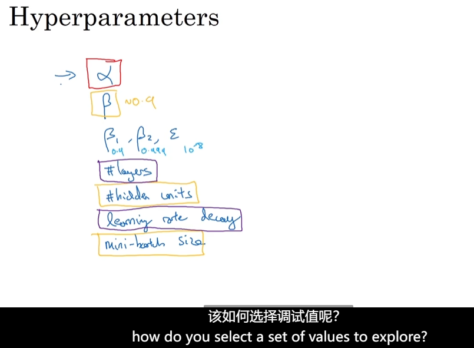
- Try random values
  - 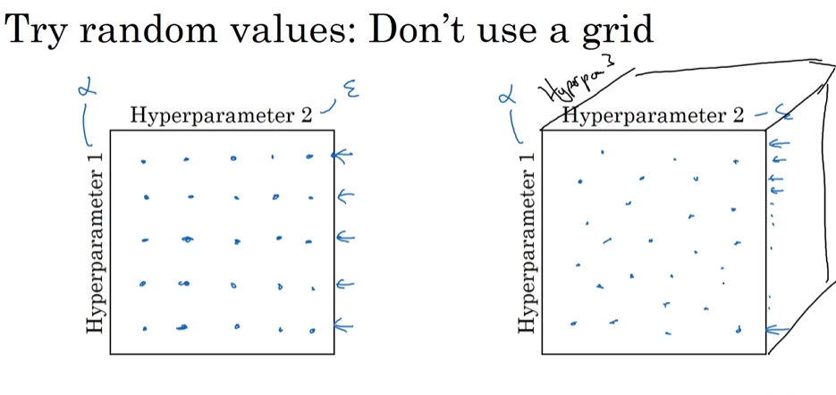
- Coarse to fine
  - 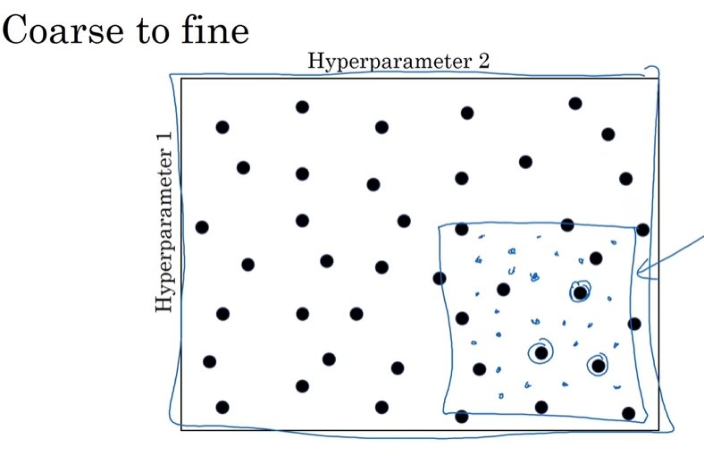

## Using an appropriate scale to pick hyperparameters

- 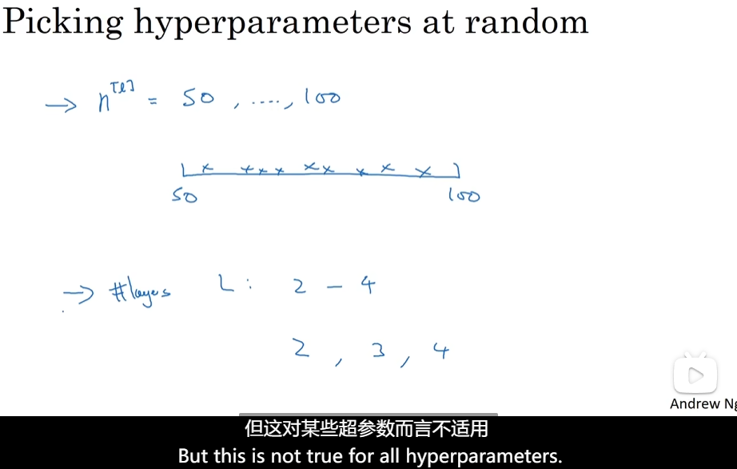
- Appropriate scale for hyperparameters
  - 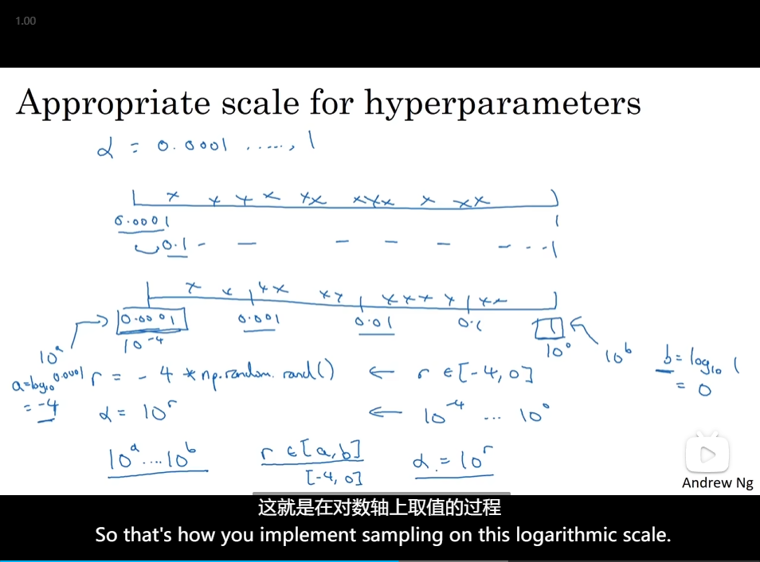
- Hyperparameters for exponentially weighted averages
  - 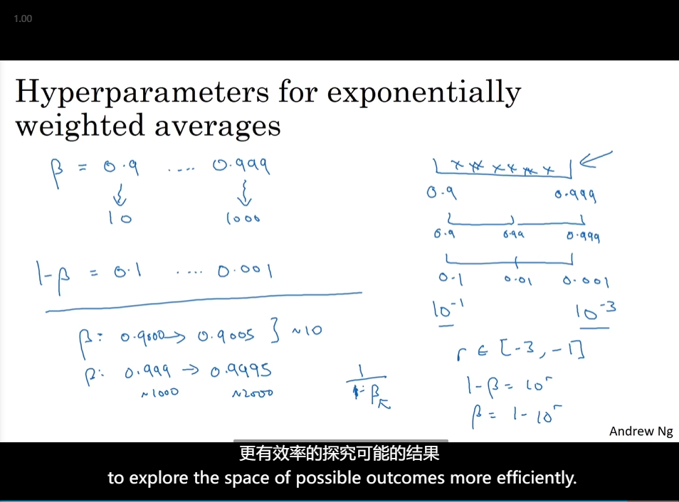

## Hyperparameters tuning in practice: Pandas vs. Caviar

- 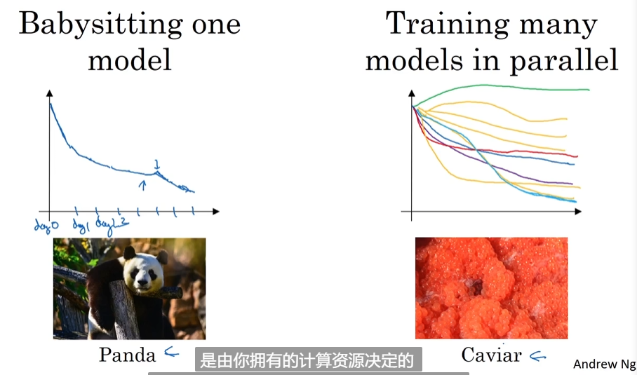

## Batch Normalization

### Normalizing activationsin a network

- Normalize Z
  - So to train w^3,b^3 faster
  - 
- So every component of Z has mean zero and variance one
- this allows you to make the hidden unit values of other **means and variances** as well.
  - 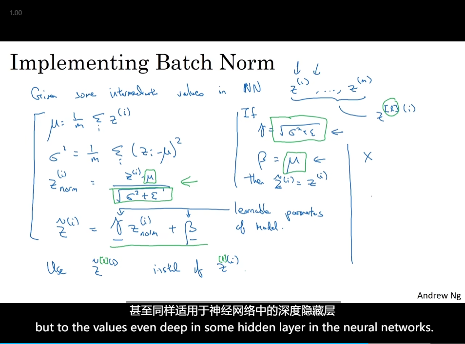

### Fitting Batch Norm into a neural network

- Adding Batch Norm to a network
  - 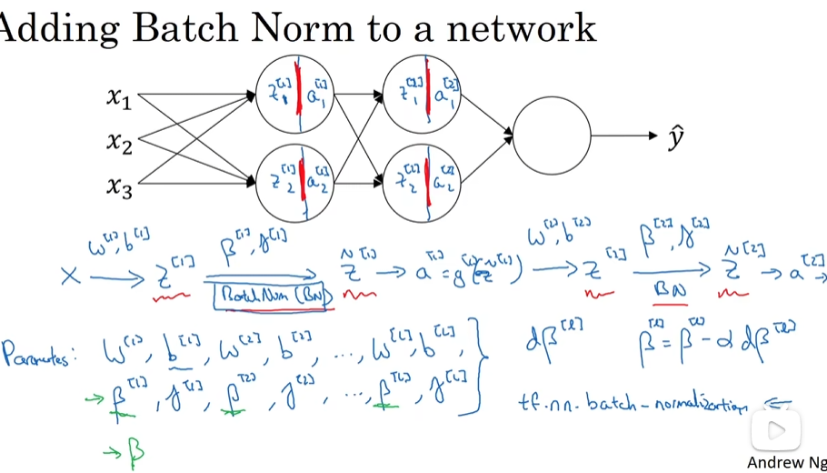
- Working with mini-batches
  - you have got to get rid of b
  - 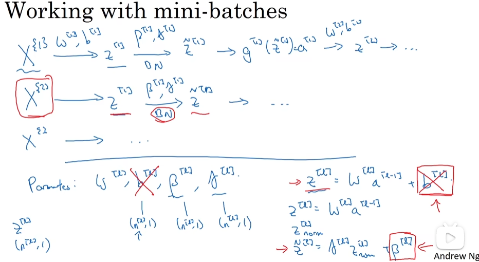
- Implementing gradient descent

## Why does Batch Norm work

- it limits the amount to which updating the parameters in the earlier layers
  - During training, the distribution of inputs to each layer can change as the parameters of the preceding layers are updated. This phenomenon is known as internal covariate shift. Batch Norm reduces internal covariate shift by normalizing the inputs within each mini-batch. Normalizing the inputs helps maintain a more consistent distribution of activations throughout the network, making it easier for the model to learn and converge.
  - 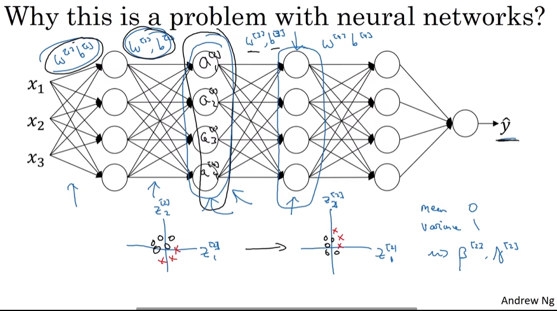
- Batch Norm as regularization
  - 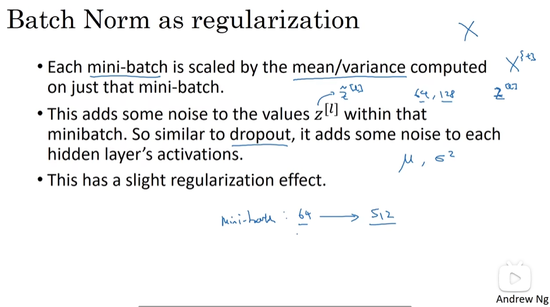

## Batch Norm at test time

- Batch Norm at test time
  - But in practice, what people usually do is implement an exponentially weighted average
  - 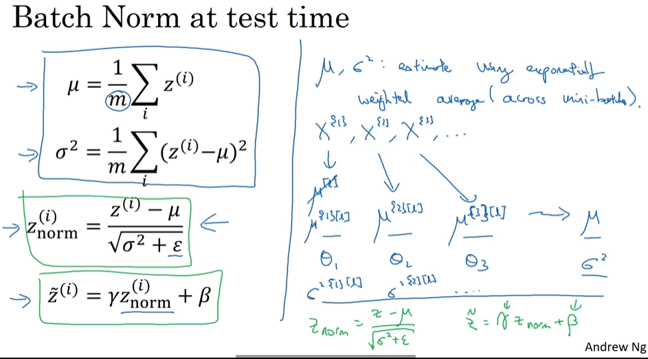

## Softmax regression

- 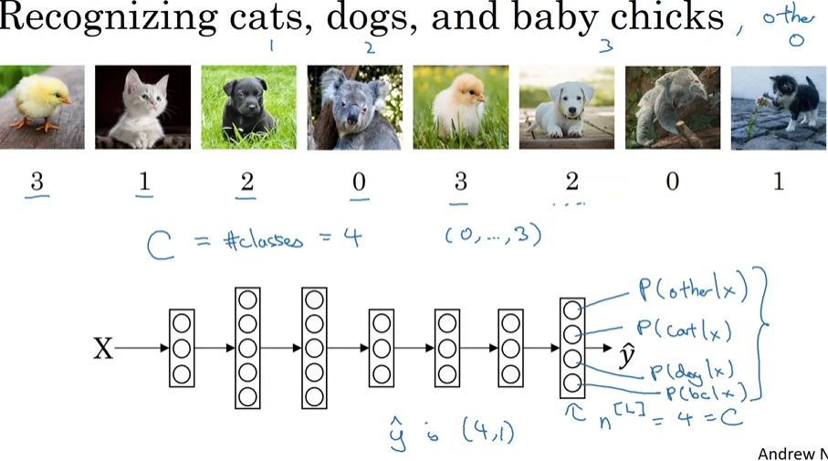
- it needs to take in a vector of input and then outputs a vector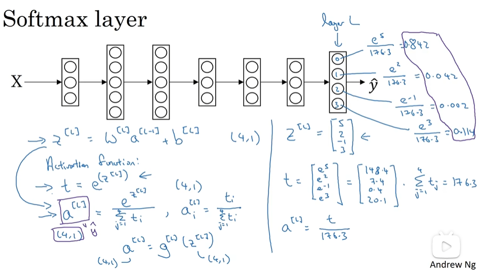
- 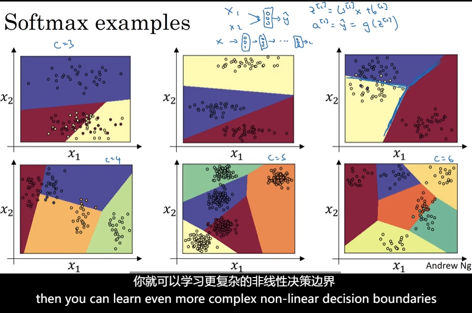
 
## Training a softmax classifier

- hard max
  - 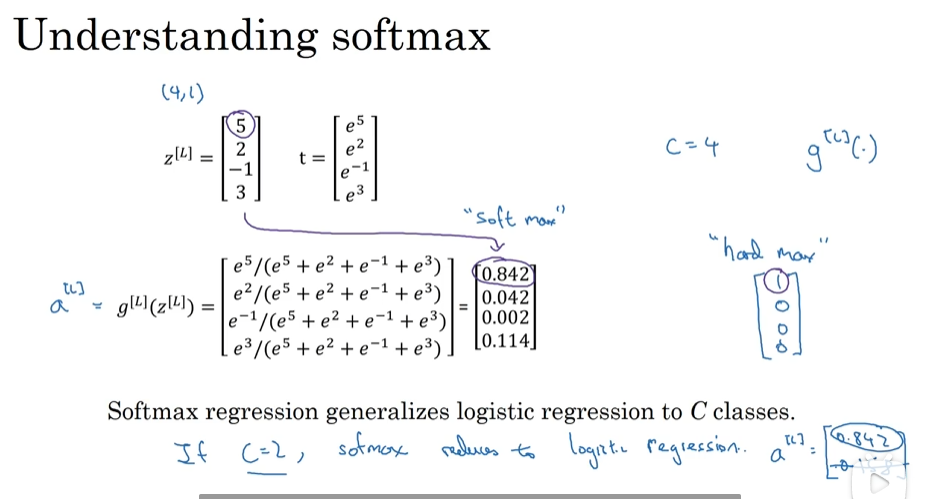
- Loss function- yes
  - 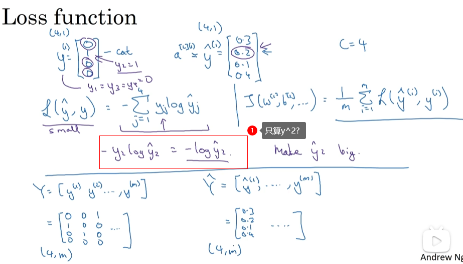
- Gradient descent with softmax
  - 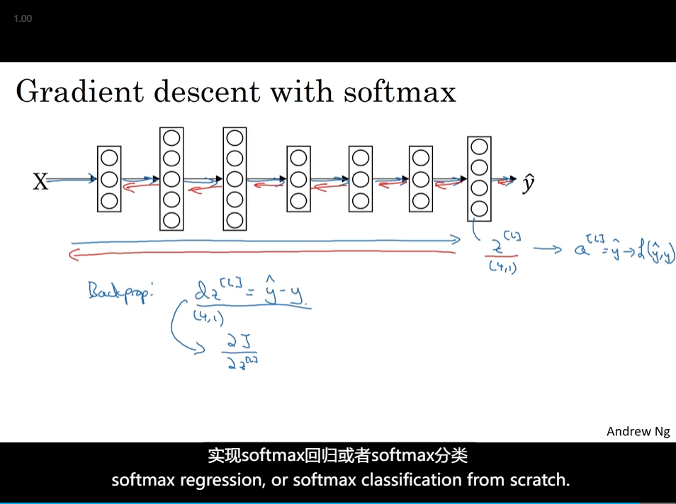