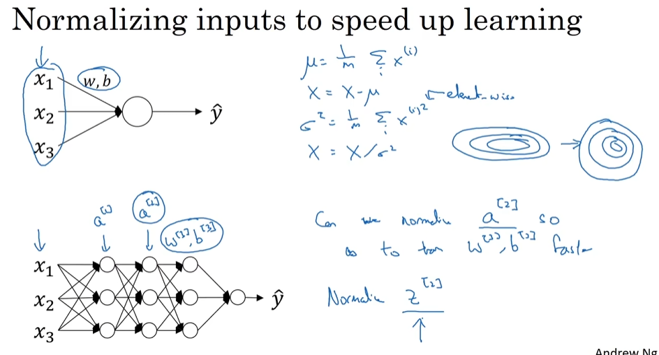

# Hyperparameter tuning

- [Hyperparameter tuning](#hyperparameter-tuning)
  - [Tuning Process](#tuning-process)
  - [Using an appropriatescale to pickhyperparameters](#using-an-appropriatescale-to-pickhyperparameters)
  - [Hyperparameters tuning in practice: Pandas vs. Caviar](#hyperparameters-tuning-in-practice-pandas-vs-caviar)
  - [Batch Normalization](#batch-normalization)
    - [Normalizing activationsin a network](#normalizing-activationsin-a-network)
    - [Fitting Batch Norminto a neural network](#fitting-batch-norminto-a-neural-network)
  - [Why doesBatch Norm work](#why-doesbatch-norm-work)
  - [Batch Norm at test time](#batch-norm-at-test-time)
  - [Softmax regression](#softmax-regression)
  - [Training a softmax classifier](#training-a-softmax-classifier)

## Tuning Process

- Important
- Try random values
- Coarse to fine

## Using an appropriatescale to pickhyperparameters

- 
- Appropriate scale for hyperparameters
- Hyperparameters for exponentially weighted averages

## Hyperparameters tuning in practice: Pandas vs. Caviar

- 

## Batch Normalization

### Normalizing activationsin a network

- Normalize Z
- So every component of Z has mean zero and variance one
- this allows you to make the hidden unit values of other **means and variances** as well.
  - 

### Fitting Batch Norminto a neural network

- Adding Batch Norm to a network
- Working with mini-batches
  - you have got to get rid of b
  - 
- Implementing gradient descent

## Why doesBatch Norm work

- it limits the amount to which updating the parameters in the earlier layers
  - 
- Batch Norm as regularization

## Batch Norm at test time

- Batch Norm at test time

## Softmax regression

- 
- it needs to take in a vector of input and then outputs a vector
- 
 
## Training a softmax classifier

- hardmax
- Loss function- yes
- Gradient descent with softmax