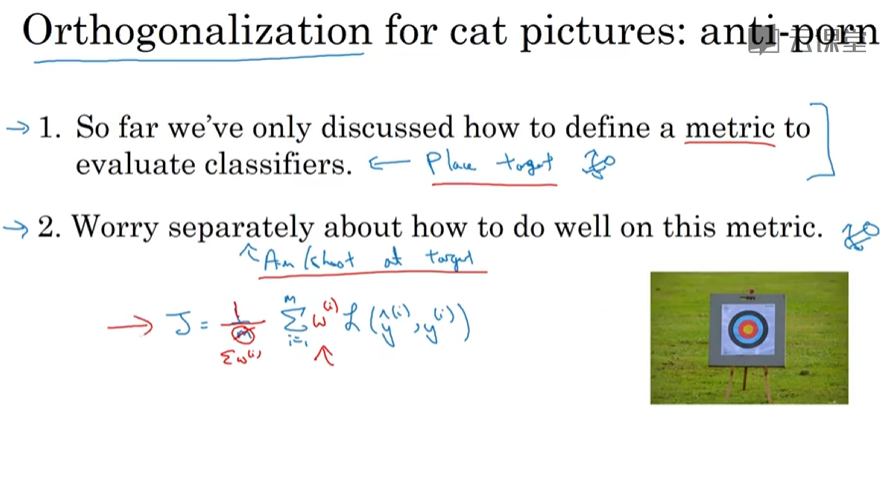

# ML Strategy

- [ML Strategy](#ml-strategy)
  - [Why](#why)
  - [Orthogonalization](#orthogonalization)
  - [Single numbere valuation metric](#single-numbere-valuation-metric)
  - [Satisficing and optimizing metrics](#satisficing-and-optimizing-metrics)
  - [Train/dev/test distributions](#traindevtest-distributions)
  - [Size of dev and test sets](#size-of-dev-and-test-sets)
  - [When to change dev/test sets and metrics](#when-to-change-devtest-sets-and-metrics)
  - [Why human-level performance?](#why-human-level-performance)
  - [Avoidable bias](#avoidable-bias)
  - [Understanding human-level performance](#understanding-human-level-performance)
  - [Surpassing human-level performance](#surpassing-human-level-performance)
  - [Improving your model performance](#improving-your-model-performance)
  - [Error Analysis](#error-analysis)
    - [Carrying out error analysis](#carrying-out-error-analysis)
    - [Cleaning up Incorrectly labeled data](#cleaning-up-incorrectly-labeled-data)
    - [Build your first system quickly then iterate](#build-your-first-system-quickly-then-iterate)
  - [Mismatched training and dev/test data](#mismatched-training-and-devtest-data)
    - [Bias and Variance with mismatched data distributions](#bias-and-variance-with-mismatched-data-distributions)
    - [Addressing data mismatch](#addressing-data-mismatch)
  - [Transfer learning](#transfer-learning)
  - [Learning from multiple tasks](#learning-from-multiple-tasks)
    - [Multi-task learning](#multi-task-learning)
  - [End-to-end deep learning](#end-to-end-deep-learning)
    - [What is end-to-end deep learning](#what-is-end-to-end-deep-learning)
    - [Whether to use end-to-end learning](#whether-to-use-end-to-end-learning)

## Why

## Orthogonalization

- 
- 

## Single numbere valuation metric

- Using a single number evaluation metric
  - 
- average
  - 

## Satisficing and optimizing metrics

- optimizing metric
- satisficing metric: running time
  - 

## Train/dev/test distributions

- dev/test sets
  - 
- Guideline
  - 

## Size of dev and test sets

- 

## When to change dev/test sets and metrics

- cat dataset example
  - 
- Orthogonalization for cat pictures
  - 
- 

## Why human-level performance?

- 
- Why compare to human-level performance

## Avoidable bias

- Difference **Bayes error** or approximation of Bayes error and **the training error** to be the avoidable bias.
- You can't actually do better than Bayes error unless you're overfitting
  - 

## Understanding human-level performance

- Human-level error as a proxy for Bayes error
  - 
- Error analysis example
  - 
- Summary of bias/variance with human,level performance
  - 

## Surpassing human-level performance

- 
- Problems where ML significantly surpasses human-level performance

## Improving your model performance

- 

## Error Analysis

### Carrying out error analysis

- 

### Cleaning up Incorrectly labeled data

- if it doesn't make a significant difference to your ability, to use the dev set to evaluate cost bias
  - 
- Correcting incorrect dev/test set examples
  - 

### Build your first system quickly then iterate

- Build your first system quicklythen iterate
  - 

## Mismatched training and dev/test data

- 
- Speech recognition example
  - 

### Bias and Variance with mismatched data distributions

- Cat classifier example
  - 
- Summary
  - degree of overfitting to dev set
  - 
- More general formulation
  - 

### Addressing data mismatch

- Addressing data mismatch
  - street numbers
  - 
- Artificial data synthesis
  - 

## Transfer learning

- what you do is initialize the last layers' weights
- And if you retrain all the parameters in the neural network,
  - then this initial phase of training on image recognition is sometimes called pre-training
  - And then if you are updating all the weights afterwards, then training on the radiology data sometimes that's called fine tuning
- 

- When transfer learning makes sense
  - 

## Learning from multiple tasks

### Multi-task learning

- Simplified autonomous driving example
  - 
- Neural network architecture
  - you would sum only over values of j with a 0 or 1 label
  - 
- When multi-task learning makes sense
  - But if you can train a big enough neural network, then multi-task learning, certainly should not or should very rarely hurt performance.
  - 

## End-to-end deep learning

### What is end-to-end deep learning

- 
- Face recognition
- Machine translation

### Whether to use end-to-end learning

- motion planning
  - 
