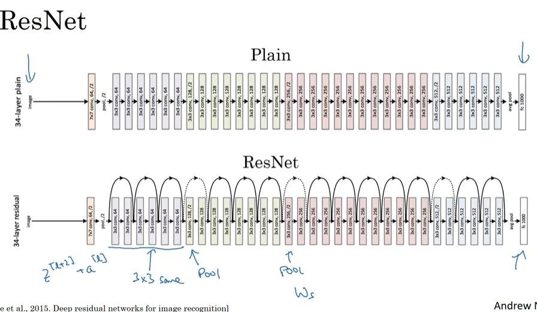

# Case Studies

- [Case Studies](#case-studies)
  - [Outline](#outline)
  - [Classic networks](#classic-networks)
  - [Residual Networks (ResNets)](#residual-networks-resnets)
  - [Why ResNets work](#why-resnets-work)
  - [Network in Network and 1x1 convolutions](#network-in-network-and-1x1-convolutions)
  - [Inception network motivation](#inception-network-motivation)
  - [Inception network](#inception-network)
  - [Using open-source implementations](#using-open-source-implementations)
  - [Transfer Learning](#transfer-learning)
  - [Data augmentation](#data-augmentation)
  - [The state of computer vision](#the-state-of-computer-vision)

## Outline

- 

## Classic networks

- LeNet - 5（3
  - 
- AlexNet（1
  - 
- VGG - 16（2
  - 

## Residual Networks (ResNets)

- Residual block(skip connection(use Relu)
  - 
  - 

## Why ResNets work

- it's so easy for these extra layers **to\no to** learn the identity function, that you are kind of guaranteed that it doesn't hurt performance
- $z^l+2$ and $a^l$ have the same dimension
  - 当wx+b>0时，通常神经元会被激活，产生一个非零的输出，表示神经元"学到了东西"，即它对输入数据中的某些模式或特征产生了响应。
  - 
- 

## Network in Network and 1x1 convolutions

- Network in Network
  - 
- Using 1x1 convolutions
  - 
  - 

## Inception network motivation

- Motivation for inception network
  - 
- The problem of computational cost
  - 
- Bottle neck layer
  - 

## Inception network

- Inception module
  - 
- Inception network
  - 

## Using open-source implementations

## Transfer Learning

- Transfer Learning
  - 

## Data augmentation

- Common augmentation method
  - 
- Color shifting
  - 
-  run in parallel
   -  

## The state of computer vision

- Data vs.hand-engineering
  - 
- Tips for doing well on benchmarks/winning competitions
  - 
- Use open source code
  - 