# 专业英语

- [专业英语](#专业英语)
  - [01](#01)
  - [02](#02)
  - [03](#03)
  - [04](#04)
  - [05](#05)
  - [06](#06)
  - [07](#07)
  - [08](#08)
  - [09](#09)
  - [10](#10)

## 01

- word
  - 

- sentence

- 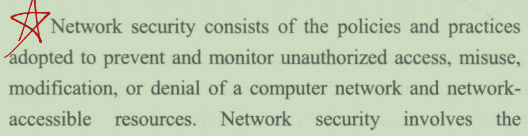
- 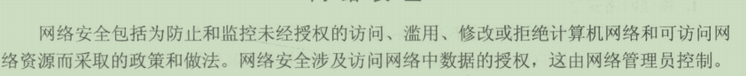

- 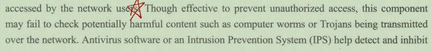
- 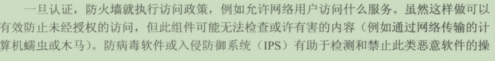

- 
- 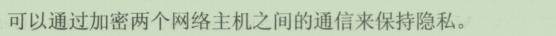

- 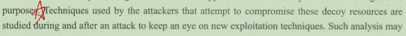
- 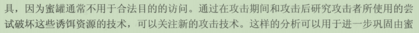

- 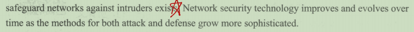
- 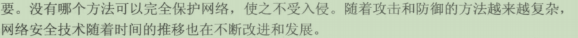

- 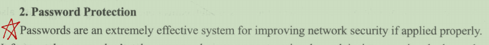
- 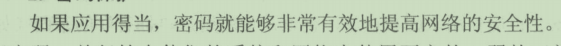

## 02

- word
  - 
  - 
  - 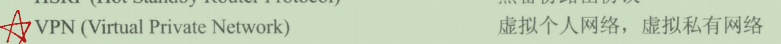
- sentense
  - 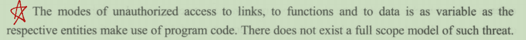
  - 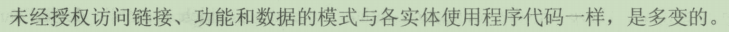

## 03

- word
  - 
- sentense
  - 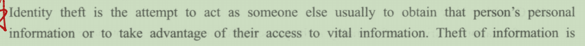
  - 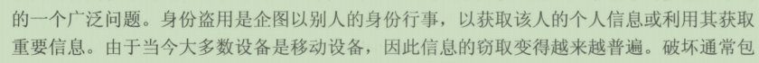
  - 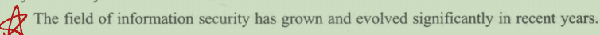
  - 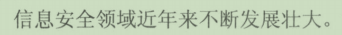
  - 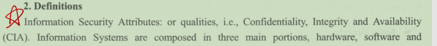
  - 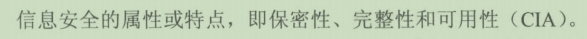
  - 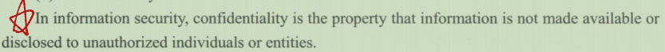
  - 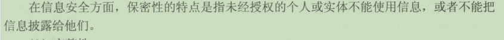
  - 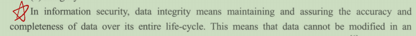
  - 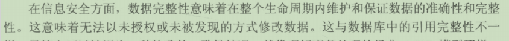

## 04

- words
  - 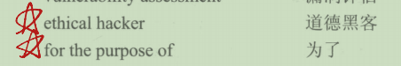
  - 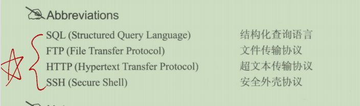
- sentense
  - 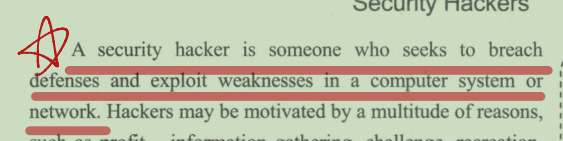
  - 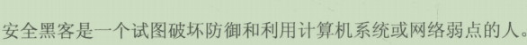
  - 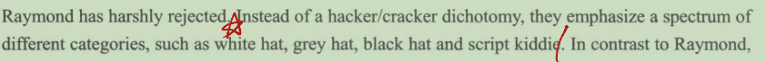
  - 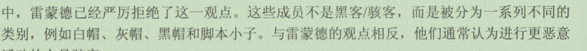
  - 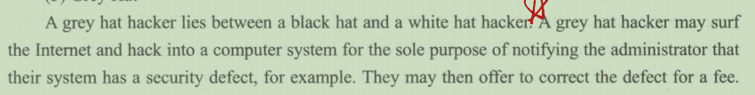
  - 灰帽子黑客位于黑帽子和白帽子黑客之间
  - 
  - 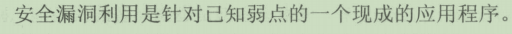
  - 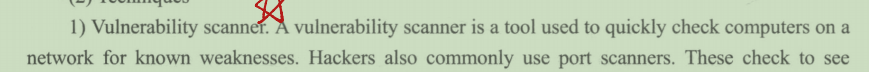
  - 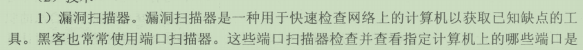

## 05

- words
  - 
  - 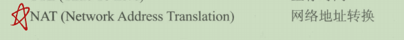
  - 
- sentense
  - 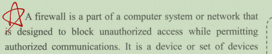
  - 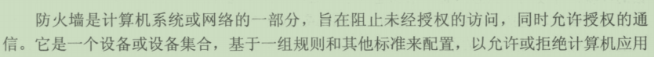
  - 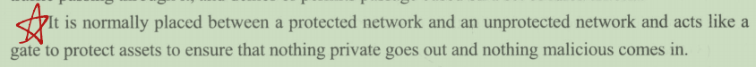
  - 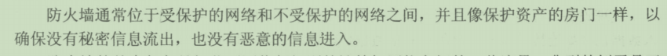
  - 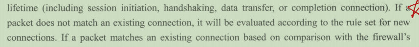
  - 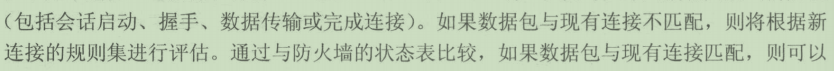
  - 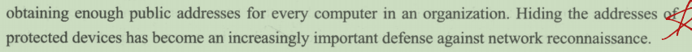
  - 隐藏地址保护设备已成为抵御网络侦察的一种越来越重要的防御手段。

## 06

- words
  - 
  - 
- sentense
  - 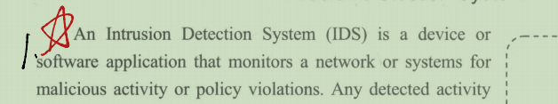
  - 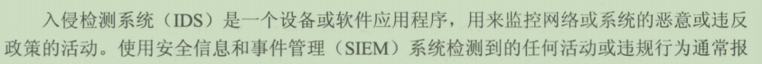
  - 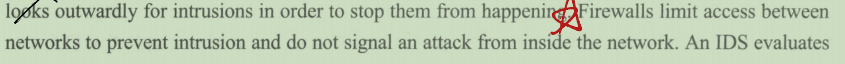
  - 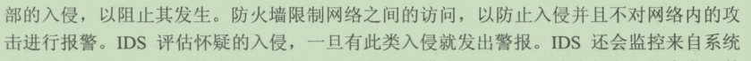
  - 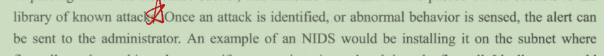
  - 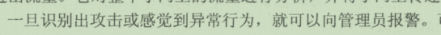
  - 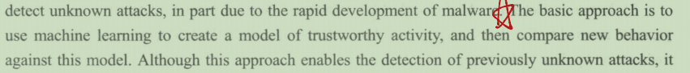
  - 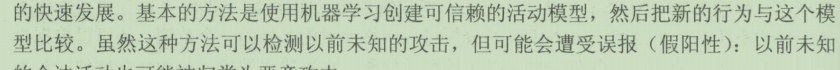
  - 
  - 

## 07

- words
  - 
- sentenses
  - 
  - 
  - 
  - 
  - 
  - 
  - 
  - 
  - 
  - 
  - 
  - 

## 08

- words
  - 
  - 
  - The binding is established through a process of registration and issuance of certificates at and by a Certificate Authority (CA)
  - 通过在证书颁发机构（CA）**注册和颁发证书**的过程来建立绑定
  - 
  - 
  - 
  - 
  - 
  - 

## 09

- words
  - 
  - 
  - 
- sentenses
  - 
  - 
  - 
  - 
  - 
  - 

## 10

- words
  - 
- sentenses
  - 
  - 
  - 
  - 
  - 
  - 
