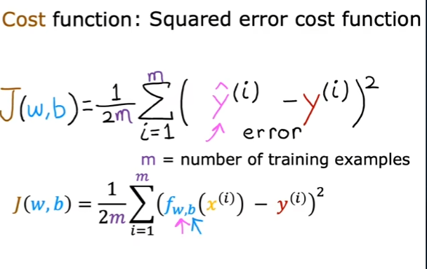

# ML

- [ML](#ml)
  - [Superised Learning](#superised-learning)
  - [Unsperised Leaning](#unsperised-leaning)
  - [线性回归(linear regression)](#线性回归linear-regression)
  - [代价函数](#代价函数)
  - [Gradient descent（梯度下降](#gradient-descent梯度下降)
  - [Multiple features(variables)](#multiple-featuresvariables)
  - [Vectorization](#vectorization)
  - [用于多元线性回归的梯度下降法](#用于多元线性回归的梯度下降法)
  - [Feature Scaling](#feature-scaling)
  - [## Choosing the Learning Rate](#-choosing-the-learning-rate)
  - [Feature Engineering](#feature-engineering)
  - [Polynomial Regression](#polynomial-regression)
  - [Logistic Regression](#logistic-regression)
  - [Decision boundary](#decision-boundary)
  - [Cost function in logistic regression](#cost-function-in-logistic-regression)
  - [simplified Loss function](#simplified-loss-function)
  - [Gradient Descent](#gradient-descent)
  - [The Problem of Overfitting](#the-problem-of-overfitting)

## Superised Learning

- the data comes with both inputs x and input lables y

1. Regression
   1. Predict a number **infinitely** many possible outputs
2. Classification
   1. predict categories

## Unsperised Leaning

- Find something interesting in unlabeled data.
- the data comes only with inputs x

1. Clustering
   1. Group similar datapoints together.
2. Dimensionality reduction
   1. Compress data using fewer numbers.
3. Anomaly detection
   1. Find unusual data points.

## 线性回归(linear regression)

- Notation:

  1. x ="input" variable;feature
  2. y ="output" variable;"target" variable
  3. m = number of training examples

1. y-hat: the estimated value of y
2. Model:$f_w,b(x)=wx+b$
   1. w,b:
      1. parameters
      2. cofficients
      3. weight

## 代价函数



## Gradient descent（梯度下降


- Alpha, is the **learning rate**.


- too small or too large


- batch gradient descent

why $\frac{(ax+b-y)^2}{dx} = 2(ax+b-y)x$

## Multiple features(variables)

- 

- $x_j$ = $j^{th}$ feature
- $n =$ number of featuresn
- $x^{(i)} =$ features of $i^{th}$ training example
- $x_j^{i}$ = value of feature $j$ in $i^{th}$ training example

- multiple linear regression
  - 

## Vectorization

```python
f = np.dot(w,x)+b

w = [w1,w2...wn]
d = [d1,d2...dn]

w = w - 0.1 *d
```

## 用于多元线性回归的梯度下降法

- 

## Feature Scaling

- Mean normalization
- Z-score normalization

- leaning curve
  - 

## ## Choosing the Learning Rate

- Debug trick: With a small enough a, J(w, b) should decrease on every iteration
- how to choose
  - pick the largest possible learning rate
  - or just something slightly smaller than the largest reasonable value

## Feature Engineering

- Using intuition to design new features, by transforming or combining original features.

## Polynomial Regression

## Logistic Regression

- sigmoid function(Logistic regression)
  - $g(z) = \frac{1}{1+e^{-z}}, 0<g(z)<1$
  - 
- f
  - 

## Decision boundary

- 
- 

## Cost function in logistic regression

- logistic Loss function
  - y = 0
  - y = 1

## simplified Loss function

- 
- 

## Gradient Descent

- 

## The Problem of Overfitting

- 

- over-fit = high-variance
- underfit = high-bias

- ⭐⭐⭐⭐Z如何创造这样的曲线
