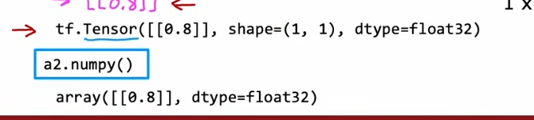

# Neural Network

- [Neural Network](#neural-network)
  - [Demand Prediction](#demand-prediction)
  - [Neural Networks Intuition](#neural-networks-intuition)
  - [Neural network model](#neural-network-model)
  - [forward propagation](#forward-propagation)
  - [Datain TensorFlow](#datain-tensorflow)
  - [Building a neural network](#building-a-neural-network)
  - [Forward prop in NumPy](#forward-prop-in-numpy)
  - [Train a Neural Network in TensorFlow](#train-a-neural-network-in-tensorflow)
  - [Activation Functions](#activation-functions)
    - [Sigmoid激活函数的替代方案](#sigmoid激活函数的替代方案)
    - [Choosing activation functions](#choosing-activation-functions)
  - [why need activation functions](#why-need-activation-functions)
  - [multiclass classification problem](#multiclass-classification-problem)
    - [softmax](#softmax)
    - [Neural Network with Softmax output](#neural-network-with-softmax-output)
    - [Multi-labelClassification](#multi-labelclassification)
  - [Advanced Optimization](#advanced-optimization)
  - [Additional Layer Types](#additional-layer-types)
  - [derivative](#derivative)
  - [Computation Graph](#computation-graph)

## Demand Prediction

- Demand Prediction
- neural network
- Multiple hidden layers

## Neural Networks Intuition

- 

## Neural network model

## forward propagation

- 

## Datain TensorFlow

1. Note about numpy arrays
2. difference

## Building a neural network

- 
- 

## Forward prop in NumPy

- 

## Train a Neural Network in TensorFlow

- 
- 

## Activation Functions

### Sigmoid激活函数的替代方案

### Choosing activation functions

- 
- 

## why need activation functions

- a linear function of a linear function is itself a linear function.

## multiclass classification problem

### softmax

- 
- cost

### Neural Network with Softmax output

- 
- 
- More numerically accurate.
- No longer a1...a10

### Multi-labelClassification

- 
- 

## Advanced Optimization

- Adam Algorithm Intuition
- in Code

## Additional Layer Types

- Convolutional Layer
- example

## derivative

- 

## Computation Graph

- 
- Neural Network example
- efficient
