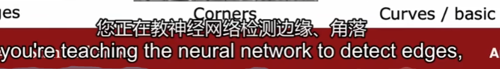
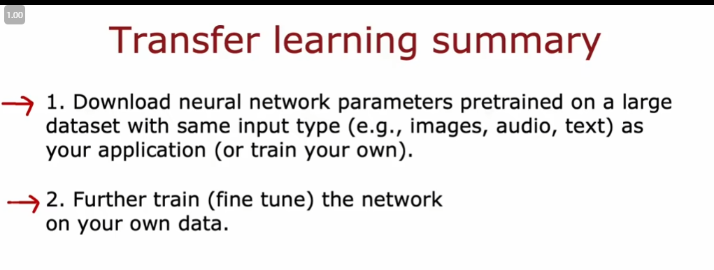
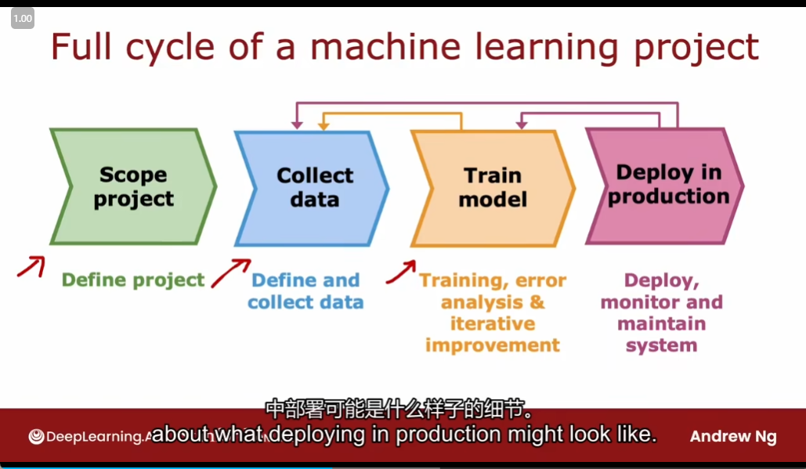
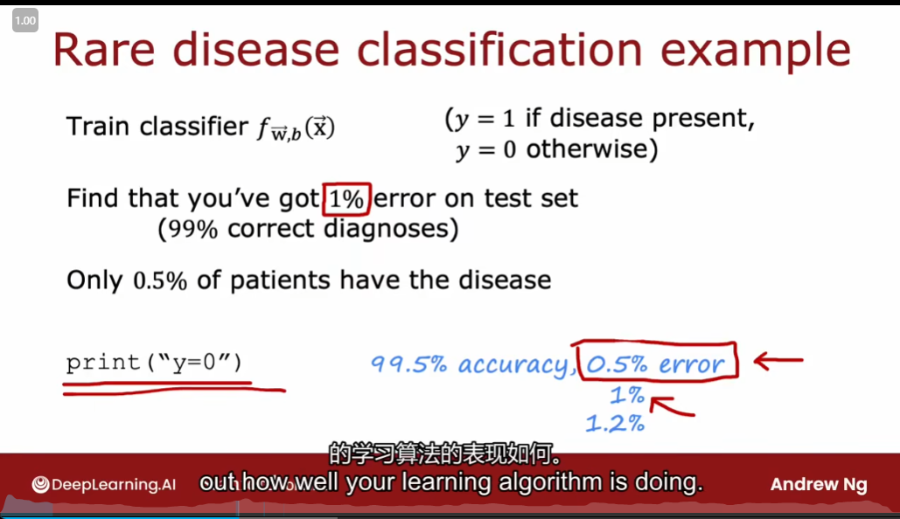
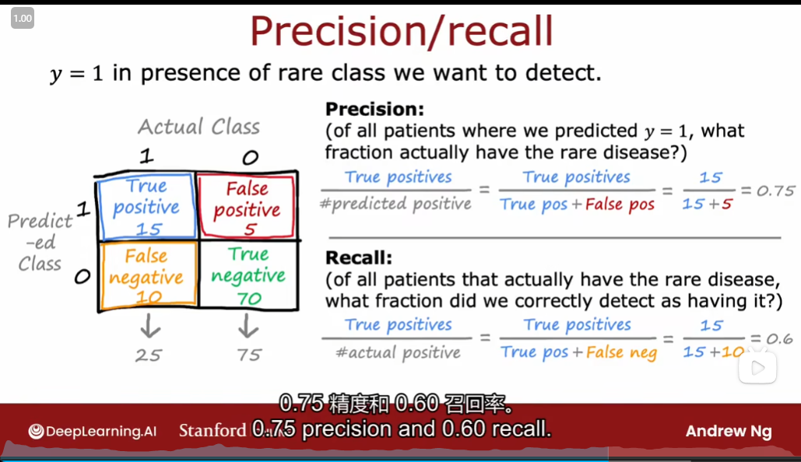
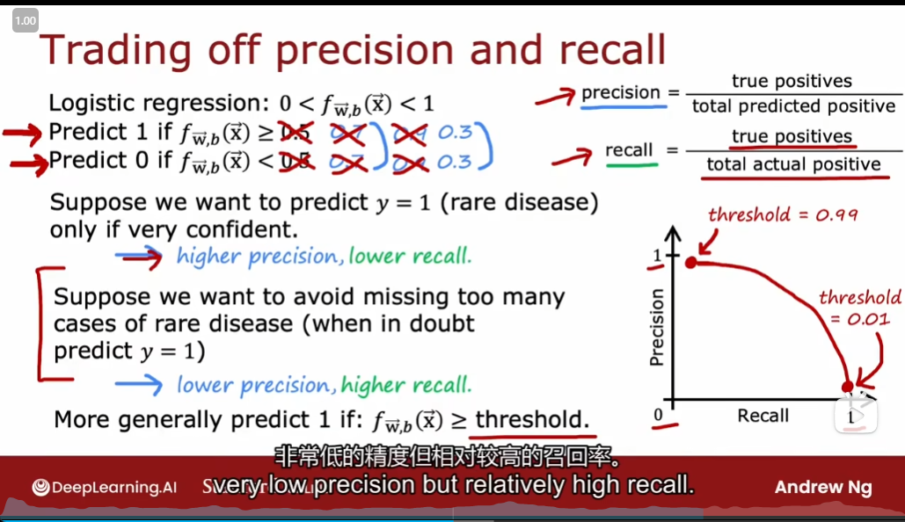
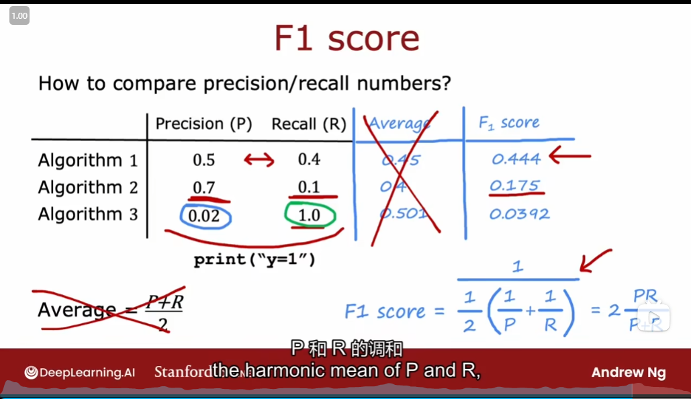

# Deciding what to try next

- [Deciding what to try next](#deciding-what-to-try-next)
  - [question](#question)
  - [Evaluating a model](#evaluating-a-model)
  - [Model selection and training/cross validation/test sets](#model-selection-and-trainingcross-validationtest-sets)
  - [Diagnosing bias and variance](#diagnosing-bias-and-variance)
    - [Learning Curves](#learning-curves)
  - [Deciding what to try next for bias and variance](#deciding-what-to-try-next-for-bias-and-variance)
  - [Bias/variance and neural networks](#biasvariance-and-neural-networks)
  - [Machine learning development process](#machine-learning-development-process)
  - [Error analysis](#error-analysis)
  - [Adding data](#adding-data)
  - [Transfer learning: using datafrom a different task](#transfer-learning-using-datafrom-a-different-task)
  - [Full cycle ofamachine learning project](#full-cycle-ofamachine-learning-project)
  - [Error metrics for skewed datasets](#error-metrics-for-skewed-datasets)
  - [Trading off precision and recall](#trading-off-precision-and-recall)

## question

⭐⭐⭐⭐

- 
- 

## Evaluating a model

- Train/test procedure for linear regression (with squared error cost)
  - 
  - Train/test
- Train/test procedure for classification problem

## Model selection and training/cross validation/test sets

- Cross-validation: that this is an extra dataset that we're going to use to check or trust check the validity or really the accuracy of different models.

  

- choosing a neural network architecture
  - 
  - 

## Diagnosing bias and variance

- bias and variance
- high bias and variance
- exmaple

### Learning Curves

- 
- High bias
- High Variance

## Deciding what to try next for bias and variance

- 

## Bias/variance and neural networks

- 
- It hardly ever hurts to have a larger neural network so long as you regularize appropriately.
- Neural network regularization

## Machine learning development process

- Iterative loop of ML development
- Example: Buiding a spam classifier
  - 
  - 

## Error analysis

- 

## Adding data

- Data augmentation
  - 
  - 
- Data augmentation by introducing distortions
  - 
- Data synthesis
  - 

## Transfer learning: using datafrom a different task

- 
- 

## Full cycle ofamachine learning project

- 
- 

## Error metrics for skewed datasets

- 
- 

## Trading off precision and recall

- 
- F1 score
