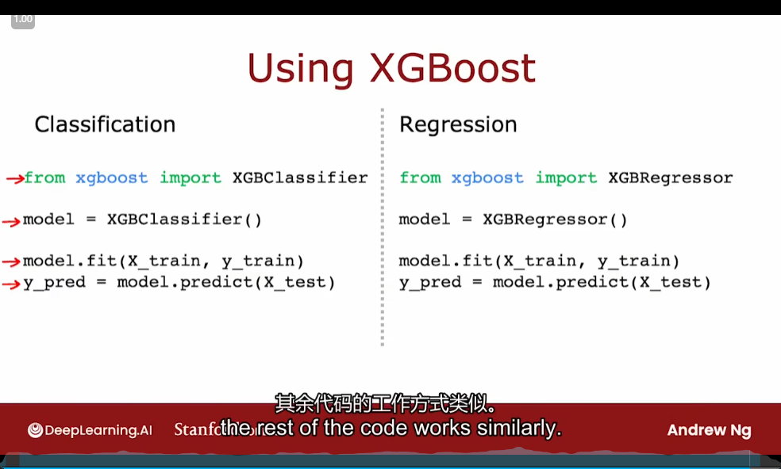

# 4. Decision Tree Model

- one example
- pick one

## Learning Process

1. 
2. 

## Measuring purity

- Entropy as a measure of impurity
  - 
  - 

## Choosing a split: information Gain

- information Gain
  - 
  - 

## Decision Tree Learning

- 
- 

## Using one-hot encoding ofcategorical features

- 
- 

## Splitting on a continuous variable

## Regression Trees (optional)

- 

## Using multiple decision trees

- 
- 

## Sampling with replacement

## Random forest algorithm

## XGBoost

- XGBoost (extreme Gradient Boosting)
  - 

## When to use decision trees

- 
