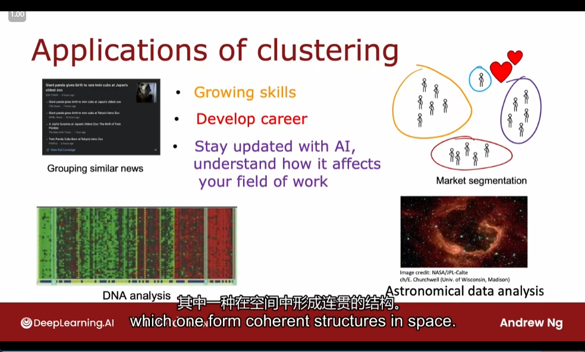
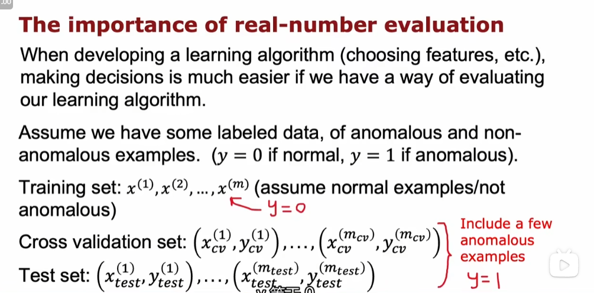
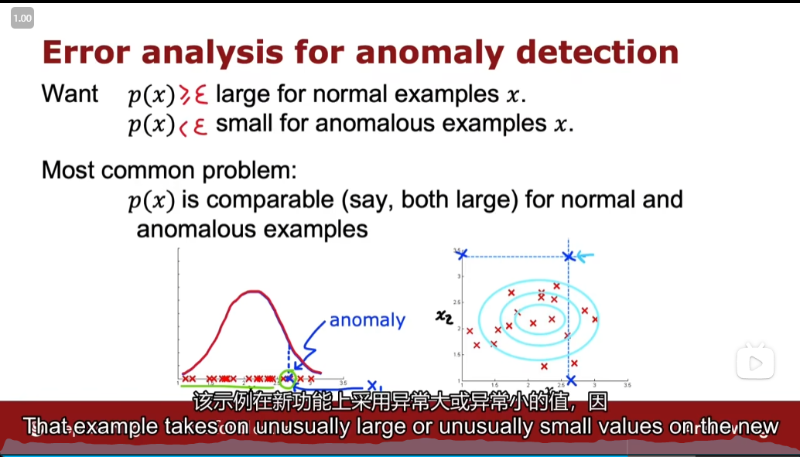
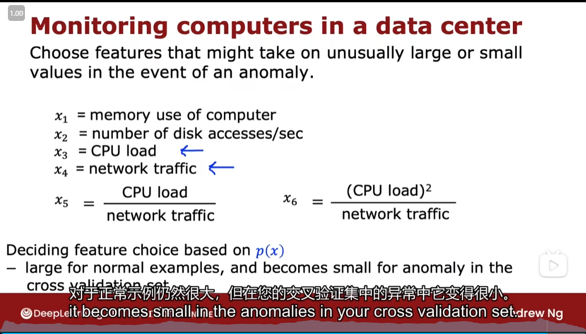

# Unsupervised Learning ,Recommender Systems and Reinforcement Learning

- [Unsupervised Learning ,Recommender Systems and Reinforcement Learning](#unsupervised-learning-recommender-systems-and-reinforcement-learning)
  - [Clustering](#clustering)
  - [k-means](#k-means)
  - [K-means algorithm](#k-means-algorithm)
  - [Optimization objective](#optimization-objective)
  - [Initializing K-means](#initializing-k-means)
  - [Choosing thenumber of clusters](#choosing-thenumber-of-clusters)
  - [Anomaly Detection](#anomaly-detection)
    - [Finding unusualevents](#finding-unusualevents)
    - [Gaussian (Normal) Distribution](#gaussian-normal-distribution)
    - [Developing and evaluating an anomaly detection system](#developing-and-evaluating-an-anomaly-detection-system)
    - [Anomaly detection vs. supervised learning](#anomaly-detection-vs-supervised-learning)
    - [Choosing what features to use](#choosing-what-features-to-use)

## Clustering

## k-means

- Step1
- Step2

## K-means algorithm

- 
- example
  - 

## Optimization objective

- 

## Initializing K-means

- 
- 

## Choosing thenumber of clusters

- 
- 

## Anomaly Detection

### Finding unusualevents

- 
- 

### Gaussian (Normal) Distribution

- example

### Developing and evaluating an anomaly detection system

- real-number evalution
- Aircraft engines monitoring example
  - 
  - 
 
### Anomaly detection vs. supervised learning

- 
- example
  - 

### Choosing what features to use

- Non-gaussian features
- Error analysis for anomaly detection
- Monitoring computers in a data center
