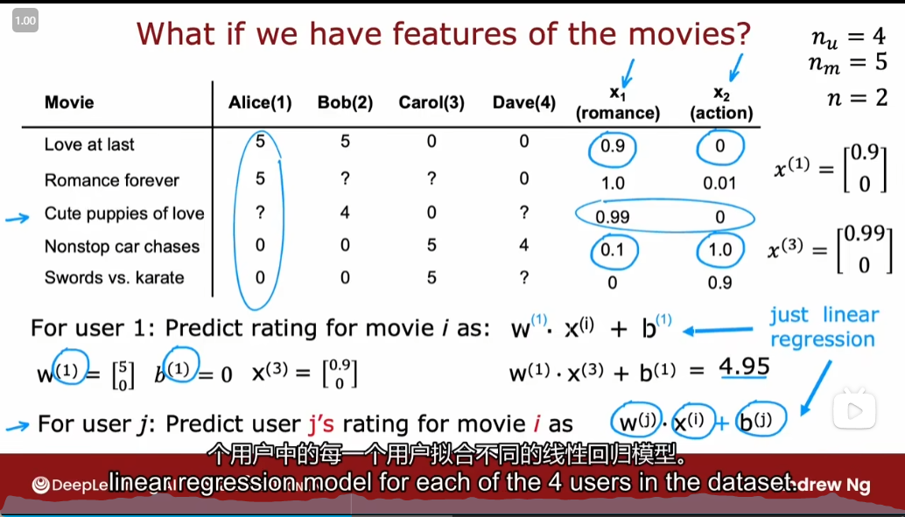
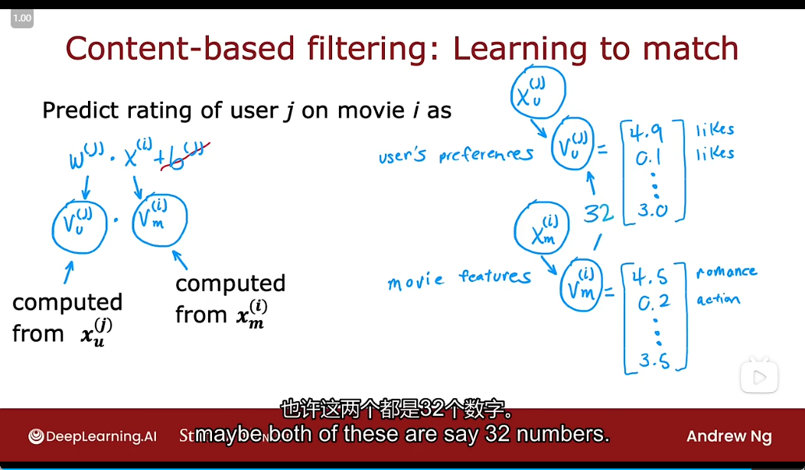

# Recommender System

- [Recommender System](#recommender-system)
  - [Making recommendations](#making-recommendations)
  - [Collaborative Filtering](#collaborative-filtering)
    - [Using per-item features](#using-per-item-features)
    - [Collaborative filtering algorithm](#collaborative-filtering-algorithm)
    - [Binary labels:favs，likes and clicks](#binary-labelsfavslikes-and-clicks)
    - [Mean normalization](#mean-normalization)
  - [TensorFlow implementation](#tensorflow-implementation)
  - [Finding related items](#finding-related-items)
  - [imitations of Collaborative Filtering](#imitations-of-collaborative-filtering)
  - [Collaborative filtering VS Content-based filtering](#collaborative-filtering-vs-content-based-filtering)
  - [Deep learning forcontent-based filtering](#deep-learning-forcontent-based-filtering)
  - [Recommending from a large catalogue](#recommending-from-a-large-catalogue)
  - [TensorFlow Implementation](#tensorflow-implementation-1)

## Making recommendations

- some signs

## Collaborative Filtering

- because multiple users have rated the same movie **collaboratively**, given you a sense of what this movie maybe like, that allows you to guess what are appropriate features for that movie, and this in turn allows you to predict how other users that haven't yet rated that same movie, may decide to rate it in the future

### Using per-item features

- 
- signs
- for each of the nu users

### Collaborative filtering algorithm

- 
- 
- 

### Binary labels:favs，likes and clicks

- 
- 
- 

### Mean normalization

- 

## TensorFlow implementation

- Custom Training Loop
  - 
- 

## Finding related items

- 

## imitations of Collaborative Filtering

- 

## Collaborative filtering VS Content-based filtering

- 
- Examples of user and item features
  - 
- Learning to match
  - 

## Deep learning forcontent-based filtering

- 
- 
- 

## Recommending from a large catalogue

- 
- 
- 
- 

## TensorFlow Implementation

- 
