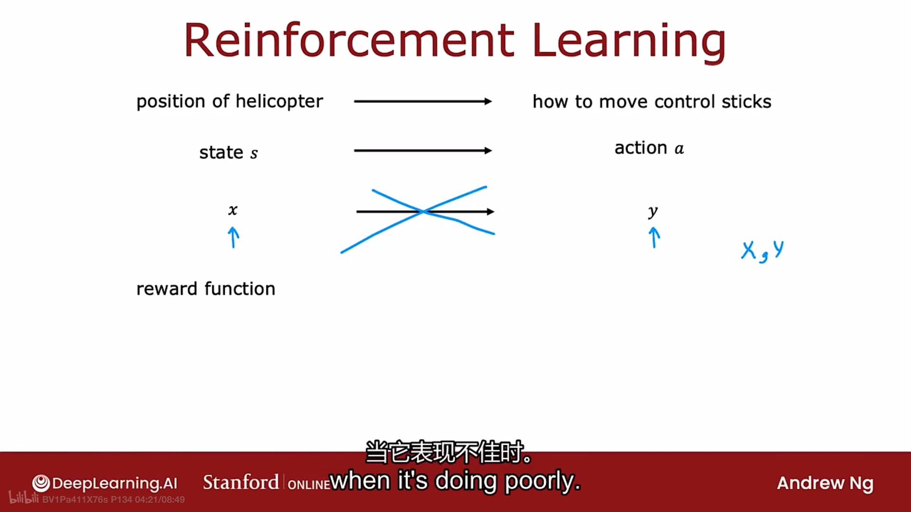
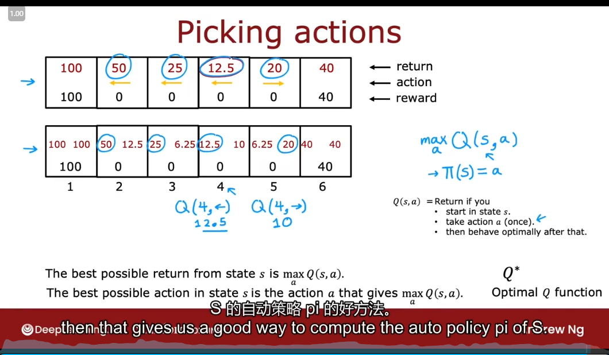
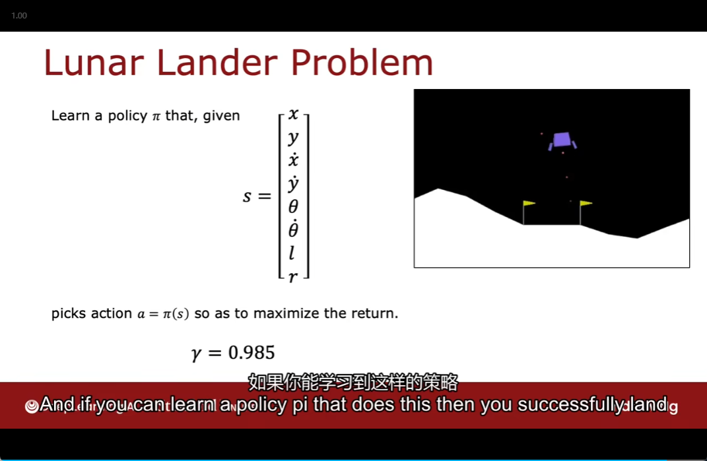

# 7. Reinforcement Learning

- [7. Reinforcement Learning](#7-reinforcement-learning)
  - [Reinforcement Learning Introduction](#reinforcement-learning-introduction)
  - [Mars rover example](#mars-rover-example)
  - [The Return in reinforcement learning](#the-return-in-reinforcement-learning)
  - [Making decisions: Policies in reinforcement learning](#making-decisions-policies-in-reinforcement-learning)
  - [Review of key concepts](#review-of-key-concepts)
  - [State-action value function definition](#state-action-value-function-definition)
  - [State-action value function example](#state-action-value-function-example)
  - [Bellman Equation](#bellman-equation)
  - [Random(stochastic) environment(Optional)](#randomstochastic-environmentoptional)
  - [Example of continuousstate application](#example-of-continuousstate-application)
  - [Lunar Lander](#lunar-lander)
  - [Learning the state-value function](#learning-the-state-value-function)
  - [Algorithm refinement](#algorithm-refinement)
    - [Improved neural network Architecture](#improved-neural-network-architecture)
    - [$\\epsilon$-greedy policy](#epsilon-greedy-policy)
    - [Mini-batch and soft update](#mini-batch-and-soft-update)
    - [The state of reinforcement learning](#the-state-of-reinforcement-learning)

## Reinforcement Learning Introduction

- 
- 

## Mars rover example

- 

## The Return in reinforcement learning

- 

- Theo return you get depends on the rewards
- and ther rewards depends on the actions you take
- andt so the return depends on the actions you take

- 

## Making decisions: Policies in reinforcement learning

- 

## Review of key concepts

- 
- MDP

## State-action value function definition

- 
- 

## State-action value function example

- 

## Bellman Equation

- 
- 
- explanation
  - 
  - 

## Random(stochastic) environment(Optional)

- 
- 

## Example of continuousstate application

- 
- 

## Lunar Lander

- 
- 

## Learning the state-value function

- 
- 
- Deep Q-Network
  - 

## Algorithm refinement

### Improved neural network Architecture

- 

### $\epsilon$-greedy policy

- 

### Mini-batch and soft update

- Mini-batch
  - 
  - 
  - 
  - 
- soft update
  - 

### The state of reinforcement learning
