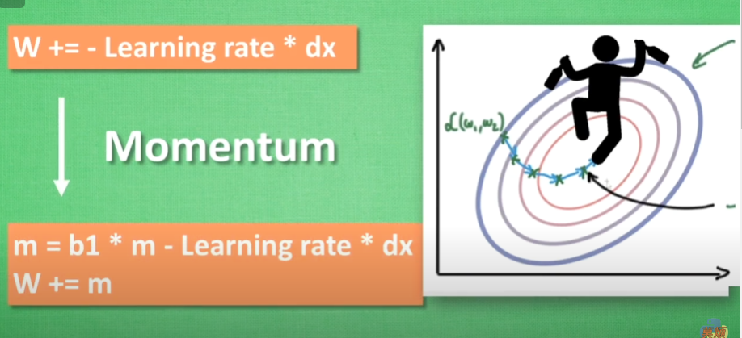

# intruduce 

- [intruduce](#intruduce)
  - [word](#word)
  - [Variable](#variable)
  - [Activation Function 激励函数](#activation-function-激励函数)
  - [regression](#regression)
  - [Classification](#classification)
  - [保持提取](#保持提取)
  - [批训练](#批训练)
  - [Speed up neural network training process](#speed-up-neural-network-training-process)
  - [Optimizer 优化器](#optimizer-优化器)
  - [What is Convolutional Neural Networks](#what-is-convolutional-neural-networks)

pip install matplotlib -i https://pypi.tuna.tsinghua.edu.cn/simple matplotlib

## word

- back propagation误差反向传递？
  - 误差计算：根据前向传播的输出和实际目标之间的差异，计算损失函数的梯度。这个梯度表示了神经网络预测的误差。

- 张量（tensor）是一个多维数组，类似于矩阵，但可以具有任意数量的维度。张量是这些领域中最基本的数据结构之一，用于存储和表示数据，以及进行各种数学运算。

    下面是一些关于张量的基本概念：

    维度（Rank）： 张量的维度通常被称为"秩"（rank），表示张量的阶数或维度的数量。例如，一个一维张量是一个向量，二维张量是一个矩阵，而三维或更高维度的张量可以包含更多的数据。

    形状（Shape）： 张量的形状表示每个维度的大小。例如，一个形状为 (3, 4) 的二维张量表示一个 3x4 的矩阵，其中有 3 行和 4 列。

    数据类型（Data Type）： 张量可以包含不同的数据类型，例如整数、浮点数、布尔值等。不同的数据类型适用于不同类型的问题和计算。

    元素（Element）： 张量中的每个数值称为一个元素。元素的值可以存储数据，如图像像素、权重、偏差等

## Variable

```py
import torch
import numpy as np

# 创建数据
np_data = np.arange(6).reshape((2, 3))

# numpy to tensor
torch_data = torch.from_numpy(np_data)
# tensor to numpy
tensor2array = torch_data.numpy()

print('\nnumpy\n', np_data,
      '\ntorch\n', torch_data,
      '\ntensor2array\n', tensor2array)

# abs

# numpy格式
data = [-1, -2, 1, 2]
# 转torch
tensor = torch.FloatTensor(data)  # 32bit

print(np.abs(data))
print(torch.abs(tensor))

# matrix

data = [[1, 2], [3, 4]]
tensor = torch.FloatTensor(data)# 32-bit floating point

print('\nnumpy:', np.matmul(data, data),
      '\ntorch:', torch.mm(tensor, tensor))
```

```py
import torch
from torch.autograd import Variable

# Variable in torch is to build a computational graph,
# but this graph is dynamic compared with a static graph in Tensorflow or Theano.
# So torch does not have placeholder, torch can just pass variable to the computational graph.

tensor = torch.FloatTensor([[1, 2], [3, 4]])  # build a tensor
variable = Variable(tensor, requires_grad=True)  # build a variable, usually for compute gradients

# v_out = 1/4 * sum(variable*variable)
v_out = torch.mean(variable*variable)   # x^2
v_out.backward()  # backpropagation from v_out

# the gradients w.r.t the variable, d(v_out)/d(variable) = 1/4*2*variable = variable/2
# 问题：⭐mean的作用呢？ 求导为什么是1/n?
print(variable.grad)
print(variable.data)  # tensor形式
print(variable.data.numpy())  # numpy形式
```

## Activation Function 激励函数

```py
import torch
import torch.nn.functional as F
from torch.autograd import Variable
import matplotlib.pyplot as plt

# fake data
x = torch.linspace(-5, 5, 200)  # x data (tensor), shape=(200,)
x = Variable(x)
x_np = x.data.numpy()   # numpy array for plotting

# following are popular activation functions
y_relu = torch.relu(x).data.numpy()
y_sigmoid = torch.sigmoid(x).data.numpy()
y_tanh = torch.tanh(x).data.numpy()
y_softplus = F.softplus(x).data.numpy() # there's no softplus in torch
# y_softmax = torch.softmax(x, dim=0).data.numpy() softmax is a special kind of activation function, it is about probability
```

- 
  - `x = torch.linspace(-5，5，200)`

    这行代码使用 PyTorch 创建了一个张量 x，其中包含了从 -5 到 5 的 200 个等间隔值。具体来说，这行代码执行了以下操作：

    torch.linspace(start, end, steps) 创建一个张量，包含从 start 到 end 之间的 steps 个等间隔的值。
    在你的代码中，start 设置为 -5，end 设置为 5，steps 设置为 200。
    因此，x 包含了从 -5 到 5 之间的 200 个等间隔值，用于表示一个连续的数值范围。

- (200,) 表示一个包含200个元素的一维张量。这是一个扁平的张量，其中的元素**排成一行**，没有额外的维度。这种形状通常用于表示一维数据或向量。
  - (200, 1) 表示一个包含200个元素的二维张量，其中有一个维度为1。这可以被看作是一个**列向量，每个元素位于不同的行**，而列数为1。这种形状通常用于表示多个单变量数据点或作为神经网络的输入。

```py
x = torch.linspace(1, 10, 10)
print(x)
tensor([ 1.,  2.,  3.,  4.,  5.,  6.,  7.,  8.,  9., 10.])
```

## regression

```py
"""
View more, visit my tutorial page: https://mofanpy.com/tutorials/
My Youtube Channel: https://www.youtube.com/user/MorvanZhou

Dependencies:
torch: 0.4
matplotlib
"""
import torch
import torch.nn.functional as F
import matplotlib.pyplot as plt

# torch.manual_seed(1)    # reproducible

# 使用 torch.unsqueeze(..., dim=1) 用于维度扩展的主要目的是将原始张量的形状从一维张量（一维数组）变为二维张量，其中的值排列在一个列向量中
x = torch.unsqueeze(torch.linspace(-1, 1, 100), dim=1)  # x data (tensor), shape=(100, 1)
y = x.pow(2) + 0.2*torch.rand(x.size())                 # noisy y data (tensor), shape=(100, 1)

# torch can only train on Variable, so convert them to Variable
# The code below is deprecated in Pytorch 0.4. Now, autograd directly supports tensors
# x, y = Variable(x), Variable(y)

# plt.scatter(x.data.numpy(), y.data.numpy())
# plt.show()

# 这行代码定义了一个名为 Net 的类，它继承自 torch.nn.Module，这是 PyTorch 中用于构建神经网络模型的基类。
class Net(torch.nn.Module):
    def __init__(self, n_feature, n_hidden, n_output):
        # super(Net, self).__init__()：这一行调用父类 torch.nn.Module 的构造函数，确保正确初始化神经网络。
        super(Net, self).__init__()

        self.hidden = torch.nn.Linear(n_feature, n_hidden)   # hidden layer
        self.predict = torch.nn.Linear(n_hidden, n_output)   # output layer

    def forward(self, x):
        x = F.relu(self.hidden(x))      # activation function for hidden layer
        x = self.predict(x)             # linear output
        return x

net = Net(n_feature=1, n_hidden=10, n_output=1)     # define the network
print(net)  # net architecture

# net.parameters() 返回神经网络模型 net 中的所有可学习参数，这些参数将在训练过程中更新。
# ⭐一开始的值是什么
optimizer = torch.optim.SGD(net.parameters(), lr=0.2)
loss_func = torch.nn.MSELoss()  # this is for regression mean squared loss

plt.ion()   # something about plotting

for t in range(200):
    prediction = net(x)     # input x and predict based on x

    loss = loss_func(prediction, y)     # must be (1. nn output, 2. target)

    optimizer.zero_grad()   # clear gradients for next train
    loss.backward()         # backpropagation, compute gradients
    # 它通常在你计算完梯度后，将这些梯度应用到模型的参数上以更新参数值
    optimizer.step()        # apply gradients

    if t % 5 == 0:
        # plot and show learning process
        plt.cla()
        plt.scatter(x.data.numpy(), y.data.numpy())
        plt.plot(x.data.numpy(), prediction.data.numpy(), 'r-', lw=5)
        plt.text(0.5, 0, 'Loss=%.4f' % loss.data.numpy(), fontdict={'size': 20, 'color':  'red'})
        plt.pause(0.1)

plt.ioff()
plt.show()
```

- SGD Stochastic Gradient Descent
  - SGD的随机性使得训练更加高效。因为它不需要计算整个训练数据集的梯度，而只需要计算小批量数据的梯度，这通常可以大大加快训练速度。此外，SGD的随机性使得计算梯度的过程可以并行化，因为不同的小批量数据可以在不同的处理单元上计算
- torch.optim
  - PyTorch 中的优化模块，它包含了许多优化算法，可用于训练深度学习模型。这个模块提供了各种优化器的实现，包括随机梯度下降（SGD）、Adam、Adagrad、RMSprop 等，以及许多变种和改进版本。
- ⭐在深度学习中，梯度的累积是因为采用了自动微分（automatic differentiation）的计算方法。当你对损失函数进行反向传播（计算梯度）时，每次**调用反向传播都会将梯度添加到现有梯度上**，而不是替代它

## Classification

```py
"""
View more, visit my tutorial page: https://mofanpy.com/tutorials/
My Youtube Channel: https://www.youtube.com/user/MorvanZhou

Dependencies:
torch: 0.4
matplotlib
"""
import torch
import torch.nn.functional as F
import matplotlib.pyplot as plt

# torch.manual_seed(1)    # reproducible

# make fake data
# 创建一个形状为 (100, 2) 的张量，其中所有元素都是1。这个张量用于生成数据。
n_data = torch.ones(100, 2)

# 在代码中，噪声是通过使用 torch.normal(mean, std) 函数来添加的，其中 mean 表示均值，std 表示标准差。在这种情况下，均值为0，标准差为1。
x0 = torch.normal(2*n_data, 1)      # class0 x data (tensor), shape=(100, 2)
y0 = torch.zeros(100)               # class0 y data (tensor), shape=(100, 1)

x1 = torch.normal(-2*n_data, 1)     # class1 x data (tensor), shape=(100, 2)
y1 = torch.ones(100)                # class1 y data (tensor), shape=(100, 1)

# 参数中的 0 表示连接的维度，具体来说，它指定了在哪个维度上连接这些张量
# 如果维度参数是0，那么它表示在行的维度上进行连接。
x = torch.cat((x0, x1), 0).type(torch.FloatTensor)  # shape (200, 2) FloatTensor = 32-bit floating
y = torch.cat((y0, y1), ).type(torch.LongTensor)    # shape (200,) LongTensor = 64-bit integer

# The code below is deprecated in Pytorch 0.4. Now, autograd directly supports tensors
# x, y = Variable(x), Variable(y)

# plt.scatter(x.data.numpy()[:, 0], x.data.numpy()[:, 1], c=y.data.numpy(), s=100, lw=0, cmap='RdYlGn')
# plt.show()


class Net(torch.nn.Module):
    def __init__(self, n_feature, n_hidden, n_output):
        # super(Net, self).__init__()：这一行调用父类 torch.nn.Module 的构造函数，确保正确初始化神经网络。
        super(Net, self).__init__()
        self.hidden = torch.nn.Linear(n_feature, n_hidden)   # hidden layer
        self.out = torch.nn.Linear(n_hidden, n_output)   # output layer

    def forward(self, x):
        x = F.relu(self.hidden(x))      # activation function for hidden layer
        x = self.out(x)
        return x

# 问题：为什么调用时都不用指定n_hidden
# 在这个示例中，n_hidden 参数的值不需要在模型的前向传播函数中显式指定，因为它已经在模型的构造函数 __init__ 中指定并用于初始化模型的隐藏层

net = Net(n_feature=2, n_hidden=10, n_output=2)     # define the network
print(net)  # net architecture

optimizer = torch.optim.SGD(net.parameters(), lr=0.02)
loss_func = torch.nn.CrossEntropyLoss()  # the target label is NOT an one-hotted

plt.ion()   # something about plotting

for t in range(100):
    out = net(x)                 # input x and predict based on x
    loss = loss_func(out, y)     # must be (1. nn output, 2. target), the target label is NOT one-hotted

    optimizer.zero_grad()   # clear gradients for next train
    loss.backward()         # backpropagation, compute gradients
    optimizer.step()        # apply gradients

    if t % 2 == 0:
        # plot and show learning process
        plt.cla()
        # torch.max(out, 1)为行最大值，()[1]为最大值的索引，()[0]为最大值的值
        prediction = torch.max(out, 1)[1]
        pred_y = prediction.data.numpy()
        target_y = y.data.numpy()
        plt.scatter(x.data.numpy()[:, 0], x.data.numpy()[:, 1], c=pred_y, s=100, lw=0, cmap='RdYlGn')
        accuracy = float((pred_y == target_y).astype(int).sum()) / float(target_y.size)
        plt.text(1.5, -4, 'Accuracy=%.2f' % accuracy, fontdict={'size': 20, 'color':  'red'})
        plt.pause(0.1)

plt.ioff()
plt.show()
```

- method2


```py

net1 = net1(n_feature=2, n_hidden=10, n_output=2)  # define the net1work
print(net1)  # net1 architecture

net2 = torch.nn.Sequential(
    torch.nn.Linear(2, 10),
    torch.nn.ReLU(),
    torch.nn.Linear(10, 2)
)

print(net2)

# net1(
#   (hidden): Linear(in_features=2, out_features=10, bias=True)
#   (out): Linear(in_features=10, out_features=2, bias=True)
# )
# Sequential(
#   (0): Linear(in_features=2, out_features=10, bias=True)
#   (1): ReLU()
#   (2): Linear(in_features=10, out_features=2, bias=True)
# )
```

## 保持提取

```py
def save():
    # save net1
    net1 = torch.nn.Sequential(
        torch.nn.Linear(1, 10),
        torch.nn.ReLU(),
        torch.nn.Linear(10, 1)
    )
    optimizer = torch.optim.SGD(net1.parameters(), lr=0.5)
    loss_func = torch.nn.MSELoss()

    for t in range(100):
        prediction = net1(x)
        loss = loss_func(prediction, y)
        optimizer.zero_grad()
        loss.backward()
        optimizer.step()

    # 2 ways to save the net
    torch.save(net1, 'net.pkl')  # save entire net
    torch.save(net1.state_dict(), 'net_params.pkl')   # save only the parameters


def restore_net():
    # restore entire net1 to net2
    net2 = torch.load('net.pkl')
    prediction = net2(x)

def restore_params():
    # restore only the parameters in net1 to net3
    net3 = torch.nn.Sequential(
        torch.nn.Linear(1, 10),
        torch.nn.ReLU(),
        torch.nn.Linear(10, 1)
    )

    # copy net1's parameters into net3
    net3.load_state_dict(torch.load('net_params.pkl'))
    prediction = net3(x)
```

## 批训练

```py
import torch
import torch.utils.data as Data

torch.manual_seed(1)  # reproducible
# 具体来说，torch.manual_seed(1) 设置了 PyTorch 随机数生成器的种子为1。这意味着在接下来的操作中，生成的随机数将会是确定性的

# BATCH_SIZE = 5
BATCH_SIZE = 8

x = torch.linspace(1, 10, 10)  # this is x data (torch tensor)
y = torch.linspace(10, 1, 10)  # this is y data (torch tensor)

torch_dataset = Data.TensorDataset(x, y)
loader = Data.DataLoader(
    dataset=torch_dataset,  # torch TensorDataset format
    batch_size=BATCH_SIZE,  # mini batch size
    shuffle=True,  # random shuffle for training
    num_workers=3,  # subprocesses for loading data
)


def show_batch():
    for epoch in range(3):  # train entire dataset 3 times
        for step, (batch_x, batch_y) in enumerate(loader):  # for each training step
            # train your data...
            print('Epoch: ', epoch, '| Step: ', step, '| batch x: ',
                  batch_x.numpy(), '| batch y: ', batch_y.numpy())


if __name__ == '__main__':
    show_batch()

```

## Speed up neural network training process

- Moment
- AdaGrad
- RMSProp
- Adam

## Optimizer 优化器

```py
import torch
import torch.utils.data as Data
import torch.nn.functional as F
import matplotlib.pyplot as plt

# torch.manual_seed(1)    # reproducible

LR = 0.01
BATCH_SIZE = 32
EPOCH = 12

# fake dataset
x = torch.unsqueeze(torch.linspace(-1, 1, 1000), dim=1)
y = x.pow(2) + 0.1*torch.normal(torch.zeros(*x.size()))

# plot dataset
plt.scatter(x.numpy(), y.numpy())
plt.show()

# put dateset into torch dataset
torch_dataset = Data.TensorDataset(x, y)
loader = Data.DataLoader(dataset=torch_dataset, batch_size=BATCH_SIZE, shuffle=True, num_workers=2,)


# default network
class Net(torch.nn.Module):
    def __init__(self):
        super(Net, self).__init__()
        self.hidden = torch.nn.Linear(1, 20)   # hidden layer
        self.predict = torch.nn.Linear(20, 1)   # output layer

    def forward(self, x):
        x = F.relu(self.hidden(x))      # activation function for hidden layer
        x = self.predict(x)             # linear output
        return x

if __name__ == '__main__':
    # different nets
    net_SGD         = Net()
    net_Momentum    = Net()
    net_RMSprop     = Net()
    net_Adam        = Net()
    nets = [net_SGD, net_Momentum, net_RMSprop, net_Adam]

    # different optimizers
    opt_SGD         = torch.optim.SGD(net_SGD.parameters(), lr=LR)
    opt_Momentum    = torch.optim.SGD(net_Momentum.parameters(), lr=LR, momentum=0.8)
    opt_RMSprop     = torch.optim.RMSprop(net_RMSprop.parameters(), lr=LR, alpha=0.9)
    opt_Adam        = torch.optim.Adam(net_Adam.parameters(), lr=LR, betas=(0.9, 0.99))
    optimizers = [opt_SGD, opt_Momentum, opt_RMSprop, opt_Adam]

    loss_func = torch.nn.MSELoss()
    losses_his = [[], [], [], []]   # record loss

    # training
    for epoch in range(EPOCH):
        print('Epoch: ', epoch)
        for step, (b_x, b_y) in enumerate(loader):          # for each training step
            for net, opt, l_his in zip(nets, optimizers, losses_his):
                output = net(b_x)              # get output for every net
                loss = loss_func(output, b_y)  # compute loss for every net
                opt.zero_grad()                # clear gradients for next train
                loss.backward()                # backpropagation, compute gradients
                opt.step()                     # apply gradients
                l_his.append(loss.data.numpy())     # loss recoder
```

## What is Convolutional Neural Networks
