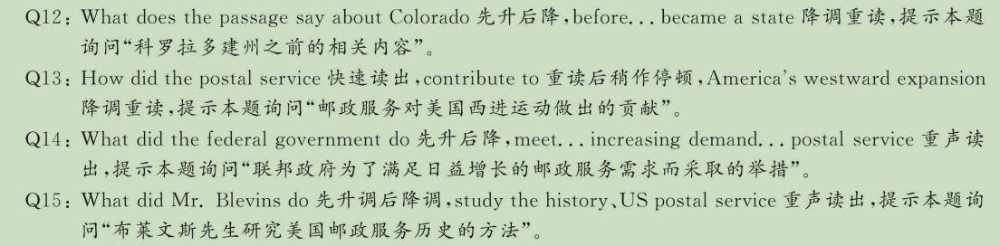
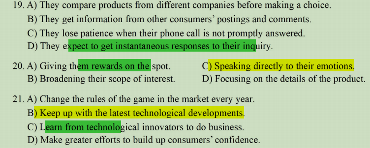

# 202306

- [202306](#202306)
  - [0520](#0520)
  - [0521](#0521)
  - [0522](#0522)
  - [0523](#0523)
  - [0524](#0524)
  - [0527](#0527)
  - [0528](#0528)
  - [0529](#0529)
  - [0530](#0530)
  - [0605](#0605)
  - [0606](#0606)
  - [0610](#0610)

## 0520

1- M： Hi, Lily, how's the new apartment?

2- W ：It's okay.

3- M： What? How can it be just okay when last week you were thrilled-about the place and kept posting photos-of it online?

4- W ：Well? last week when I moved-in, the apartment seemed cozy, just the right size for one person. But now it just seems tiny, shabby and solitary.

5- M： Ah, that's the problem. You miss-your roommates from university? don't-you?

6- W ：I'm going to sound like an idiot, because I used to complain to you all the time about how crowded our dormitory room was? and about all the things they did to irritate me, like watching movies late-at night without headphones? or talking loudly early in the morning. But now I miss them terribly.

7-M ：Of course you do. That's perfectly normal. When I got my first place I remember thinking I couldn't wait to live by myself / and get away from my juvenile/ˈdʒuːvənaɪl/ roommates and all their annoying habits. But then I began missing them and feeling lonely and thinking that our dormitory was like paradise? even though there were six of us guys in one small room.

8-W ：I thought it was just me who felt/felt/ like that.

9- M：Look, you lived-at home with-us, and then you had three roommates and this is your first time living alone. So it's hard. But your first apartment is a milestone in your life, and you should celebrate-it. Tell me about the apartment.

10-W：Actually? it's not bad. In fact, it's pretty adorable? now that I have decorated-it and it has everything I need. I have-a kitchen to cook-in and a bathroom all to myself, and then another room with my bed at one end? and-a sofa? a small table and chairs at the other end. 11-M：That does sound adorable and I can't wait to see it, and neither can mom and dad.

## 0521

1- W ：Welcome to our program Book Talk. Our guest today is Frank Jones, a critic/ˈkrɪtɪk/ of our education system, and the author of a new book, How to Reform Our Universities.

2- M ：Hello? Susan.

3- W ：Frank, you support radically/ˈrædɪkəlly/ changing universities in America?

4- M : Yes, I believe that the purpose of higher education is to prepare young people to enter/ˈentə/ the workforce, and that our current system fails to do this. We're allocating/ˈæləkeɪting/ too many resources to disciplines/ˈdɪsɪplɪn/ that don't match the needs-of employers.

5- W ：I think your attitude to education is-a bit cynical/ˈsɪnɪkəl/, Frank. Surely the purpose of university is to prepare young people to participate /pɑːˈtɪsəpeɪt/ fully in civic life? rather than just to find well-paid jobs.

6- M ：Susan, many young graduates struggle to find any job, let alone a good one. The job market is grim/ɡrɪm/, particularly for students who study the arts.

7- W ：I agree that it isn't easy for young people to find work, but you propose closing down all departments that **aren't directly** related to science and technology. Is that really the solution?

8-M ：You're overstating my point. My argument is that we need to use more of our budget/ˈbʌdʒɪt/ on areas like science and engineering. To do that? we need to take money from subjects like literature and music.

9- W ： But the arts have value. They're an important part of our culture. ® Studying literature or music or sculpture/ˈskʌlptʃə(r)/ might not result in a job **in that area**, but it helps young people to thin= about the world in a deeper way? which makes-them better citizens and makes for a better society.

10-M ： I agree that the arts-are valuable to society, but it's naive to think that not only the most talented? but all students should study them at university level. The arts are very competitive? and most graduates will end- up with a great deal of debt, **obtaining** a degree that has little value on the job market.

## 0522

1- M ：Have you decided what you wish to study?

2- W ：Yes, professor. I wish to study architecture.

3- M：Ah, that's-a wonderful profession. Why did-you choose-it?

4- W ：I gave a-lot-of thought to things you said during our last discussion, and I decided architecture made/meɪd/ the most sense for me. In particular I'm attracted to the marriage/ˈmærɪdʒ/ of design and engineering.

5-M ：That's great, but I seem to remember you were **preoccupied/priːˈɒkjəpaɪd/ with** all the lofty mathematics. You no longer think this aspect will be too hard for you?

6-W ： No. I was doing some online research and I think I should be able to manage. Math might be the toughest/ˈtʌfɪst/  subject I am encounter in the curriculum/kəˈrɪkjələm/, but I'll simply put-in the work required. I'm **certain** the fruits-of my labor will pay off.

7-M： I'm sure that's true. Due to its material nature, architecture is one field / where you will be able to clearly witness/ˈwɪtnəs/ the contribution /you make to a city. And the legacies/ˈleɡəsi/ you build / will last much longer than any of us mortals/ˈmɔːtl/.

8-W： Yeah, I guess that's true too. So what subjects do you think I should start brushing/ˈbrʌʃɪŋ/ up-on in preparation? I have the whole summer.

9-M： These days, architecture is a very diverse/daɪˈvɜːs/ and dynamic/daɪˈnæmɪk/ degree. Most universities will encourage you to learn/ different things from fields as wide-ranging as philosophy and economics/ˌekəˈnɒmɪks/. Nevertheless /ˌnevəðəˈles/, I **would** suggest you start with computer science because there will be many intricate/ˈɪntrɪkət/ visuals/ˈvɪʒuəls/ you will have to produce as part-of your projects.

1 0-W ： Any software in particular you think I should start with?

11-M： Photoshop is-a good place. If you aren't yet, try to become as proficient/prəˈfɪʃənt/ as you can with-it. And another thing that I would recommend-you to learn /as much as you can / is fine arts, in particular, the history of Western art.

Q 1 ： W h y does the woman wish to study architecture?
Q 2 ： H o w does the woman say she will overcome the difficulty in learning mathematics?
Q 3 ： What does the man say about architects contribution to a city?
Q 4 ： What subject does the man suggest the woman start with?

## 0523

1-W: So as I mentioned/ˈəʊvə/-over the phone, we are looking for someone who is very discreet/dɪˈskriːt/, I can't/kɑːnt/ stress this enough.

2-M: I fully understand.

3-W: As we all know, being such a famous football player at Real/rɪəl/ Madrid/məˈdrɪd/, Mr.Sanchez/ˈsæntʃɛz/ has-a very high public profile. This means he cannot leave the house without being recognized and **harassed/ˈhærəst**.

4-M: Yes, I completely understand / how **imperative/ɪmˈperətɪv/**/ it would be to respect Mr.Sanchez's / private/ˈpraɪvət/ life.

5-W: Good, As his **personal assistant**, you would be required to run **common** everyday chores/tʃɔz/ for Mr.Sanchez, things he cannot do himself due to his **fame/feɪm/**, like going to the supermarket or postoffice. So, well at first sight it may appear that working for a celebrity/səˈlebrəti/ is very glamorous/ˈɡlæmərəs/. Nothing could be further from the truth. I'm telling you this so that you don't get any false expectations/ˌekspekˈteɪʃən/ / of what the job has to offer you.

6-M: Thanks. I understand this too. This is my first job after graduating from university. So **frankly**. I don't have much prior/ˈpraɪə/ working experience/ɪkˈspɪəriəns/, I am, however, very excited-about the prospect-of joining this company and very keen/kiːn/ to start from the bottom / in whatever **capacity/kəˈpæsəti/** I may be of use.

7-W : That's good to hear, You sound very energetic, Tell me why do you think you are well suited for this job?

8-M: Well, firstly, I love football, I'm-a lifelong Real/rɪəl/ Madrid/məˈdrɪd/ supporter and go to their games every weekend I can / I would simply love to have-a job where **I'm involved in** some capacity with Real Madrid, regardless of the position and salary. And secondly, I think what this company does in sports consultancy / is very cool. And I think my language skills could prove very useful down the road.

9-W: Please tell me more about your language skills.

10-M: I am fully fluent-in English-and Spanish and have-a working proficiency/prəˈfɪʃənsi/ / in French

## 0524

Adventure sports are undeniably/ˌʌndɪˈnaɪəbəly/ attractive to many energetic and thrill/θrɪl/-seeking kids. **Sports** like rock climbing/ˈklaɪmɪŋ/, surfing, sking, and **mountain biking**, thus have lots-of appeal, They don't have many of the rules and pressures-of traditional team sports, but they still have all the benefits-of outdoor physical activity.

When properly supervised, extreme/ɪkˈstriːm/ sports can be a part of a healthy, balanced life. Some adventure sports may be associated with high risks-of injury, so it's important for kids to figure out when to take risks, and when not to. **Risk-free activities deprive** kids-of the opportunity to test themselves and overcome their fears. But to some, these very risks are what makes these sports a bad choice. They say that extreme sports can often lead to devastating/ˈdevəsteɪtɪŋ/ injuries/ˈɪndʒəriz/, especially as young thrill-seekers / may attempt feats/that are too advanced for them.

But let's be real, Most kids do all kinds-of dangerous stuff whether you want them to or not. Adventure sports have many of the same risks and dangers, but they have-an additional sense-of adventure, courage/ˈˈkɜːrɪdʒ/ and autonomy that is important to foster in young children. As always, it's up to parents to decide what's best for their kids. But if you do decide that adventure sports are a **bit** too much, do try to introduce other forms-of **outdoor** adventures into their lives, Camping under the stars. fishing, stargazing or even just playing in the woods/wʊdz/ can help a lot in building the same sense-of self-confidence and risk-taking as in adventure sports.

## 0527

The shiny gadgets/ˈɡædʒɪt/-of today will be waste tomorrow. Manufacturers don't talk much about this / when they announce the big new thing / that will replace your mostly / just-as good old thing. In fact, technology firms often purposely design devices / that will not last long and cannot be repaired / so that consumers will have to spend their money on a new one.

This year, the French government began requiring tech manufacturers to list a repairability score, If-a device can be repaired, then its life can be extended, saving consumers money / and the planet/ˈplænɪt/ the burden of so many trashed gadgets. Equipped/ɪˈkwɪpt/ with this knowledge, consumers can make better choices about which products to buy.

Some 59 million tons-of old TVs, computers, screens, smartphones, washers and other electronics are discarded every year, This waste is dangerous, Batteries/ˈbætəri/ explode /ɪkˈspləʊd/ in recycling facilities/fəˈsɪlɪtiz/, Toxic substances like mercury/ˈmɜːkjəri/ leak into soil and groundwater and disperse in the air. Manufacturing flat screens adds greenhouse gases to the atmosphere. We need tech companies to take the lead to solve this problem. If they won't, governments must make them do so.

Although tech companies will often speak-of environmental sustainability/səsˌteɪnəˈbɪlɪti/, many lobby against repair legislation, fearful it will eat into their profits, Sustainability matters, but marketable design appears to matter more to these companies, Consumers should support right-to-repair legislation, In this world, damage is-a certainty. But we cannot leave things broken:  A problem of our creation is-a problem that can be fixed.

## 0528

on average, US workers spend about 10% of their workday surfing the internet, emailing friends or shopping online. This behavior, called cyberloafing, is believed to cost employers up to $ 85 billion a year in lost productivity

The majority of cyberloafing research focuses/ˈfəʊkəsɪz/ on ways to prevent employees from engaging in this behavior through interventions such as internet monitoring and computer use policies, But it turns out, such behaviors may not be a sign that a worker is lazy or just wasting time. Social media use at work has been linked/lɪŋkt/ to higher levels-of employee engagement and job satisfaction, New research suggests cyberloafing can help workers cope / with-an exceptionally stressful work environment

But is cyberloafing actually effective at reducing employee stress levels? That's the question my research team wanted to answer / in our new study.

Our hypothesis/haɪˈpɒθəsɪs/ was that cyberloafing may serve as a mini-break, giving employees an opportunity to recover from stressful work situations, To test this, we asked/ɑːskt/ workers to complete-an online survey and rank how much time they spent cyberloafing, checking non-work emails and shopping. We also asked them to rank job satisfaction, their desire to quit, and how often they've experienced/ɪkˈspɪəriənst/ mistreatment at work, such as being bullied, threatened or yelled-at, As-you might expect, we found that overall, more mistreatment-at work was correlated with lower levels of jobs atisfaction and-a greater desire to quit. More interestingly, we found that cyberloafing effectively buffered this connection. That-is, mistreated workers who spent more time surfing the web and checking emails reported higher job satisfaction/ and were less likely to want to quit than similar participants/pɑːˈtɪsəpənts/ who didn't cyberloaf as much, This suggests that cyberloafing acts-as a sort-of relief valve/vælv/ for workers,helping them recover from stressful experiences.

While we did not directly/dəˈrektli/ assess how cyberloafing affects worker performance, we believe by relieving stress it may not only reduce worker turnover, but also ultimately/ˈʌltəmətli/ bolster/ˈbəʊlstə/ productivity. this fits with other recent research that suggests taking short breaks is associated with higher levels of daily job performance, That isn't to say cyberloafing is always good, Too much time spent-on non-work activities likely causes/ˈkɔːzɪz/ performance to suffer. All-in all, managers should be more lenient/ˈliːniənt/ with employees. We believe a bit-of online shopping on surfing the internet at work / could make workers more productive in the long run.

## 0529

When Julius Morton moved to Nebraska/nəˈbræskə/ City in 1854, he faced-a problem shared by many settlers in the territory: It was-a **treeless plain**, That meant no trees for building materials, or for fuel, But Morton was one of the world's first conservationists/ˌkɒnsəˈveɪʃənɪst/, stating, “For prosperity/prɒˈsperəti/, we ought to plant as many forests as we have exhausted and consumed”. So he started planting trees, beginning with his own land. By 1860 Morton possessed/pəˈzest/-a forest of more than 300 trees. A few years later, he had more than 1,000.

As the forest grew, so did Morton's influence in Nebraska. This was largely because Morton founded the Nebraska City News , the state's first newspaper, in which he frequently wrote editorials/ˌedəˈtɔːriəl/ about the practical and aesthetic/iːsˈθetɪk/ benefits / of tree planting. He also organized the Nebraska State **Gardening Society** / and served on the Nebraska State Board-of Agriculture, While serving on the Board. Morton came up with-an idea to spread his belief/bəˈliːf/ in tree planting statewide

On January 4, 1872, Morton drafted-a resolution that April 10 be designated day for the planting of trees in the State of Nebraska and urged people to go out and plant trees themselves, Morton called the special event/ɪˈvent/ Arbor Day as “arbor” is Latin for “tree. The state government agreed, And on April 10, 1872, the first unofficial Arbor Day was celebrated throughout Nebraska, Prizes/ˈpraɪzɪz/ were awarded to counties, cities, and individuals who planted the largest number of trees. That day, an astounding/əˈstaʊndɪŋ/ one million trees were planted in Nebraska / and average of more than six for every man, woman and child in the state, Since 1885, Nebraska has planted more than 700,000 acres-of trees, earning it the nickname “the Tree Planters State”

Arbor Day became a legal, civic holiday in the state in 1885, It was held on April 22-Julius Morton's birthday. In addition to a parade /pəˈreɪd/ in Nebraska City, Morton introduced what has since become along-standing Arbor Day tradition: School children went outside and planted trees together.

In 1970, nearly a century after Arbor Day was first celebrated, President Richard Nixon declared the last Friday of every April to be observed as National Arbor Day. All 50 states recognize the April observance/əbˈzɜːvəns/ although many hold an additional state Arbor Day in a month more suited to local tree planting.

## 0530

Modern humans arose in Africa about 200,000 years ago. They then spread across Europe/ˈjʊərəp/ and Asia/ˈeɪʃə/ sometime after 60,000 years ago. This is the "Out of Africa" model, as it's commonly known. In the 1990s, the hypothesis found widespread acceptance. But this popular idea is-in need-of revision/rɪˈvɪʒən/, particularly given the number of important findings across Asia over the past few decades.

For instance, many new human fossils/ˈfɒsəl/ found, particularly in China, are now dated/ˈdeɪtɪd/ as older than 60,000 years. This **calls-into** question the idea that modern humans migrated out-of Africa only 60,000 years ago. Take the recent discovery of two modern human teeth found in the Luna cave in China's Guangxi Zhuang Autonomous Region. When my research team and I dated these teeth, we found they were more than 70,000 years old a situation clearly impossible if modern humans moved out of Africa only 60,000 years ago.

So with such findings, what happened-exactly? Where does the most current data suggest we came from?

The first question we should ask is why did modern humans leave Africa to begin with? If a population is perfectly adapted to a particular environment and has access to an abundance-of resources. then there really is no reason to move or change, For instance, some monkeys in Africa have **a set-of teeth** that has hardly changed over the course of millions-of years, indicating that they found-a place that has worked for them.

So what happened with humans? Some researchers have suggested that population density increased to the point where smaller human groups were forced to explore new lands. Other researchers have suggested that due to major environmental **events**-in East Africa, humans were prompted to find greener pastures/ˈpɑːstʃə/. Yet-another explanation could simply be that early modern human hunters were following the large animals that they relied-on, and so they moved out-of Africa without realizing that they were actually moving from one continent/ˈkɒntɪnənt/ to another.

Humans need daily access to reliable fresh water, which appears to be absent from many coastal/ˈkəʊstl/ areas. This brings us to another question: by which route did modern humans move out-of Africa? No clear route across the Mediterranean/ˌmedətəˈreɪniən◂/ from North Africa appear to be present, so the earlier dispersals out-of Africa and into Europe and Asia might have been across the Arabian/əˈreɪbiə/ Peninsula/pəˈnɪnsələ/.

## 0605

Do you ever have the annoying feeling that you don't have time to really think anymore? You are not-alone. **A variety/vəˈraɪəti/ of** factors have conspired to rob-us-of time for reflection / about ourselves and our lives. Today, our preoccupied minds are rarely silent. The average person receives hundreds-of texts and voice messages/ˈmesɪdʒɪz/-a day, and holidays for many of us are action-packed weeks more likely full-of family activities than opportunities for tranquility/traŋˈkwɪlɪti/ and contemplation /ˌkɒntəmˈpleɪʃən/.

**Regular reflection, however, underlies all great professionals.** It's-a prerequisite/priːˈrekwəzət/ for you to recharge your mental batteries, see things in a new light and tap into your creativity. Almost all of the great advisors that I have studied / have found ways to get-away from it all and contemplate their life and work. Some researchers in the field of creativity, **in fact, believe that insight occurs during the reflection and relaxation/ˌriːlækˈseɪʃən/ that follows a period of intense activity**

Schedule time for reflection about-your work /or a particular project you're engaged-in. I usually block-out half an hour, Don't answer the phone, Push your papers to the side, Sketch/sketʃ/, make lists, draw mind maps” of ideas that come to you. At the end, write down any emerging/ɪˈmɜːdʒɪŋ/ ideas.

When you're alone, stop worrying/ˈwʌriɪŋ/ and think. A lot-of our down time is spent worrying about trouble some things in our lives or fantasizing about how we'd like-our lives to be. Revisit things during moments-of relaxation after a period of intense work, This is when we are the most creative.

Q 9 ：W h a t do w e learn about the feeling that one doesn，t have time to think anymore?
Q 1 0 ：W h a t trait do all great professionals share?
Q l l ：W h a t do s o m e researchers believe is conducive to creative ideas?

## 0606

**Even before Colorado/kɒləˈrædəʊ/ was-a state, it had post offices.** The first opened-in 1859, in-a settlement founded by migrants searching for gold, Life could be unpredictable at West / gold failed/feɪld/ to appear, drought/draʊt/ ruined/ˈruːɪnd/ farmers and settlers clashed with Native Americans. On the settlement's location now stands-a sprawling/ˈsprɔːlɪŋ/ university campus. Amid all the changes/ˈtʃeɪndʒɪz/, one feature remained constant-the postal service/ˈsɜːvɪs/.

The maps tracing America's westward expansion/ɪkˈspænʃn/ are telling. In 1864, there were few postal/ˈpəʊstl/ branches / on land controlled by Native/ˈneɪtɪv/ Americans, which still accounted for most of the West, Over the next 25 years, post offices grew quickly. Colonization/ˌkɒlənaɪˈzeɪʃn/ of the West could be regarded as-a result of big government rather than pioneers/ˌpaɪəˈnɪə/.  As federal/ˈfedərəl/ subsidies and land **grants**/ɡrɑːnts/ tempted people into the deserts-and plains，the post kept them connected.

In the mid-19th century, the Post Office Department was far from a centralized/ˈsentrəlaɪzd/ bureaucracy/bjʊəˈrɒkrəsi/.To keep up with migration patterns, postal services were added to existing businesses. **The federal government commissioned private wagons to carry the mail**, Short-term contracts were granted to local businessmen to act as postmasters. These partnerships enabled the mail to quickly follow migrants. helping knit/nɪt/ together remote parts-of the country.

Mr. Blevins, a digital historian, wrote-a book on the history of the US postal service, he used data science to analyze historical trends. Most strikingly, he built an accompanying/əˈkʌmpəniɪŋ/ website, complete with interactive maps. They show readers how, within a generation, the postal service helped colonize a continent/ˈkɒntɪnənt/. These online interactive maps illustrate the formative/ˈfɔːmətɪv/ power of snail mail.

Q12 ：what does the passage say about Colorado before it became a state?
Q13 ：How did the postal service contribute to America's westward expansion?
Q14 ：what did the federal government do to meet the increasing demand for the postal service in the West?
Q15 ：what did Mr. Blevins do to study the history of the US postal service?

## 0610

- 

Over the past 20 years, the internet has gradually become a dominant feature of our lives. It has changed how we communicate with each other, and it has delinitely transformed the way we do business with each other. Marketing has also changed in a number of ways. For instance, in the past, consumers had to call a phone number and patiently wait on hold, in order to get the information they wanted. **Today, they want the information immediately. They'll go to the company's social media page and post comments-and questions, expecting to receive an immediate response**, If they don't get their questions answered soon. they'll move on to another company that will answer them quickly.

Marketing departments today need to follow technological/ˌteknəˈlɒdʒɪkəl/ development, For example, this year's smartphone is smarter than last year's: self-driving cars are now on the road, Marketers have to do research on which technologies are coming into being. Otherwise, they risk being left behind in the virtual dust, Marketing has also changed due to the importance of video. People don't just want to read text; they want to watch things happening. Companies now have to explore how they can use video on a consistent basis to share information about their businesses/ˈbɪznɪsɪz/, Fortunately, it's extremely easy to shoot something these days. All you need is a smartphone.

But what's the result of all this? Shorter attention spans, We aren't the same people that we were 20 years ago. Not only have we grown accustomed
/əˈkʌstəmd/ to getting the information we want instantaneously/ˌɪnstənˈteɪniəs/ our attention spans are much shorter. If something doesn't capture our attention within a few seconds,we're on to the next piece of content. **Marketers need to figure out ways to speak directly to the customers'emotions, and they need to figure out how to do that as quickly as possible,** Once people are emotionally engaged, they'll stick with you.

If marketing has changed this much in the past 20 years, imagine what the next 20 years will bring. In a recent survey, only 9% of marketers could say with confidence that their marketing efforts were actually working. Their confidence is being shaken, because the rules of the game change every year. That's why it's important for marketers to pay attention / to the latest technological developments and consider collaborating / with technological innovators. **That way, they'll be moving at the same pace as the tech industry.**

Q19 ： What does the speaker say about today's consumers?
Q20 ： How do marketers capture consumers, attention as quickly as possible?
Q21 ： What does the speaker suggest marketers do to meet future challenges?
