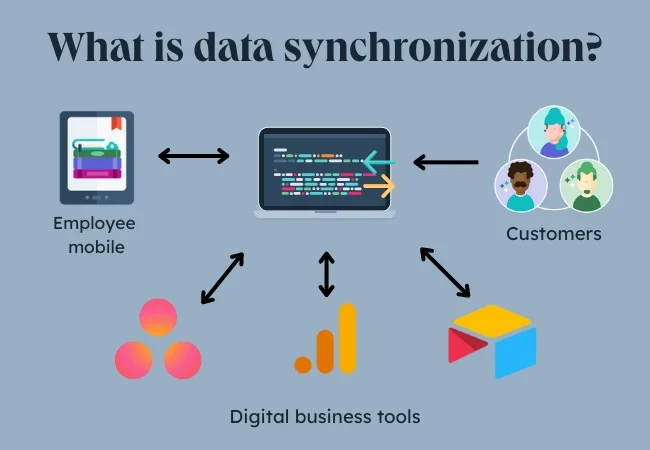
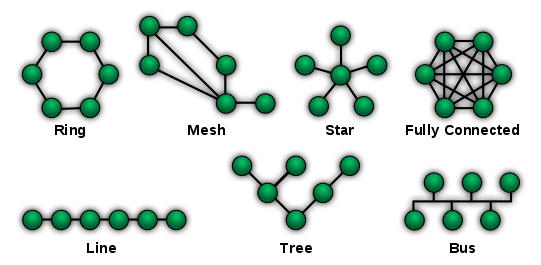

# words

## 12-14

1. **multimodal/ˌmʌlti'məudəl/** human–computer interaction is one of the application directions of virtual humans
2. by inputting the corresponding audio and any **mesh/meʃ/ vertex/ˈvɜːteks/**,
3. cross-modal **retrieval/rɪˈtriːvəl/** methods
4. do not consider the **contextual/kənˈtekstʃuəl/** **semantic/sɪˈmæntɪk/** information of the speech.
5. **promoting** the vigorous development of this field
6. We propose two **taxonomies/tækˈsɒnəmi/** to group methods
7. the system pursues multimodal interaction with low-latency and **high-fidelity/fɪˈdeləti/** anthropomorphic virtual humans
8. have multiple **rounds** of dialogue
9. introduced key pose **interpolation**
10. The model can be divided into three types: identity-dependent (D), identity-independent(I), and **hybrid**(H).

## 12-18

1. **Prior to** the popularity of deep learning,
2. many factors, such as prior **assumptions/əˈsʌmpʃən/**
3. shows the **literature** map
4. Talking-head video generation, **i.e.**, lip motion sequence generation,
5. ...visual phoneme annotation, **etc./et ˈsetərə/**
6. used two decoders to **decouple** the voice and the speaker identity to generate the video
7. Meshtalk uses the neutral face **template** mesh as the basis to generate the talking-head video
8. while Meshtalk can **parse out** the absolute **latent/ˈleɪtənt/** space of audio-related and audio-independent facial movements.
9.  which **simulates/ˈsɪmjəleɪt/** **implicit/ɪmˈplɪsɪt/** representation with MLP
10. **identity** information coupled with audio features will reduce the accuracy
11. and the **emerging** NeRF
12. a method that is not limited by the input voice and identity **is** needed.
13. to solve the pixel **jitter/'dʒɪtɚ/** problem in the target area
14. However, in the **generative adversarial network** part of the model
15. AAM coefficients lead to potential errors and limited flexibility **when transferring reference faces to new objects**
16. The 3DMM **coefficients/ˌkəʊəˈfɪʃənt/** include **rigid** head pose parameters, facial recognition coefficients, expression coefficients, **/bəˈnɑkjəlɚ/** gaze direction parameters, and **spherical/ˈsferɪkəl/ harmonic illumination/ɪˌluːməˈneɪʃən** coefficients
17. 3D vertex coordinates corresponding to a fixed **topology/təˈpɑlədʒi/** mesh.
18. that **disentangles/ˌdɪsənˈtæŋɡəl/** audio-related and audio-unrelated information
19. and additional **auxiliary/ɔːɡˈzɪljəri,/** techniques,
20. are mainly **derived** from the dataset.
21. Si used knowledge **distillation/dɪstɪˈleɪʃn/** to separate emotional,
22. the **displacement** of implicit emotions from audio.
23. a simple audio-visual **synchronization/ˈsɪŋkrənaɪz/** discriminator
24. an audio-visual **derivative/dɪˈrɪvətɪv** correlation loss
25. **prosodic/prəˈsɒdɪk/** features of speech and lip synchronization
26. address the problem of **incongruity/ˌɪnkənˈɡruːəti/**
27. visual quality and **sensory/ˈsensəri/** effects

- synchronization
- topology
- distill

## 12-19

1. We provide an **in-depth** analysis of each method
2. **elucidating/ɪˈluːsədeɪt/** the relationships between different approaches and identifying
3. **transformative** break throughs
4. that can learn **hierarchical/haɪˈrɑːkɪkəl** representations of data
5. One **captivating/ˈkæptɪveɪtɪŋ/** application empowered by deep neural
6. that convincingly **articulate** speech
7. Talking head generation has gained significant attention in recent years as a **mesmerizing/ˈmezməraɪz/** domain
8. the quality and **perceptual** realism of generated talking heads
9. by enabling focused processing of **salient/ˈseɪliənt/** regions
10. in a more **holistic/həʊˈlɪstɪk/** manner.
11. **shedding light on** the relationships
12. Faster inference times enable **seamless/ˈsiːmləs/** integration of these systems into various applications,
13. This subjective evaluation helps **gauge/ɡeɪdʒ/** the level of realism
14. in practical **scenarios/sənærioʊz/**.
15. None the less...
16. which can be **cumbersome**
17. may **hinder** the evolution of new research
18. there are many **variations**
