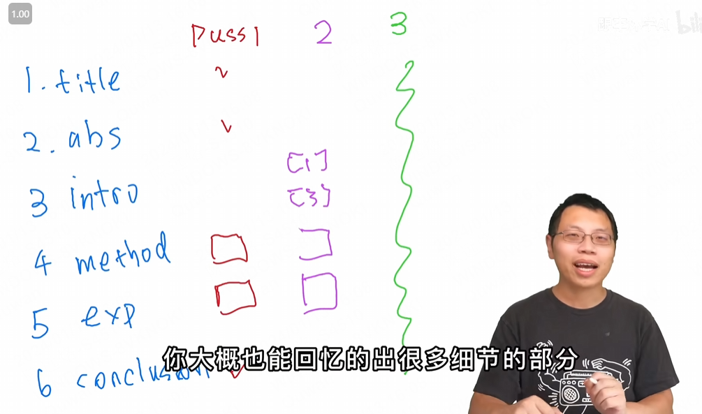

# word4

## 1-10

1. tackle the problem of depth estimation from **stereo/'sterɪəʊ/** images or video sequence
2. tried to learn camera **intrinsics/ɪnˈtrɪnzɪk/** for every two consecutive frames

## 1-11

1. In this part, we **elaborate/ɪˈlæbərət/** the technical details
2. Specifically, given two **consecutive/kənˈsekjətɪv/** video frames
3. Adjusting images to **compensate/ˈkɑːmpenseɪt/** for geometric distortion
4. depth maps are being used **thoroughly/ˈθʌrəli/** **throughout/θruːˈaʊt/** the generation process
5. this is the **seminal/ˈsemɪnl/** paper
6. dense 3D geometry annotations are **prohibitively/prəˈhɪbətɪv/** costly for videos
7. **dispensing with** recurrence and convolutions entirely
8. even all previously reported **ensembles**.

- how to read paper carefully
  - 