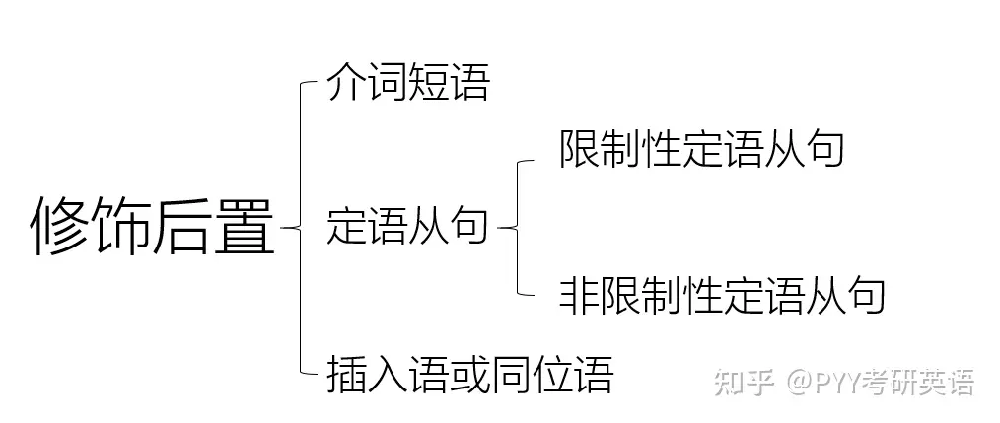
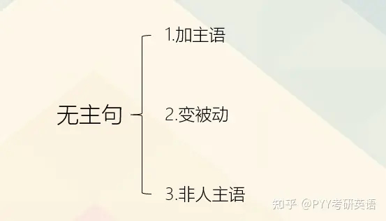

# 1week

- [1week](#1week)
  - [0920](#0920)
  - [0925](#0925)
  - [0926](#0926)
  - [0927](#0927)
  - [0928](#0928)
  - [0929](#0929)
  - [0930](#0930)
  - [0931](#0931)

## 0920

1. optimize/ˈɒptəmaɪz/ wind turbine power generation
2. come off the **assembly line_1**
3. state of the art
4. When I founded and was leading the Google Brain Team
5. a landing AI
6. hope you **stick with me** through this class
7. tumor/ˈtuːmər/
   1. benign/bɪˈnaɪn/
   2. malignant/məˈlɪɡnənt/
8. **crosses/ˈkrɔːsɪz/** to show the patients with a tumor that was malignant
9. So to **recap** supervised/ˈsuːpərvaɪzd/ learning maps input x to output y

- wind turbine/ˈtɜːrbən,/
- assembly line:max_bytes(150000):strip_icc()/AssemblyLine3-2-c9c005f8e3db48e4975a3172098852b2.jpg)

## 0925

1. When **executing/ˈeksəkjuːting**/ a "Code" cell, its code is sent to a execution/ˌeksəˈkjuːʃən/ **kernel**.
2. **hammock**
3. **concretely**, if you take that point
4. a slightly **hilly** outdoor park
5. a **golf course** where the high points are
6. this **equal/ˈiːkwəl/** sign is the **assignment/əˈsaɪnmənt/ operator/ˈɒpəreɪtə**
7. about how to correctly/kəˈrektly/ in **semantic/sɪˈmæntɪk/** gradient descent,
8. you want to **simultaneously** update w and b

- 
- a steep gradient
- hilly

## 0926

1. This means you **subtract/səbˈtrækt/** from w, a negative number.
2. So this is a tricky one.
3. you'll be **two-thirds** of the way
   1. three-fourths
4. and sometimes to **designate** that this is a vector/ˈvektə/
5. GPU hardware that **stands for** Graphics Processing Unit
6. this still doesn't use **factorization**.
7. It's much faster **behind the scenes/sinz/**.
8. the derivative of the cost J **with respect to** $w_1$.
9. with this being the Greek/ɡriːk/ **alphabets/ˈælfəbet/** Mu.
10. As a rule of thumb
11. you can try to **spot** whether or not
12. **To fix this**,you can use-a smaller learning rate
13. It turns out that is one **flavor** of feature engineering
14. and the third **feature/ˈfiːtʃə/** is the size **cubed**.
    1. These two features, x squared and x **cubed**
15. it was strangely **exhilarating/ɪɡˈzɪləreɪtɪŋ/**.
16. We often designate **clauses/ˈklɔːzɪz/** as no or yes
17. and this will turn out to be the same z as the one you saw on the previous **slide**.
18. the loss function **incentivizes/ɪnˈsentɪvaɪz/** or **nurtures/ˈnɜːtʃə/**
    1. plants **nurtured** in the greenhouse
19. But there's a bowl of **porridge/ˈpɒrɪdʒ/** that is neither too cold nor too hot.

- subtract
- tricky

## 0927

1. doing something as **harsh** as eliminating it **outright**.
2. function that's less **prone** to overfitting
3. And so this new cost function **trades off** two goals/ɡoʊl/ that you might have.
4. and then it **fell out of favor** for a while.
5. **tremendous** **traction/ˈtrækʃən/** in some applications
6. trying to build software to **mimic** the brain
7. it has a number of inputs where it receives electrical/ɪˈlektrɪkəl/ impulses/ˈɪmpʌls/ from other **neurons**.
8. I'd like to give one big **caveat/ˈkæviæt/**,
   1. one **caveat** being that having a larger new network can slow down your algorithm/ˈælɡərɪðəm/.
9. which is **frankly** very little
10. that neural networks have really taken off

- neurous
- nucleus/ˈnjuːkliəs/
- caveat

## 0928

1. **inventory/ˈɪnvəntri/_1** levels
2. **shipping costs**, the amounts
3. This feature vector is **fed/fed/** to this layer
4. This term **activations** comes from biological neurons
5. A layer is **a grouping of** neurons
6. You will learn later in this course some tips for a question of the **architecture** of the neural network

## 0929

1. and **unroll** them into a vector
2. 1 over 1 plus e **to the negative z**.
3. is getting a little bit **cluttered/ˈklʌtəd/**
4. They're a little bit **burnt/bɜːnt/** beans.
5. The input features 200 degrees **celsius** and 17 minutes.
6. **Dense** is another name for the layers of a neural network
7. One thing I briefly **alluded** to is
8. In this video, I want to **step through** with you how data is represented-in NumPy and Tensorflow
9. And then this open **square bracket** groups the first and the second row together.
10. if you had to implement forward propagation yourself **from scratch** in Python
11. it's helpful to know how it works **under the hood**
12. I think there's been a lot of unnecessary **hype**
13. Without further ado/əˈduː/
14. of the linear algorithm and the **ground truth label**
15. This code **snippet_1** specifies
16. somewhat **arcane/ɑːˈkeɪn/** term, but it stands for **rectified/ˈrektɪfaɪ/** linear unit.

- hood
- allude & elude

## 0930

1. Now, quick/kwɪk/ quiz/kwɪz/ question;
2. To **embellish/ɪmˈbelɪʃ/** logistic **/ləˈdʒɪstɪk/** regression a little bit ~
3. And that **wraps up** the section on
4. using **contour/kɑːntʊr/ plot/plɒt/** comprising these ellipses/ɪˈlɪps/.
5. So if you put two **electrodes/ɪˈlektrəʊd/** on your chest you will record the **voltages/ˈvəʊltɪdʒ/** that look
6. ShanDong old Home's offical is **unavailable/ˌʌnəˈveɪləbəl/** in that day

- contour plot
- embellish

## 0931

1. being a **convolutionalˌ/kɑːnvəˈluːʃən/** layer.
2. these things could be **fruitful**
3. And you can then **count up** in the test set the fraction of examples where y hat is not equal to the actual ground truth label.
4. it turns out that with one further **refinement** to the idea you saw in this
5. such as these 10 different models that you might **contemplate** using for your machine learning application.
6. **Armed** with these three measures
7. figure out to **what extent** the algorithm has
8. The two key **quantities** to measure are
9. Because **extrapolating** to the right of this curve
10. continuento fill the **fourth-order** polynomial.
11. And what this means is this gives us
new **recipe** to try to reduce bias or reduce variance

- So features X, x squared, x cube and **x to the 4**.
- extrapolate
