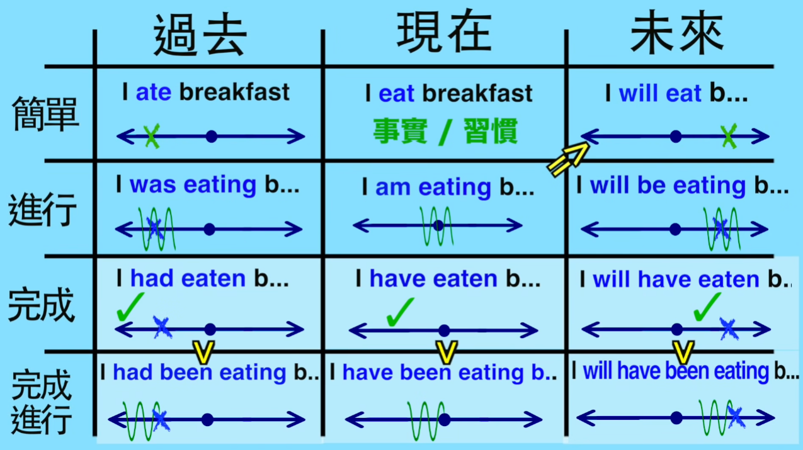
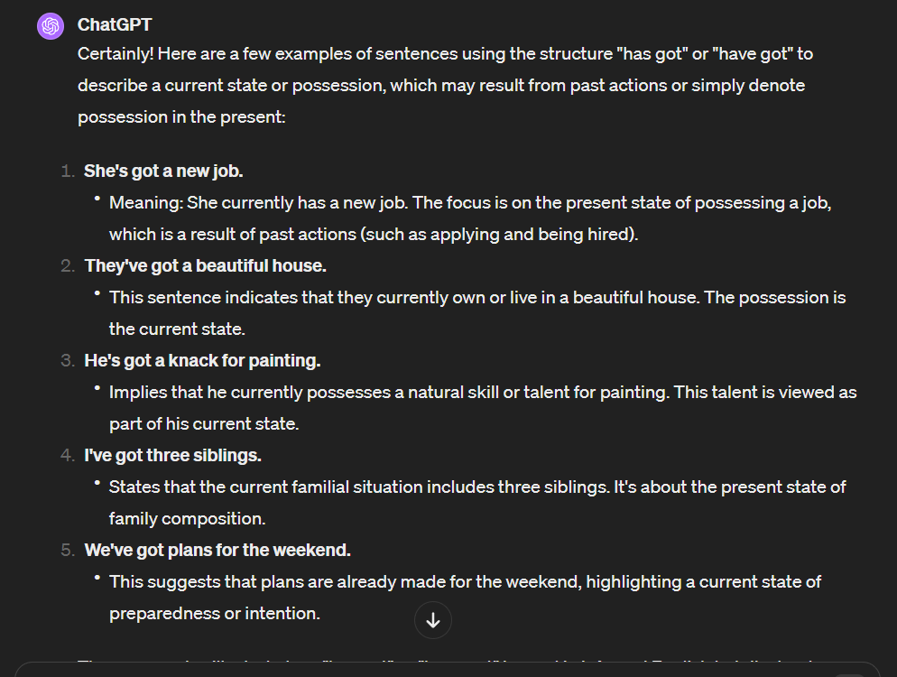

# 1wk

## 02-18

1. xinjiang's landscape is **truly unparalleled/ʌnˈpærəleld/**

## 02-20

- tense
  - <image style="height:180px; background-color:#CDDEC2" src="images/image-3.png"/>
  - <image style="height:100px; background-color:#CDDEC2" src="images/image-1.png"/>
  - <image style="height:180px; background-color:#CDDEC2" src="images/image-2.png"/>

## 02-21

1. sticking to the standard grammatical **constructions** with "have" or "had" is recommended.

- the sex is not being **had**
  - Passive Voice: In the passive voice, **the focus is on the action** (or the state of being) rather than who or what is performing the action. The passive voice is constructed with a form of the verb **"to be"** followed by the past participle of the main verb.
    - "to be"
      - such as "is," "are," "was," "were"
- It's **got a** boyish charm
  - the structure "has got" or "have got" to describe **a current state or possession**, which may result from past actions or simply denote possession in the present
    - 

- You've got to whip it
  - a modal construction with "**have got to**"
  - it implies **an action that should be taken** now or in the immediate future.
  - It's a form of expressing obligation or a need to perform an action.

## 02-22

1. **slanting** the shape of an object
