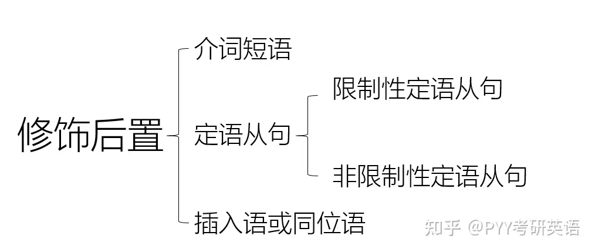

# 6

## 高频词

- which results in the fact that
- 计数单位
  - "Thousand"（千）：1,000（10的3次方）
  - "Million"（百万）：1,000,000（10的6次方）
  - "Billion"（十亿）：1,000,000,000（10的9次方
- 月份
- 时间
  - founded on January 1st,1995
  - in the next three years.
  - 至今：so far
- 短语
  - kinds of: 各种各样的
  - in many parts of China：中国的许多地方
  - all over the world. 世界各地
  - throughout the Chinese history：历来
  - Since ancient times : 自古以来
  - one of which: 其中
  - draws more and more attention: 引起越来越多的注意
  - Data shows that
- words
  - symbolize：象征
  - representative
  - growth： 增长
  - prosperity，booming：繁荣
  - poem, poet
  - film
  - internet literature 
  - for years: 连年
  - share: 份额
  - further: 进一步

## 六级翻译必备技巧

### 一、修饰后置

#### 1.介词短语

- 修饰后置

- 过中秋节的习俗于唐代早期在中国各地开始流行。（2014.6）
- The tradition of celebrating/spending Mid-Autumn festival became popular throughout China in the early Tang dynasty.

#### 2.1定语从句

- 当定语的修饰部分中，出现了“动词”，则修饰部分就要使用定语从句。

- 对于那些**月薪较低却渴望在大城市拥有一套属于自己的体面、舒适的栖身之所的**人来说，高昂的房价是他们无法承受的负担。
- For those people **who earn less but eager to own a decent and comfortable place of their own in a big city**,the high housing price is a heavy burden that they cannot afford.

#### 2.2 非限制性定语从句

- 当题目中出现“这，该，其”这样的字眼，指代前面说的那件事情，我们就要想到用非限制性定语从句

- 大学生之间的竞争也越来越激烈，这导致任何一名大学生找到工作的机会都变小了。
- The competition among graduates has become more and more fierce,which results in the fact that the chance that any individual graduate finds a job has decreased.

#### 3.插入语同位语

- 只要开头出现了名词解释，例如：xx是xx.这样的解释说明的内容。我们就用插入语。

- 旅游业是最近二十年来在世界各地迅速发展的一个行业，现在正引起中国公众越来越大的注意。
- Tourism,a fast developing industry for the last two decades all over the world,now draws more and more attention of Chinese public.

### 二、多动句

- 哪个动词离主语近，哪个就处理成谓语动词，其他动词全部处理成非谓语动词。

- 鉴于这一状况，政府近来采取了一系列的措施来防止房价过快增长，包括提高利率及增加房产税等。（2013.12）
- For this reason，the government has taken a series of measures to prevent the housing price from raising too fast,including raising interest rates and increasing taxes on real estate etc.

- 漫步在花园中，人们可以看到一系列精心设计的景观犹如山水画卷一般展现在面前
- Wandering in the garden,people can see that a series of well-designed views emerge just like a painting.

### 三、无主句

#### 被动

- 人是主语

- 至今已有约120个中文词加进了牛津英语词典，成了英语语言的一部分
- So far,about 120 Chinese words have been added to Oxford English Dictionary,becoming a part of the English language.
- 另有850亿元用于新建或升级城市垃圾处理和污水（sewage）处理设施，加上300亿元投资未来三年的植树造林（forestation）
- Another 85 billion yuan will be used to build or upgrade the facilities for treatment of urban garbage and sewage and additional 30 billion yuan will be invested in forestation in the next three years.

#### 非人主语

- 中国地方戏种类很多，其中京剧（Peking Opera）是一个具有代表性的剧种。
- There are many kinds of local operas in China,one of which is Peking Opera,a representative one.

## 例子

荷花色彩鲜艳，夏日清晨绽放，夜晚闭合，花期长达两三个月，吸引来自各地的游客前往观赏。

The lotus, with its bright color and a flowering period of two or three months, **blooms** in the summer morning and **closes** at night, attracting tourists from **all over the world** to appreciate it.

荷花具有多种功能，既能绿化水面，又能美化庭院，还可以净化水质、减少污染、改善环境。

The lotus has multiple(many)functions. It can not only green water surface,beautify courtyard, but also purify water quality, reduce pollution and improve environment.

荷花迎骄阳而不惧，出淤泥而不染，象征纯洁、高雅，常来比喻人的高尚品德，历来是诗人画家创作的重要题材。

The lotus, facing fierce sunshine without fear, and born in a dirty place without being polluted, symbolizes purity and elegance, and represents people's noble morals."

Therefore, it become important themes for poets and painters throughout the Chinese history.

荷花盛开的地方也是许多摄影爱好者经常光顾之地。

- The place where the lotus blooms is also the resort(place)
  - visited by photographers frequently.
  - many photographers always come.

---

the resort(place) visited by photographers frequently.

the resort(place) that many photographers always come.

## read-word

-  **culminating** in disproportionate levels of damaging sentiment.
-  **Resort** to all means regardless of the consequence
-   Strive to succeed **at the expense of** their **well-being**.

阅读：
- 用词需严谨，范围要对
- 要在原文中找到依据(不可推断)