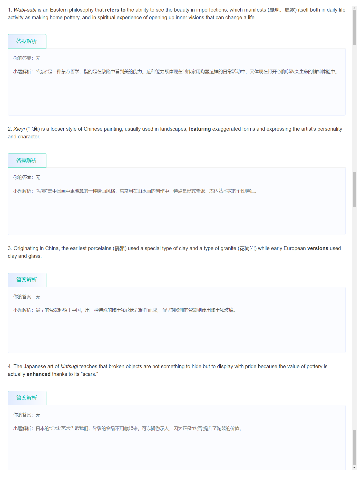

# 8word

## 11-11

1. Now, this is our first serious **foray** into
2. comprising a large **corpus** of English text
3. space **punctuation** if you wish

## 11-13

1. then up to **numerical round up**
2. are two specific **instantiations**
3. that when you see "I want a glass of orange **blank**

## 11-14

1. So there are various **heuristics** for
2. the entire cap size in the **denominator**
3. a strong correlation between urban **deprivation** and poor health
4. **ethnicity**, sexual orientation bias
5. And after **ingesting** the input sequence

- 1
  - 
  - 

- 2
  - 
  - 

- 3 
  - 
  - 