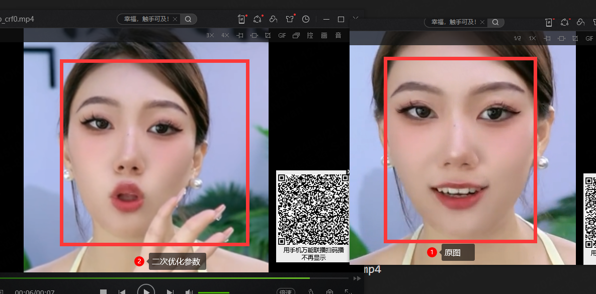
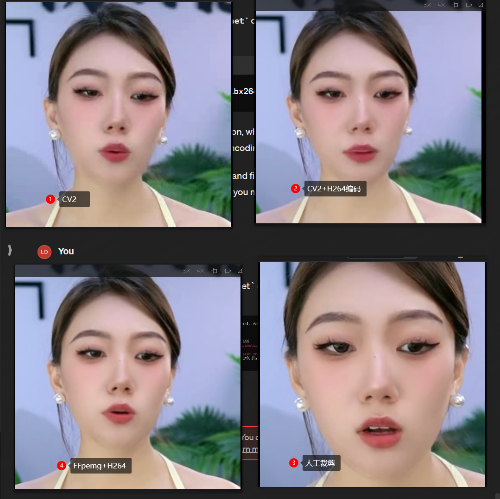

# 模板

- 解压图片
  - ffmpeg -i ⭐.mp4 -vf "select=not(mod(n\,1))" -vsync 0 ⭐/%05d.png
  - ffmpeg -i ⭐.mp4 -start_number ⭐ -vf "select=between(n\,⭐\,⭐)" -vsync 0 ./%05d.png

- 抠图
  - python main.py --img_dir ⭐ --out_dir ⭐ --color cg --bg ⭐ --multi_process 20 --mask_th ⭐
- 阈值抠图
  - python main.py --img_dir ⭐ --out_dir ⭐ --color g --multi_process 5 --upper ⭐ --lower ⭐ 

- 合成视频
  - python get_seg_video3.py ---path ⭐/ --video_file ⭐.mp4 --start_id 1 --end_id -1

- 删除文件
  - rm -rf ./⭐/

- 切换

- 查看文件大小
  - ls -lh ⭐

- 查看文件夹数量
  - ls -1 ⭐ | wc -l

- du -sh /data/*
  - 查看data下文件夹使用情况

  
  - 查看磁盘使用情况

- 挂在进程在后台
  - nohup python ⭐.py > output.log 2>&1 &

   * `> output.log`: Redirect standard output (stdout) to a file named `output.log`.
   * `2>&1`: Redirect standard error (stderr) to the same location as stdout (in this case, `output.log`).
   * `&`: Run the command in the background.

- conda config --show channels

- 当前conda路径
  - echo $CONDA_PREFIX$
- 当前conda包
  - conda list

- pip -i
  - -i https://pypi.tuna.tsinghua.edu.cn/simple

- ls /proc/880585 -lh

- git clone
  - --server-option 192.168.110.84

- 跨服务器文件传输
  - sudo scp -P 56000 -r /data/log/crop-video __su@10.112.226.54:/data/log/

- pid查看路径
  - ls -l /proc/⭐/cwd

- 查看代理服务器
  - env | grep -i proxy

- 强制重装
  - pip install --force-reinstall
- 查看文件个数
  - ls -l | grep "^-" | wc -l

## 1110

ffmpeg -i /data/log/1110/陈/chen_1.mp4 -vf "select=not(mod(n\,1))" -vsync 0 /data/log/1110/陈/chen_1/%05d.png
ffmpeg -i /data/log/1110/陈/chen_2.mp4 -vf "select=not(mod(n\,1))" -vsync 0 /data/log/1110/陈/chen_2/%05d.png

python main.py --img_dir /data/log/1110/陈/chen_1/ --out_dir /data/log/1110/陈/chen_1_mask100/ --color cg --bg /data/log/1110/陈/c.png --multi_process 20 --mask_th 100
python main.py --img_dir /data/log/1110/陈/chen_2/ --out_dir /data/log/1110/陈/chen_2_mask100/ --color cg --bg /data/log/1110/陈/c.png --multi_process 5 --mask_th 100

python get_seg_video3.py ---path /data/log/1110/陈/chen_1_mask100/ --video_file /data/log/1110/陈/chen_1_mask100.mp4 --start_id 1 --end_id 1000
python get_seg_video3.py ---path /data/log/1110/陈/chen_2_mask100/ --video_file /data/log/1110/陈/chen_2_mask100.mp4 --start_id 1 --end_id -1

--- 

ffmpeg -i /data/log/1110/金可/jk_1.mp4 -vf "select=not(mod(n\,1))" -vsync 0 /data/log/1110/金可/jk_1/%05d.png
ffmpeg -i /data/log/1110/金可/jk_2.mp4 -vf "select=not(mod(n\,1))" -vsync 0 /data/log/1110/金可/jk_2/%05d.png

python main.py --img_dir /data/log/1110/金可/jk_1/ --out_dir /data/log/1110/金可/jk_1_mask100 --color cg --bg /data/log/1110/金可/jk.png --multi_process 12 --mask_th 100
python main.py --img_dir /data/log/1110/金可/jk_2/ --out_dir /data/log/1110/金可/jk_2_mask100 --color cg --bg /data/log/1110/金可/jk.png --multi_process 20 --mask_th 100

python get_seg_video3.py ---path /data/log/1110/金可/jk_1_mask100 --video_file /data/log/1110/金可/jk_1_mask100.mp4 --start_id 1 --end_id 1500
python get_seg_video3.py ---path /data/log/1110/金可/jk_2_thres/ --video_file /data/log/1110/金可/jk_2_thres.mp4 --start_id 1 --end_id 700

## 1113

python main.py --img_dir /data/log/1110/金可/jk_1/ --out_dir /data/log/1110/金可/jk_1_threshold --color g --multi_process 5 --upper 120,255,229 --lower 43,93,2

--img_dir G:\Video_Dispose\1110\jk\jk_1_ori --out_dir ../outs --color g --multi_process 0  --upper 135,255,229 --lower 43,172,1 --bg G:\Video_Dispose\1110\jk\jk.png

--img_dir G:\Video_Dispose\1110\jk\jk_2_ori --out_dir ./outs --color g --multi_process 0  --upper 70,221,230 --lower 42,170,74 --bg G:\Video_Dispose\1110\jk\jk.png

--img_dir G:\Video_Dispose\1110\jk\jk_2_ori --out_dir ./outs --color g --multi_process 0  --upper 70,255,230 --lower 42,170,59 --bg G:\Video_Dispose\1110\jk\jk.png

- 越小，扣的越少（绿色越多

python main.py --img_dir /data/log/1110/金可/jk_2/ --out_dir /data/log/1110/金可/jk_2_mask0new --color cg --bg /data/log/1110/金可/jk_new.png --multi_process 20 --mask_th 0

python main.py --img_dir /data/log/1110/金可/jk_1/ --out_dir /data/log/1110/金可/jk_1_threshold2 --color g --multi_process 5 --bg /data/log/1110/金可/jk.png --upper 135,255,229 --lower 43,172,1

python main.py --img_dir /data/log/1110/金可/jk_2/ --out_dir /data/log/1110/金可/jk_2_thres --color g --multi_process 20  --upper 70,255,230 --lower 42,170,59 --bg /data/log/1110/金可/jk.png

## 1113

1. ffmpeg -i /data/log/1113/tingting.mp4 -vf "select=not(mod(n\,1))" -vsync 0 /data/log/1113/tingting/%05d.png
2. python main.py --img_dir /data/log/1113/tingting/ --out_dir /data/log/1113/tingting_dis --color cg --bg /data/log/1113/ting.png  --multi_process 20 --mask_th 100

## 1114

python get_seg_video3.py ---path /data/log/1110/金可/jk_1_threshold2/ --video_file /data/log/1110/金可/jk_1_threshold2.mp4 --start_id 1 --end_id -1

mkdir FengYang1 FengYang2 FengYang3

ffmpeg -i /data/log/1114/FengYang1.mp4 -vf "select=not(mod(n\,1))" -vsync 0 /data/log/1114/FengYang1/%05d.png
ffmpeg -i /data/log/1114/FengYang2.mp4 -vf "select=not(mod(n\,1))" -vsync 0 /data/log/1114/FengYang2/%05d.png
ffmpeg -i /data/log/1114/FengYang3.mp4 -vf "select=not(mod(n\,1))" -vsync 0 /data/log/1114/FengYang3/%05d.png

python main.py --img_dir /data/log/1114/FengYang1/ --out_dir /data/log/1114/FengYang1_100/ --color cg --bg /data/log/1114/FengYangPic.png --multi_process 6 --mask_th 100
python main.py --img_dir /data/log/1114/FengYang2/ --out_dir /data/log/1114/FengYang1_200/ --color cg --bg /data/log/1114/FengYangPic.png --multi_process 6 --mask_th 100
python main.py --img_dir /data/log/1114/FengYang3/ --out_dir /data/log/1114/FengYang1_300/ --color cg --bg /data/log/1114/FengYangPic.png --multi_process 6 --mask_th 100

---

ffmpeg -i /data/log/1114/XiaoMeng.mp4 -vf "select=not(mod(n\,1))" -vsync 0 /data/log/1114/XiaoMeng/%05d.png

python main.py --img_dir /data/log/1114/XiaoMeng/ --out_dir /data/log/1114/XiaoMeng_100/ --color cg --bg /data/log/1114/XiaoMengPic.png --multi_process 25 --mask_th 100

---

ffmpeg -i /data/log/1114/jk_2.mp4 -vf "select=not(mod(n\,1))" -vsync 0 /data/log/1114/jk_2/%05d.png

python main.py --img_dir /data/log/1114/jk_2/ --out_dir /data/log/1114/jk_2_thres_oc --color g --multi_process 30  --upper 70,255,230 --lower 42,170,59 --bg /data/log/1114/jk.png

rm -rf ./FengYang1/*
rm -rf ./FengYang2/*
rm -rf ./FengYang3/*
rm -rf ./FengYang1/*

10621-12694
624-2485
3761-5566

ffmpeg -i /data/log/1114/FengYang1.mp4 -start_number 10621 -vf "select=between(n\,10621\,12694)" -vsync 0 /data/log/1114/FengYang1/%05d.png
ffmpeg -i /data/log/1114/FengYang2.mp4 -start_number 624 -vf "select=between(n\,624\,2485)" -vsync 0 /data/log/1114/FengYang2/%05d.png
ffmpeg -i /data/log/1114/FengYang3.mp4 -start_number 3761 -vf "select=between(n\,3761\,5566)" -vsync 0 /data/log/1114/FengYang3/%05d.png

python main.py --img_dir /data/log/1114/FengYang1/ --out_dir /data/log/1114/FengYang1_100/ --color cg --bg /data/log/1114/FengYangPic.png --multi_process 6 --mask_th 100
python main.py --img_dir /data/log/1114/FengYang2/ --out_dir /data/log/1114/FengYang2_100/ --color cg --bg /data/log/1114/FengYangPic.png --multi_process 6 --mask_th 100
python main.py --img_dir /data/log/1114/FengYang3/ --out_dir /data/log/1114/FengYang3_100/ --color cg --bg /data/log/1114/FengYangPic.png --multi_process 6 --mask_th 100

python get_seg_video3.py ---path /data/log/1114/FengYang1_100/ --video_file /data/log/1114/FengYang1_100.mp4 --start_id 1 --end_id -1
python get_seg_video3.py ---path /data/log/1114/FengYang2_100/ --video_file /data/log/1114/FengYang2_100.mp4 --start_id 1 --end_id -1
python get_seg_video3.py ---path /data/log/1114/FengYang3_100/ --video_file /data/log/1114/FengYang3_100.mp4 --start_id 1 --end_id -1

rm ./000{01..36}.png
rm ./00{624..635}.png

rm ./0{7323..7633}.png

python get_seg_video3.py ---path /data/log/1114/XiaoMeng_100/ --video_file /data/log/1114/XiaoMeng_100.mp4 --start_id 1 --end_id -1

## 1115

python get_seg_video3.py ---path /data/log/1114/jk_2_thres/ --video_file /data/log/1114/jk_2.mp4 --start_id 1 --end_id -1

python get_seg_video3.py ---path /data/log/1114/XiaoMeng_100/ --video_file /data/log/1114/XiaoMeng_100.mp4 --start_id 1 --end_id -1

## 1117

upper指高阈值，lower低阈值

- no3

--upper
48,229,246
--lower
44,172,143

- no4

--upper
48,222,252
--lower
44,164,178

## 1122

ffmpeg -i /data/log/1122/145457.mp4 -vf "select=not(mod(n\,1))" -vsync 0 /data/log/1122/145457/%05d.png

python main.py --img_dir /data/log/1122/145457 --out_dir /data/log/1122/145457_dis --color cg --bg /data/log/1122/pic.png --multi_process 20 --mask_th 150

python get_seg_video3.py ---path /data/log/1122/145457_dis/ --video_file /data/log/1122/145457_dis.mp4 --start_id 1 --end_id -1

## 1123

ffmpeg -i /data/log/1123/jk_1.mp4 -vf "select=not(mod(n\,1))" -vsync 0 /data/log/1123/jk_1/%05d.png

python main.py --img_dir /data/log/1123/jk_1/ --out_dir /data/log/1123/jk_1123/ --color cg --bg /data/log/1123/jk_bg.png --multi_process 20 --mask_th 150

python main.py --img_dir /data/log/1123/jk_1/ --out_dir /data/log/1123/jk_1123_g/ --color g --bg /data/log/1123/jk_bg.png --multi_process 20 --mask_th 150 --upper 50,255,246 --lower 43,135,81

## 1207

- ffmpeg -i G:\Video_Dispose\1207\v.mp4 -vf "select=not(mod(n\,1))" -vsync 0 G:\Video_Dispose\1207\img\%05d.png

--img_dir
G:\Video_Dispose\1207\img
--out_dir
G:\Video_Dispose\1207\img_dis
--color
g
--multi_process
0
--upper
73,255,172
--lower
63,114,50

## DaGAN

- /data/log/DaGAN/DaGANTest/testVideo.mp4
- /data/log/DaGAN/DaGANTest/DingZhen

python crop-video.py --inp "/data/log/DaGAN/DaGANTest/testVideo.mp4"

python crop-video.py --inp "/data/log/DaGAN/DaGANTest/DingZhen.jpg"

ffmpeg -i /data/log/DaGAN/DaGANTest/testVideo.mp4 -ss 0.0 -t 92.68 -filter:v "crop=337:337:371:411, scale=256:256" /data/log/DaGAN/DaGANTest/crop.mp4

python demo.py  --config config/vox-adv-256.yaml --driving_video G:\dataset\DaGANTest\crop.mp4 --source_image G:\dataset\DaGANTest\testDingZhen.png --checkpoint G:\DownLoad\CVPR22_DaGAN\DaGAN_vox_adv_256.pth.tar --relative --adapt_scale --kp_num 15 --generator DepthAwareGenerator

python demo.py  --config config/vox-adv-256.yaml --driving_video /data/log/DaGAN/DaGANTest/crop.mp4 --source_image /data/log/DaGAN/DaGANTest/log.png --checkpoint /data/log/DaGAN/DaGANTest/CVPR22_DaGAN/DaGAN_vox_adv_256.pth.tar --relative --adapt_scale --kp_num 15 --generator DepthAwareGenerator

torchaudio==0.10.1+rocm4.1

set http_proxy=192.168.110.84
set https_proxy=192.168.110.84

## 1-11

python demo.py  --config config/vox-adv-256.yaml --driving_video /data/log/DaGAN/DaGANTest/crop.mp4 --source_image /data/log/DaGAN/DaGANTest/log.png --checkpoint /data/log/DaGAN/DaGANTest/CVPR22_DaGAN/DaGAN_vox_adv_256.pth.tar --relative --adapt_scale --kp_num 15 --generator DepthAwareGenerator

python main.py --img_dir /data/log/1123/jk_1/ --out_dir /data/log/1123/jk_1123/ --color cg --bg /data/log/1123/jk_bg.png --multi_process 20 --mask_th 150

ls -lh /data9/caijiaran/debug_data/519_video/01.mp4

cp /data9/caijiaran/debug_data/520_video/01.mp4 /data/log/0111/02.mp4

ffmpeg -i /data/log/0111/01.mp4 -vf "select=not(mod(n\,1))" -vsync 0 /data/log/0111/01/%05d.png

ffmpeg -i /data/log/0111/02.mp4 -vf "select=not(mod(n\,1))" -vsync 0 /data/log/0111/02/%05d.png

CUDA_VISIBLE_DEVICES=0 python main.py --img_dir /data/log/0111/01 --out_dir /data/log/0111/01_dis --color cg --bg /data/log/0111/01bg.png --multi_process 30 --mask_th 150

CUDA_VISIBLE_DEVICES=1 python main.py --img_dir /data/log/0111/02 --out_dir /data/log/0111/02_dis --color cg --bg /data/log/0111/02bg.png  --multi_process 30 --mask_th 150

/data/log/0111/01_dis/
/data/log/0111/02_dis/

## 1-16

python demo.py  --config G:\code\CVPR2022-DaGAN\config\vox-adv-256.yaml --driving_video G:\dataset\DaGANTest\crop.mp4 --source_image G:\dataset\DaGANTest\testDingZhen.png --checkpoint G:\DownLoad\CVPR22_DaGAN\DaGAN_vox_adv_256.pth.tar --relative --adapt_scale --kp_num 15 --generator DepthAwareGenerator

conda DaGAN create -f G:\env\DaGAN\environment.yml

python demo.py  --config G:\code\CVPR2022-DaGAN\config\vox-adv-256.yaml --driving_video G:\dataset\DaGANTest\crop.mp4 --source_image G:\dataset\DaGANTest\testDingZhen.png --checkpoint G:\DownLoad\CVPR22_DaGAN\DaGAN_vox_adv_256.pth.tar --relative --adapt_scale --kp_num 15 --generator DepthAwareGenerator

python demo.py  --config config/vox-adv-256.yaml --driving_video G:\dataset\DaGANTest\crop.mp4 --source_image G:\dataset\DaGANTest\testDingZhen.png --checkpoint G:\dataset\FOMM\vox-adv-cpk.pth.tar --relative --adapt_scale

## 1-19

- ffmpeg -i 01.mp4 -start_number 1 -vf "select=between(n\,1\,1000)" -vsync 0 ./img/%05d.png
- python main.py --img_dir /data/log/0119/img --out_dir /data/log/0119/dis_img --color cg --bg /data/log/0119/bg.png --multi_process 20 --mask_th 20
- python get_seg_video3.py ---path /data/log/0119/dis_img/ --video_file /data/log/0119/dis_img.mp4 --start_id 1 --end_id -1

- python main.py --img_dir /data/log/0119/img --out_dir /data/log/0119/dis_img_150 --color cg --bg /data/log/0119/bg.png --multi_process 30 --mask_th 150
- python get_seg_video3.py ---path /data/log/0119/dis_img_150/ --video_file /data/log/0119/dis_150.mp4 --start_id 1 --end_id -1

- python main.py --img_dir /data/log/0119/img --out_dir /data/log/0119/dis_img_250 --color cg --bg /data/log/0119/bg.png --multi_process 30 --mask_th 250
- python get_seg_video3.py ---path /data/log/0119/dis_img_250/ --video_file /data/log/0119/dis_250.mp4 --start_id 1 --end_id 400

- python main.py --img_dir /data/log/0119/img --out_dir /data/log/0119/green_img --color g --multi_process 5 --upper 73,228,178 --lower 55,95,51
- python get_seg_video3.py ---path /data/log/0119/green_img --video_file /data/log/0119/green_img.mp4 --start_id 1 --end_id 500

- python main.py --img_dir /data/log/0119/img --out_dir /data/log/0119/green_strong --color g --multi_process 5 --upper 75,228,178 --lower 55,45,39
- python get_seg_video3.py ---path /data/log/0119/green_strong --video_file /data/log/0119/green_strong.mp4 --start_id 1 --end_id 500

- python main.py --img_dir /data/log/0119/img --out_dir /data/log/0119/green_strong_2 --color g --multi_process 30 
--upper 78,255,178 --lower 49,36,32
- python get_seg_video3.py ---path /data/log/0119/green_strong_2 --video_file /data/log/0119/green_strong_2.mp4 --start_id 1 --end_id -1

- cp /data9/mxp/dataset/lingxi_LiveStreaming_dataset
- cp -r /data9/mxp/dataset/lingxi_LiveStreaming_dataset/* video_pickup/

## 0121

python run.py --config config/vox.yaml --mode animate --checkpoint G:\dataset\FOMM\vox-adv-cpk.pth.tar

## 0122

python crop-video.py --inp "G:\dataset\DaGANTest\testVideo.mp4"

python crop-video-single.py --inp "/data/log/DaGAN/DaGANTest/huazhiji_0.mp4"

python crop-video-single.py --inp G:\dataset\video_pick\cut.mp4

- ffmpeg -i /data/log/DaGAN/DaGANTest/huazhiji_0.mp4 -ss 0.0 -t 55.36666666666667 -filter:v "crop=343:343:348:349, scale=256:256" crop1.mp4
  ffmpeg -i /data/log/DaGAN/DaGANTest/huazhiji_0.mp4 -ss 55.4 -t 6.333333333333336 -filter:v "crop=279:279:263:375, scale=256:256" crop2.mp4
  ffmpeg -i /data/log/DaGAN/DaGANTest/huazhiji_0.mp4 -ss 61.766666666666666 -t 9.900000000000006 -filter:v "crop=345:345:202:371, scale=256:256" crop3.mp4
  ffmpeg -i /data/log/DaGAN/DaGANTest/huazhiji_0.mp4 -ss 71.7 -t 14.299999999999997 -filter:v "crop=318:317:330:359, scale=256:256" crop4.mp4
  ffmpeg -i /data/log/DaGAN/DaGANTest/huazhiji_0.mp4 -ss 95.3 -t 6.6000000000000085 -filter:v "crop=332:332:203:342, scale=256:256" crop5.mp4
  ffmpeg -i /data/log/DaGAN/DaGANTest/huazhiji_0.mp4 -ss 108.8 -t 22.966666666666683 -filter:v "crop=282:282:324:388, scale=256:256" crop6.mp4
  ffmpeg -i /data/log/DaGAN/DaGANTest/huazhiji_0.mp4 -ss 136.3 -t 9.466666666666669 -filter:v "crop=335:335:284:354, scale=256:256" crop7.mp4
  ffmpeg -i /data/log/DaGAN/DaGANTest/huazhiji_0.mp4 -ss 145.8 -t 25.866666666666646 -filter:v "crop=347:347:313:350, scale=256:256" crop8.mp4
  ffmpeg -i /data/log/DaGAN/DaGANTest/huazhiji_0.mp4 -ss 171.7 -t 8.166666666666686 -filter:v "crop=310:309:216:367, scale=256:256" crop9.mp4
  ffmpeg -i /data/log/DaGAN/DaGANTest/huazhiji_0.mp4 -ss 179.9 -t 9.666666666666657 -filter:v "crop=326:327:182:364, scale=256:256" crop10.mp
  ffmpeg -i /data/log/DaGAN/DaGANTest/huazhiji_0.mp4 -ss 190.36666666666667 -t 26.03333333333333 -filter:v "crop=330:329:488:378, scale=256:256" crop.mp4
  ffmpeg -i /data/log/DaGAN/DaGANTest/huazhiji_0.mp4 -ss 225.06666666666666 -t 22.066666666666663 -filter:v "crop=340:340:538:377, scale=256:256" crop.mp4
  ffmpeg -i /data/log/DaGAN/DaGANTest/huazhiji_0.mp4 -ss 267.6 -t 12.0 -filter:v "crop=271:271:400:402, scale=256:256" crop.mp4
  ffmpeg -i /data/log/DaGAN/DaGANTest/huazhiji_0.mp4 -ss 297.3666666666667 -t 12.699999999999989 -filter:v "crop=301:301:438:375, scale=256:256" crop.mp4
  ffmpeg -i /data/log/DaGAN/DaGANTest/huazhiji_0.mp4 -ss 311.1 -t 7.633333333333326 -filter:v "crop=287:287:290:366, scale=256:256" crop.mp4
  ffmpeg -i /data/log/DaGAN/DaGANTest/huazhiji_0.mp4 -ss 321.53333333333336 -t 19.799999999999955 -filter:v "crop=280:280:396:403, scale=256:256" crop.mp4
  ffmpeg -i /data/log/DaGAN/DaGANTest/huazhiji_0.mp4 -ss 357.43333333333334 -t 35.06666666666666 -filter:v "crop=326:326:425:375, scale=256:256" crop.mp4
  ffmpeg -i /data/log/DaGAN/DaGANTest/huazhiji_0.mp4 -ss 392.96666666666664 -t 14.366666666666674 -filter:v "crop=310:310:276:379, scale=256:256" crop.mp4
  ffmpeg -i /data/log/DaGAN/DaGANTest/huazhiji_0.mp4 -ss 407.3666666666667 -t 7.800000000000011 -filter:v "crop=267:267:379:411, scale=256:256" crop.mp4
  ffmpeg -i /data/log/DaGAN/DaGANTest/huazhiji_0.mp4 -ss 416.8666666666667 -t 8.699999999999989 -filter:v "crop=283:283:274:372, scale=256:256" crop.mp4
  ffmpeg -i /data/log/DaGAN/DaGANTest/huazhiji_0.mp4 -ss 429.6666666666667 -t 12.033333333333303 -filter:v "crop=306:307:354:370, scale=256:256" crop.mp4
  ffmpeg -i /data/log/DaGAN/DaGANTest/huazhiji_0.mp4 -ss 447.43333333333334 -t 18.73333333333335 -filter:v "crop=312:311:307:376, scale=256:256" crop.mp4
  ffmpeg -i /data/log/DaGAN/DaGANTest/huazhiji_0.mp4 -ss 466.2 -t 5.600000000000023 -filter:v "crop=264:264:362:412, scale=256:256" crop.mp4
  ffmpeg -i /data/log/DaGAN/DaGANTest/huazhiji_0.mp4 -ss 473.06666666666666 -t 10.266666666666652 -filter:v "crop=314:313:231:380, scale=256:256" crop.mp4
  ffmpeg -i /data/log/DaGAN/DaGANTest/huazhiji_0.mp4 -ss 483.76666666666665 -t 10.900000000000034 -filter:v "crop=356:356:365:356, scale=256:256" crop.mp4
  ffmpeg -i /data/log/DaGAN/DaGANTest/huazhiji_0.mp4 -ss 494.7 -t 16.466666666666697 -filter:v "crop=271:271:358:406, scale=256:256" crop.mp4

## 0123

conda create --name facefusion python=3.10

conda create --name video_env --clone myenv

ffmpeg -i G:\dataset\video_pick\cut.mp4 -vf "select=not(mod(n\,1))" -vsync 0 G:\dataset\video_pick\yolo\%05d.png

## 0124

du -sh /data/log/*

https://youtu.be/aTUWGC7lEU4?si=Pu8FH2whT12NMqZp

sudo wget https://yt-dl.org/downloads/latest/youtube-dl -O youtube-dl

## 0125

conda create -n testYoutu python=3.8

pip install scikit-image==0.2.0

du -sh /data/log/*

## 0126

ls -1 /data/log/video-preprocessing/vox | wc -l

mv video_pickup/* /data9/log/video_pickup

cp /data/log/video-preprocessing/* /data9/log/video-preprocessing/
cp -r /data/log/video-preprocessing/* /data9/log/video-preprocessing/

CUDA_VISIBLE_DEVICES=1 python load_videos.py --metadata vox-metadata.csv --format .png --out_folder vox --workers 8

du -sh /data9/log/*

cp -r /data/keith/face_occlusion_prediction/* /data/log/face_occlusion_prediction

cp -r /data9/mxp/dataset/lingxi_LiveStreaming_dataset/video_new/* /data9/log/video_pick

nohup python load_videos.py --metadata vox-metadata.csv --format .png --out_folder vox --workers 8 > output.log 2>&1 &

ffmpeg -i G:\dataset\video_pick\crop_cut1.mp4 -vf "select=not(mod(n\,1))" -vsync 0 

G:\dataset\video_pick\crop_cut1\%05d.png

Delete:: ; 当 Delete 键被按下时
    Click ; 模拟点击鼠标左键（连续两次）
return

ffmpeg -i G:\dataset\video_pick\crop_cut2.mp4 -vf "select=not(mod(n\,1))" -vsync 0 G:\dataset\video_pick\crop_cut2\crop_cut2_%05d.png

python crop-video-single.py --inp G:\dataset\video_pick\guoquan_cut.mp4

python run.py --config config/vox.yaml --mode animate --checkpoint G:\dataset\FOMM\vox-adv-cpk.pth.tar

ps -ef | grep 2222355

## 0128

du -sh /data9/log/*

scp __su@10.112.144.132:/data9/log/video-preprocessing/output.log E:\vox_git

ls -1 /data9/log/video-preprocessing/vox/test | wc -l

python run.py --config config/dataset_name.yaml --mode reconstruction --checkpoint path/to/checkpoint

python run.py --config config/vox.yaml --mode reconstruction --checkpoint G:\dataset\FOMM\vox-adv-cpk.pth.tar

/data/log/pose-evaluation/testData/

python extract.py --in_folder /data/log/pose-evaluation/testData --out_file pose_gt.pkl --is_video --type face_pose --image_shape 256,256
python extract.py --in_folder /data/log/pose-evaluation/testData2 --out_file pose_gen.pkl --is_video --type face_pose --image_shape 256,256
python cmp_kp.py pose_gt.pkl pose_gen.pkl

python extract.py --in_folder E:\VOX\test\01 --out_file pose_gt.pkl --is_video --type face_pose --image_shape 256,256

---

python extract.py --in_folder /data/log/pose-evaluation/testData --out_file id_gt.pkl --is_video --type face_id --image_shape 256,256
python extract.py --in_folder /data/log/pose-evaluation/testData2 --out_file id_gen.pkl --is_video --type face_id --image_shape 256,256
python cmp.py id_gt.pkl id_gen.pkl

conda create --name metric_env --clone myenv

/mnt/e/vox_full/train

rsync -avz --progress __su@10.112.144.132:/data9/log/video-preprocessing/output.log /mnt/e/vox_full/train

ssh __su@10.112.144.132

ssh log@192.168.38.11

sudo nano /etc/hostname

## 1-29

python crop-video-single.py --inp G:\dataset\video_pick\guoquan_cut.mp4

python run.py --config config/vox.yaml --mode animate --checkpoint G:\DownLoad\CVPR22_DaGAN\DaGAN_vox_adv_256.pth.tar

- it is wrong
  - python demo.py  --config config/vox-adv-256.yaml --driving_video /data/log/DaGAN/DaGANTest/crop.mp4 --source_image /data/log/DaGAN/DaGANTest/log.png --checkpoint /data/log/DaGAN/DaGANTest/CVPR22_DaGAN/vox-adv-cpk.pth.tar --relative --adapt_scale --kp_num 15 --generator DepthAwareGenerator

CUDA_VISIBLE_DEVICES=0 python run_dataparallel.py --config config/vox-adv-256.yaml --device_ids 0 --name DaGAN_voxceleb2_depth --rgbd --batchsize 48 --kp_num 15 --generator DepthAwareGenerator

python crop-video-single.py --inp G:\dataset\video_pick\bug.mp4

CUDA_VISIBLE_DEVICES=0,1,2 python run_dataparallel.py --config config/vox_serve.yaml --device_ids 0,1,2 --name DaGAN_model --rgbd --batchsize 1 --kp_num 15 --generator DepthAwareGenerator

tensorboard --logdir /data/log/DaGAN/CVPR2022-DaGAN/log/vox_serveDaGAN_voxceleb2_depth/log

ffmpeg -i G:\dataset\video_pick\pickup\crop1.mp4 -vf "select=not(mod(n\,1))" -vsync 0 G:\dataset\video_pick\crop_cut2\guoquan_crop1%05d.png

ffmpeg -i G:\dataset\video_pick\pickup\crop2.mp4 -vf "select=not(mod(n\,1))" -vsync 0 G:\dataset\video_pick\crop_cut2\guoquan_crop2%05d.png

ffmpeg -i G:\dataset\video_pick\pickup\crop1.mp4 -vf "select=not(mod(n\,1))" -vsync 0 G:\dataset\video_pick\crop_cut2\guoquan_crop2%05d.png

CUDA_VISIBLE_DEVICES=0 python run_dataparallel.py --config config/vox_serve.yaml --device_ids 0 --name DaGAN_model --rgbd --batchsize 1 --kp_num 15 --generator DepthAwareGenerator

## 0130

conda create --name video_audio python=3.10

sudo docker pull registry.cn-beijing.aliyuncs.com/modelscope-repo/modelscope:ubuntu22.04-cuda11.8.0-py310-torch2.1.0-tf2.14.0-1.10.0

./youtube-dl https://g.meituan.com/app/business-live-broadcast/live-detail-new.html?liveid=3220642

## 0131

- 00:03:20 -> 91
- 00:07:08 -> 210
- 00:11:03 -> 330
- 00:19:09 -> 570
- 00:21:02 -> 630
- 00:29:28 -> 871
- 00:36:03 -> 1080
- 00:43:24 -> 1291
- 00:54:17 -> 1621
- 01:01:11 -> 1830
- 01:03:18 -> 1891
- 01:12:14 -> 2160
- 01:23:18 -> 2491
- 01:34:06 -> 2820
- 01:50:12 -> 3300
- 01:56:22 -> 3481
- 02:00:20 -> 3601
- 02:07:07 -> 3810

python -m pip install numpy==1.18.0 --no-build-isolation

crop-video.py --inp /data/log/DaGAN/DaGANTest/cut.mp4

## 0226

分离背景乐用demucs：
https://github.com/jarredou/MVSEP-MDX23-Colab_v2?tab=readme-ov-file

- 大小：256*256像素 Done
- 时间：每段10s左右 Done
- 背景音只能轻微噪声
  - 降噪处理
    - https://www.modelscope.cn/models/damo/speech_dfsmn_ans_psm_48k_causal/summary
  - 说话人二者分离
    - https://www.modelscope.cn/models/damo/speech_campplus_speaker-diarization_common/summary
- 人像不能有遮挡
  - 关键点置信度
  - 炜森遮挡模型使用

pip install funasr==1.

## 0229

- https://github.com/Hillobar/Rope
  - 视频大角度换脸的效果
- https://github.com/facefusion/facefusion?tab=readme-ov-file

python3.10 -m venv facefusion

conda create -name facefusion python=3.10

## 0301

- facefusion
- 音频裁剪
  - 已经有数组[]
    - list：[[5.24, 29.01, 0], [29.29, 37.36, 1]]
    - lsit: [start,end,identity]
  - 从视频中提取出音频为 video_audio
  - 查看0和1的数量
    - 使数量少的为视频人声片段: minor_audio_list
      - minor_audio: [[5.24, 29.01, 0], [29.29, 37.36, 0]]
  - 将原音频video_audio中，次要人声的音频时间段minor_audio_segment用无声音频段代替, 保存为disposed_audio
  - 将disposed_audio放回替换原视频音频 并保存视频

CUDA_VISIBLE_DEVICES=0 python run_dataparallel.py --config config/vox_serve.yaml --device_ids 0 --name DaGAN_model --rgbd --batchsize 1 --kp_num 15 --generator DepthAwareGenerator

CUDA_VISIBLE_DEVICES=0 python run_dataparallel.py --config config/vox_serve.yaml --device_ids 0 --name DaGAN_model --rgbd --batchsize 1 --kp_num 15 --generator DepthAwareGenerator

python run_dataparallel.py --config config/vox_serve.yaml --device_ids 0 --name DaGAN_model --rgbd --batchsize 1 --kp_num 15 --generator DepthAwareGenerator

CUDA_VISIBLE_DEVICES=0,1,2,3 python -m torch.distributed.launch --master_addr="0.0.0.0" --master_port=12348 run.py --config config/vox-adv-256.yaml --name DaGAN --rgbd --batchsize 12 --kp_num 15 --generator DepthAwareGenerator

---

CUDA_VISIBLE_DEVICES=0 python -m torch.distributed.launch --master_addr="0.0.0.0" --master_port=12348 run.py --config config/vox_serve.yaml --name DaGAN --rgbd --batchsize 12 --kp_num 15 --generator DepthAwareGenerator

opt.device_ids[0]
opt.device_ids=[0, 1, 2, 3]

CUDA_VISIBLE_DEVICES=0,1,2,3 python -m torch.distributed.launch --master_addr="0.0.0.0" --master_port=12348 run.py --config config/vox_serve.yaml --name DaGAN --rgbd --batchsize 20 --kp_num 15 --generator DepthAwareGenerator

CUDA_VISIBLE_DEVICES=0,1,2,3 python -m torch.distributed.launch --nproc_per_node=4 --master_addr="0.0.0.0" --master_port=12348 run.py --config config/vox_serve.yaml --name DaGAN --rgbd --batchsize 20 --kp_num 15 --generator DepthAwareGenerator

## 0304

CUDA_LAUNCH_BLOCKING=1 CUDA_VISIBLE_DEVICES=3 python run_dataparallel.py --config config/vox_serve.yaml --device_ids 3 --name DaGAN_model --rgbd --batchsize 1 --kp_num 15 --generator DepthAwareGenerator

- facefusion
- 音频裁剪
  - 已经有数组[]
    - list：[[5.24, 29.01, 0], [29.29, 37.36, 1]]
    - lsit: [start,end,identity]
  - 从视频中提取出音频为 video_audio
  - 查看0和1的数量
    - 使数量少的为视频人声片段: minor_audio_list
      - minor_audio: [[5.24, 29.01, 0], [29.29, 37.36, 0]]
  - 将原音频video_audio中，次要人声的音频时间段minor_audio_segment用无声音频段代替, 保存为disposed_audio
  - 将disposed_audio放回替换原视频音频 并保存视频

data/anaconda3/envs/modelscope/bin/python

## 0305

- 跑人脸遮挡检测项目

unrar x occlusion_demo.rar -d /data/log/occlusion_demo

kill -9 3757227
kill -9 4158953
kill -9 4170089

## 0308

can you wirte a script fullfill the requests as follows: 

kpt_value: from 0 to 1, get a value every 0.1 gap, total 10 value
min_occlusion_num: from 0~106, get a value every 10 gap, total 10 value
and use these two value into the follow script

python occlusion_annotation.py --input_img_dir /data/log/occlusion_demo/train_data/negtive/ --kpt-thr kpt_value --min-occlusion-num 20
python occlusion_annotation.py --input_img_dir /data/log/occlusion_demo/train_data/posive_part/ --kpt-thr kpt_value --min-occlusion-num 20

and stroage the output from the two script to document output.txt

---

- python occlusion_annotation.py --input_img_dir /data/log/occlusion_demo/train_data/negtive/ --kpt-thr 0.55 --min-occlusion-num 20
- python occlusion_annotation.py --input_img_dir /data/log/occlusion_demo/train_data/posive_part/ --kpt-thr 0.55 --min-occlusion-num 20

## 0309

CUDA_VISIBLE_DEVICES=0 python run_dataparallel.py --config config/vox_serve.yaml --device_ids 0 --name DaGAN_model --rgbd --batchsize 24 --kp_num 15 --generator DepthAwareGenerator

- 越小，扣得越少

python main.py --img_dir /data/log/0119/img --out_dir /data/log/0119/dis_img_150 --color cg --bg /data/log/0119/bg.png --multi_process 30 --mask_th 150

CUDA_VISIBLE_DEVICES=1 python main.py --img_dir /data/log/video_dis/1/ --out_dir /data/log/video_dis/0_dis/ --color cg --bg /data/log/video_dis/bg.png --multi_process 30 --mask_th 0

ffmpeg -i 1.mp4 -start_number 0 -vf "select=between(n\,0\,1800)" -vsync 0 1/%05d.png

python get_seg_video3.py ---path /data/log/video_dis/1_dis/ --video_file 20mask.mp4 --start_id 1 --end_id 1000

python get_seg_video3.py ---path /data/log/video_dis/1_thres/ --video_file thres.mp4 --start_id 1 --end_id 600

python main.py --img_dir /data/log/video_dis/1/ --out_dir /data/log/video_dis/1_thres/ --color g --multi_process 20 --upper 64,159,126 --lower 57,130,98

## 0311

- 初步完成kth+thres值的选取
  - 重配oclusion远程环境
  - 能否输出为表格形式
  - 选择差距最大的两组值
- EMOCA
  - 找出关键点模块
  - 构建原理

sudo mkdir -p /data/log_new/occlusion_demo/

sudo scp -P 56000 -r /data/log/occlusion_demo __su@10.112.226.54:

sudo mkdir -p /data/log/occlusion_demo/

sudo mv /home/__su/occlusion_demo /data/log/

## 0313

--kpt-thr 0.5875 --min-occlusion-num 18

mkdir -p /data/log/occlusion_demo/train_data/error_analyze/neg_0.55_14
mkdir -p /data/log/occlusion_demo/train_data/error_analyze/pos_0.55_14

## 0314

- 数据处理
  - 选中十张代表图
  - 导出关键点信息
    - bbox和关键点的关系
    - 导出后在何处修改
  - 将关键点得分修改
- 数据下载
  - 得到标注格式

- python crop-video.py --inp normal.mp4

CUDA_VISIBLE_DEVICES=1 python demo.py  --config config/vox_serve.yaml --driving_video /data/log/DaGAN/CVPR2022-DaGAN/normal_crop.mp4 --source_image /data/log/DaGAN/CVPR2022-DaGAN/emoca_test.png --checkpoint /data/log/DaGAN/DaGANTest/CVPR22_DaGAN/DaGAN_vox_adv_256.pth.tar --relative --adapt_scale --kp_num 15 --generator DepthAwareGenerator --result_video normal_generation.mp4

ffmpeg -i normal.mp4 -ss 0.0 -t 10.681818181818182 -filter:v "crop=284:285:158:67, scale=256:256" normal_crop.mp4

sudo scp -P 56000 -r /data/log/crop-video/video_env.yml __su@10.112.226.54:/data/log/crop-video

sudo scp -P 56000 -r /data/anaconda3/envs/myenv __su@10.112.226.54:/home/__su/

mv  /home/__su/myenv /home/__su/anaconda3/envs/

sudo scp -P 56000 -r /data/log/DaGAN/DaGANTest/cut.mp4 __su@10.112.226.54:/data/log/crop-video

python main.py --inp cut.mp4

magicmir@2021Sit_admin

conda env export --name myenv > video_env.yml

conda env create -f video_env.yml

sudo scp -P 56000 -r /data/log/DaGAN/CVPR2022-DaGAN/requirements.txt __su@10.112.226.54:/data/log/DaGAN_Serve/

python -m torch.distributed.launch --master_addr="0.0.0.0" --master_port=12348 run.py --config config/vox_serve.yaml --name DaGAN --rgbd --batchsize 12 --kp_num 15 --generator DepthAwareGenerator

conda remove --name work38 --all

set http_proxy=192.168.110.84:6128
set https_proxy=192.168.110.84:6128

python run_dataparallel.py --config config/vox_serve.yaml --device_ids 0 --name DaGAN_model --rgbd --batchsize 1 --kp_num 15 --generator DepthAwareGenerator

pip install tensorboard -i https://pypi.tuna.tsinghua.edu.cn/simple

sudo scp -P 56000 -r /data/log/DaGAN/CVPR2022-DaGAN/run_dataparallel.py __su@10.112.226.54:/data/log/DaGAN_Serve/

python main.py --inp /data/log/crop-video/cut.mp4

### 0316

- python test_emoca_on_images.py

conda env create -f conda-environment_py38_cu11_ubuntu.yml

python main.py --inp cut.mp4

写个脚本调用上面的脚本，要求

1. 对文件夹里所有的视频进行处理，对每个视频调用main.py
2. 参数: --inp video's namevideo's postfix -- video_name video's name

python main.py --inp ./video_pick/aishida_2.flv --video_name test

"/data/log/crop-video"

sudo chmod -R 777 /data/log/crop-video/video_pick

ls -l /data/log/crop-video/video_pick

python main.py --inp test.flv --video_name test

python main.py --inp ./cut/cut.mp4

https://arxiv.org/pdf/2211.12194v2.pdf
https://arxiv.org/pdf/2203.09043.pdf
https://arxiv.org/pdf/2303.03988.pdf

ffmpeg -vcodec libx264 -preset slower -profile:v high -crf 18 -pix_fmt yuv420p -i {inp} -filter:v crop={2}:{h}:{left}:{top},scale={scale} {output_path}{video_name}_crop{output_number}.mp4

An error occurred while running FFmpeg: Command '['ffmpeg', '-vcodec', 'libx264', '-preset', 'slower', '-profile:v', 'high', '-crf', '18', '-pix_fmt', 'yuv420p', '-i', '0321_test.mp4', '-ss', '1.7666666666666666', '-t', '7.3', '-filter:v', 'crop=900:899:603:480,scale=256:256', './video/video_crop1.mp4']' returned non-zero exit status 1.

ffmpeg -i 0321_test.mp4 -vcodec libx264 -preset slower -profile:v high -crf 0 -pix_fmt yuv420p -ss 1.7666666666666666 -t 7.3 -filter:v "crop=900:899:603:480,scale=256:256" ./video/video_crop_crf0.mp4

ffmpeg -i 0321_test.mp4 -vcodec libx264 -preset slower -profile:v high -crf 0 -pix_fmt yuv420p -ss 1.7666666666666666 -t 7.3 -filter:v "crop=900:899:603:480,scale=256:256" ./video/video_crop_crf0.mp4

ffmpeg -i 0original.mp4 -vcodec libx264 -preset veryslow -crf 0 -pix_fmt yuv420p -ss 1.7666666666666666 -t 7.3 -filter:v "crop=900:899:603:480,scale=256:256" ./video/video_crop_crf0.mp4

ffmpeg -i 0original.mp4 -vcodec libx264 -preset veryslow -profile:v high10 -crf 0 -pix_fmt yuv420p -tune film -ss 1.7666666666666666 -t 7.3 -filter:v "crop=900:899:603:480,scale=256:256" -acodec flac ./video/video_crop_crf0_high_quality.mkv

sudo scp -P 56000 -r /data9/mxp/dataset/lingxi_LiveStreaming_dataset/video_new __su@10.112.226.54:/data/log/crop-video/

sudo chmod -R 777 /data2/log

print(torch.cuda.is_available())
print(torch.__version__)

<!-- 不匹配导致pytorch不能用 -->
conda install pytorch=1.12.1 torchvision torchaudio cudatoolkit=11.1 -c pytorch

mamba env create --file conda-environment_py38_cu11_ubuntu.yml

mamba install pytorch==1.12.1 torchvision==0.13.1 torchaudio==0.12.1 cudatoolkit=11.8 -c pytorch

pip install git+https://github.com/facebookresearch/pytorch3d.git@v0.7.6

export http_proxy=http://192.168.110.84:6128
export https_proxy=http://192.168.110.84:6128
export ftp_proxy=http://192.168.110.84:6128

如何取消代理服务器?

## 0325

pip install pytorch-lightning==1.4.9 torchmetrics==0.6.2

pip install --force-reinstall --no-deps pytorch-lightning==1.4.9

pip install --no-deps numpy==1.23.1

mamba install pytorch=1.12.1 torchvision=0.13.1 torchaudio=0.12.1 cudatoolkit=11.8 -c pytorch

conda install pytorch torchvision torchaudio  -c pytorch-nightly -c nvidia

python demos/test_emoca_on_images.py --output_folder /data/log/emoca/gdl_apps/EMOCA/demos/output_image

kill - 9 18841 18845 18846 19761 

python test_emoca_on_images.py --input_folder /data/log/emoca/gdl_apps/EMOCA/demos/test_image/log2.jpg --output_folder /data/log/emoca/gdl_apps/EMOCA/demos/output_image/ --model_name EMOCA_v2_lr_mse_20 

## 0327

- ls -l | grep "^-" | wc -l

---

- ["https://i.pinimg.com/564x/c9/b2/aa/c9b2aa15559c0da3197df1b0d0965338.jpg","https://i.pinimg.com/736x/38/6f/57/386f578ad49f5833e1fd99ccf51ef3ca.jpg","https://i.pinimg.com/564x/b3/53/c8/b353c84f84dbc760d10303a984cf2bd0.jpg","https://i.pinimg.com/564x/65/68/2f/65682fdc69bbd1765187a5e76c34b746.jpg","https://i.pinimg.com/564x/f2/a3/35/f2a33567a6a064b5a4a53e3adf8fed9c.jpg","https://i.pinimg.com/564x/2e/44/95/2e4495f49e8342d2078c57515e13fb00.jpg","https://i.pinimg.com/564x/b0/cf/4c/b0cf4ce1d7a9118f9f61ff89290d10fd.jpg","https://i.pinimg.com/736x/8a/cf/e2/8acfe29611eaaef8f169717a70e0ca59.jpg","https://i.pinimg.com/736x/e2/5f/73/e25f736011f5aa2edaa95f10a0ca9928.jpg","https://i.pinimg.com/736x/f4/1b/78/f41b780157825310d25f7c939539d3b0.jpg","https://i.pinimg.com/564x/ba/84/9a/ba849a199bfeb3d7c649407a10549bc7.jpg","https://i.pinimg.com/564x/ec/95/f8/ec95f8c80a13014159dcaa8c01633a28.jpg","https://i.pinimg.com/564x/f8/09/e5/f809e57a5c3d9e4c27be4904c9d9ed0b.jpg","https://i.pinimg.com/564x/b0/11/8c/b0118c96a6b8d398c94c9fb7a4e19b3c.jpg","https://i.pinimg.com/564x/19/04/c9/1904c9f2e134f04807e4063b33cac0bc.jpg","https://i.pinimg.com/564x/70/a4/24/70a42471b43c7ffd4ce52c32233b8610.jpg","https://i.pinimg.com/564x/26/8c/5a/268c5a62d01f37146bf855af94adeaed.jpg","https://i.pinimg.com/736x/7b/55/38/7b5538a833f9e7289c110a4c71f9e49c.jpg","https://i.pinimg.com/564x/d9/01/09/d90109083ac23d4dd32eed9f82bbe77d.jpg","https://i.pinimg.com/564x/f6/2c/b9/f62cb93e3d6bba42d083702e0b3460ba.jpg","https://i.pinimg.com/564x/f4/1e/69/f41e6908eea62a4671d2bc0f140155e9.jpg","https://i.pinimg.com/564x/1e/bf/8b/1ebf8b75cd00ac29c15bb1d2cd88ac30.jpg","https://i.pinimg.com/564x/5d/1e/21/5d1e219d09d80f55a78b72eedbef2aef.jpg","https://i.pinimg.com/564x/a3/fa/6f/a3fa6ffe39462a8640c2b9c11a814b8b.jpg","https://i.pinimg.com/564x/1e/a2/28/1ea22882f1dbab3966dace6eb13cb6b7.jpg","https://i.pinimg.com/736x/e1/9f/f8/e19ff8f54a18e194a0046af4cbd492ae.jpg","https://i.pinimg.com/564x/b7/36/da/b736da582ba0824b181734ba0320f137.jpg","https://i.pinimg.com/736x/46/4d/3a/464d3abbbd3c4d274cf72e93e9b2d588.jpg","https://i.pinimg.com/736x/ca/71/5a/ca715a4509f2fad646e4dfb351673775.jpg","https://i.pinimg.com/736x/72/64/b3/7264b37a78cbf59c2a38d3c7b712f00c.jpg","https://i.pinimg.com/564x/a6/81/69/a6816969cc37927a5232646a776fd63a.jpg","https://i.pinimg.com/564x/74/57/af/7457af3956a28cc3b2f056ea6b5e0b59.jpg","https://i.pinimg.com/736x/ac/db/ae/acdbae291ff83e11e4b29c65a7b78b89.jpg","https://i.pinimg.com/564x/61/2e/29/612e292a81ea80e62a92fe66cec97961.jpg","https://i.pinimg.com/564x/08/74/ec/0874ec6f0c4d73665778057d0ed7a93c.jpg","https://i.pinimg.com/736x/31/ff/ae/31ffaec8c7f37468cf007678de346765.jpg","https://i.pinimg.com/564x/7b/91/53/7b9153bba03e5399bb5c6377da1ca3bf.jpg","https://i.pinimg.com/564x/79/f3/2d/79f32dad93d3db4b436715a405b0e126.jpg","https://i.pinimg.com/564x/99/23/50/992350b4449722f6af61c4137a644bd5.jpg","https://i.pinimg.com/564x/01/99/e9/0199e9f885b50aae4f0d9bd6cd272a3f.jpg","https://i.pinimg.com/736x/69/de/e0/69dee07f81316bf0267ffa2274090d9e.jpg","https://i.pinimg.com/736x/7e/af/4e/7eaf4e1a38b263724f1312f11ee78d99.jpg","https://i.pinimg.com/564x/ad/0f/7f/ad0f7fc9ecd018ebaeebb09af1443a12.jpg","https://i.pinimg.com/736x/c8/13/6e/c8136e7947cfb0d4aa1c20eee120d205.jpg","https://i.pinimg.com/736x/a0/14/b0/a014b0f939414896723e15e38c561164.jpg","https://i.pinimg.com/736x/63/7a/25/637a25673ad4ac58d5f8fd1e9017ce33.jpg","https://i.pinimg.com/736x/6a/86/46/6a8646484433c3461a61187369d4f0ad.jpg","https://i.pinimg.com/736x/ff/55/5b/ff555bcc27a7cbe61496065bc53b7659.jpg","https://i.pinimg.com/736x/a2/48/0c/a2480cbdfee7a6632591ebc2dd8cd697.jpg","https://i.pinimg.com/564x/b4/63/c9/b463c9d5802b7fb51352ec7cdc0ca3c8.jpg","https://i.pinimg.com/474x/c0/0c/91/c00c914834c4d43c00fbbf05c234b2dd.jpg","https://i.pinimg.com/736x/de/17/00/de1700642f943a930f7e1e72ce0d8b78.jpg","https://i.pinimg.com/736x/1e/f2/4c/1ef24c52277068dd75701be8476f5db2.jpg","https://i.pinimg.com/564x/3c/1c/aa/3c1caa67180a3db2f7d9962055ad9ade.jpg","https://i.pinimg.com/564x/2a/1f/77/2a1f7785723750ead8e066efce86da58.jpg","https://i.pinimg.com/736x/fe/6b/77/fe6b77d575a9a3161d4cda682e7dd82e.jpg","https://i.pinimg.com/564x/dc/d7/d9/dcd7d9a9a0e407194f6bedb0435f696e.jpg","https://i.pinimg.com/564x/fe/68/85/fe6885e4a7f0d27b1bd80905d5dd0110.jpg","https://i.pinimg.com/564x/53/93/6c/53936caad6b8080f4089795c110197f4.jpg","https://i.pinimg.com/564x/ce/62/8c/ce628c5fb724dd9d49d91537ed4a8a50.jpg","https://i.pinimg.com/564x/f0/33/e4/f033e4f2957da09e137d14305c862f6d.jpg","https://i.pinimg.com/564x/91/61/83/9161839a3bef0df3da0aba93d5d552d2.jpg","https://i.pinimg.com/564x/be/66/f7/be66f7ee1015de288508f2b43e042056.jpg","https://i.pinimg.com/564x/81/22/a7/8122a795bd44518ba04886bc1f577e9e.jpg","https://i.pinimg.com/736x/2f/48/ac/2f48acb902d01f904481f9b19ca241e6.jpg","https://i.pinimg.com/564x/3a/57/81/3a578105bf4e5cbab848ffd414a3beed.jpg","https://i.pinimg.com/736x/d2/4b/45/d24b45c15693b73fb52860073a21d9c7.jpg","https://i.pinimg.com/564x/42/b8/4e/42b84e51174951e9f83a4f9bf29866e8.jpg","https://i.pinimg.com/736x/81/3b/43/813b439c598f36523f40fa7527656806.jpg","https://i.pinimg.com/564x/32/01/65/320165ee40e50b9b0382a1cc1a97df39.jpg","https://i.pinimg.com/736x/34/a5/8c/34a58c0aec7cffce7b7394cdda8367d2.jpg","https://i.pinimg.com/564x/cc/c8/82/ccc8824ed8ba37fa441e9332d3586af1.jpg","https://i.pinimg.com/564x/75/08/5f/75085fd8f7121552746c85f754e3b21c.jpg","https://i.pinimg.com/564x/aa/8f/b2/aa8fb213a720fbaf96aa25775b3ad00b.jpg","https://i.pinimg.com/564x/56/bf/52/56bf52261d93722c836f6196de8a4a38.jpg","https://i.pinimg.com/564x/49/06/fd/4906fdbdd38ef3cab3648c779c04943e.jpg","https://i.pinimg.com/736x/82/65/ea/8265ea80c6d65ac3f43a6d824b6956ae.jpg","https://i.pinimg.com/736x/4f/08/40/4f0840ea45c1742b249ecadbbf4f5759.jpg","https://i.pinimg.com/736x/69/a9/3e/69a93ea526e01956ee7bc2da5f142a46.jpg","https://i.pinimg.com/564x/ce/f6/66/cef66606c32901c5ee232b967ec7e037.jpg","https://i.pinimg.com/736x/5a/cc/e1/5acce1eb1e40bbe1bb1623ea349f8149.jpg","https://i.pinimg.com/564x/47/e8/28/47e828cefd1647203e80e64d1df3b213.jpg","https://i.pinimg.com/564x/fd/04/e4/fd04e46242bdd0136c628cb2a2f406bd.jpg","https://i.pinimg.com/736x/9d/64/ca/9d64ca9a0cb18cc57de703b6fdb3299b.jpg","https://i.pinimg.com/564x/46/35/ca/4635ca25caf74ceb807db104aace024a.jpg","https://i.pinimg.com/736x/de/a1/58/dea158532d406ca8075eb04ee37a7842.jpg","https://i.pinimg.com/564x/7a/24/24/7a2424ac760f1f6b3a7f0488ea3f3723.jpg","https://i.pinimg.com/736x/f5/42/ab/f542ab3cb81ed65983ffae1dcb3b0614.jpg","https://i.pinimg.com/564x/5f/a6/56/5fa656d07e97995a0a4d7686d28253b1.jpg","https://i.pinimg.com/564x/07/65/e1/0765e16e0343332683a816ef080239ac.jpg","https://i.pinimg.com/736x/5d/ee/cd/5deecdcd61185854998c18d18e81347f.jpg","https://i.pinimg.com/564x/0f/8d/8a/0f8d8a0989283960b6eeb0c78a71a494.jpg","https://i.pinimg.com/736x/52/56/73/525673d0b389be5bb542ac3f9878c15c.jpg","https://i.pinimg.com/564x/47/64/81/47648145268245f89536842fc0574d61.jpg","https://i.pinimg.com/564x/d1/da/c7/d1dac712081e83611ebcd09d14f62b15.jpg","https://i.pinimg.com/564x/d6/af/b0/d6afb0d7580854ebf9f57fc39f9c9cd9.jpg","https://i.pinimg.com/736x/bc/d9/09/bcd9093ed6360406a798414c06e91c4b.jpg","https://i.pinimg.com/564x/7f/1b/aa/7f1baab15421b17d1e30c6498aa73a7d.jpg","https://i.pinimg.com/736x/82/1e/b1/821eb1605a750e5e074cade7b20f3aca.jpg","https://i.pinimg.com/564x/a8/94/27/a89427f67eaed0d27438a68b25e02d43.jpg","https://i.pinimg.com/736x/1e/b8/cb/1eb8cb518ef02e7e2eca082850539e4e.jpg","https://i.pinimg.com/564x/2e/67/97/2e6797b648936a89f81d24ad3478f756.jpg","https://i.pinimg.com/564x/79/81/80/79818053b59994267bad93b84c885f7f.jpg","https://i.pinimg.com/736x/1a/51/6e/1a516e04b3e2d941a75f5afd6b443d83.jpg","https://i.pinimg.com/564x/77/d4/75/77d4759a066cdf90590500bd298883e5.jpg","https://i.pinimg.com/736x/7d/fa/2a/7dfa2a05cc2bb3ba287aeb35b9fca249.jpg","https://i.pinimg.com/564x/54/1e/f2/541ef2edaf3c331872b449bc3092befd.jpg","https://i.pinimg.com/736x/5b/b1/fc/5bb1fc7547857bd1de52b9b805d7f99f.jpg","https://i.pinimg.com/736x/0a/c3/3d/0ac33d6b0e57ed6675f91f7930b87574.jpg","https://i.pinimg.com/564x/4c/64/14/4c64142da87b5bd06c6b2c577ec72930.jpg","https://i.pinimg.com/736x/df/fb/49/dffb49b4a00e864e854678ef3ba9294f.jpg","https://i.pinimg.com/564x/f3/01/ca/f301ca006d29180be53ecac6a97d7215.jpg","https://i.pinimg.com/564x/b1/83/12/b183128ae23c2ca4f6a036072a1c0257.jpg","https://i.pinimg.com/564x/ef/bd/db/efbddb43cd8d3021c97756d580b22fae.jpg","https://i.pinimg.com/564x/1f/58/20/1f58201da54ba1973052e83bffaa2f03.jpg","https://i.pinimg.com/736x/f5/65/5a/f5655a4212e3db549742b1f23a7f4e0c.jpg","https://i.pinimg.com/736x/f4/a9/67/f4a967be506fb238b1f5104743e9d7b7.jpg","https://i.pinimg.com/736x/f2/75/6a/f2756a1dddf793642c5d6775fef1326d.jpg","https://i.pinimg.com/564x/2a/a5/ac/2aa5ac40b86ad8162954b8c6d94bc506.jpg","https://i.pinimg.com/736x/6c/16/60/6c16606ace4ed248ecd010f5ad1c0d39.jpg","https://i.pinimg.com/736x/c5/61/91/c56191edb1c699e983d4ef5a2daa6f10.jpg","https://i.pinimg.com/564x/b4/bc/9d/b4bc9dacef8b03260d4ae65ca2d55ed7.jpg","https://i.pinimg.com/736x/ee/26/d1/ee26d1ea7f0d243c01d28d51018f98d9.jpg","https://i.pinimg.com/564x/98/21/0a/98210a591218c5f00588bfa564365fe6.jpg","https://i.pinimg.com/736x/fc/11/34/fc1134c7d408624e873dade2a5715e0c.jpg","https://i.pinimg.com/564x/b6/07/e1/b607e1631ebc5cb91deae4be809f4036.jpg","https://i.pinimg.com/736x/7f/4f/5b/7f4f5be2f9e3ae92a3ad3abb7aa76e8a.jpg","https://i.pinimg.com/564x/7e/22/96/7e229661c5196b664166da05c1285cbc.jpg","https://i.pinimg.com/564x/06/c3/67/06c36701e9194d3c61f0ff4ae6f62461.jpg","https://i.pinimg.com/736x/d4/72/53/d472535f76fedbd64f78fee456ea3e27.jpg","https://i.pinimg.com/736x/cb/1a/81/cb1a81c5b5d8cf95b5e8d84e0dc74914.jpg","https://i.pinimg.com/736x/9d/b9/e3/9db9e3298503ebedd02ce12e7ecb4461.jpg","https://i.pinimg.com/564x/e7/7a/ca/e77acaf5fe2c92880deb541a657acbfa.jpg","https://i.pinimg.com/564x/93/17/cf/9317cf3be46bf151b8760d1d673f9853.jpg","https://i.pinimg.com/564x/1a/40/52/1a40520e373e4f377691dfdd9efda83d.jpg","https://i.pinimg.com/564x/99/1e/f6/991ef65229bf834d32de23e7975fd9a2.jpg","https://i.pinimg.com/736x/2d/b1/00/2db1006e5e62ff7a52641c54acde18bc.jpg","https://i.pinimg.com/564x/08/3a/78/083a788aca6dcbbf9f48cb3de3cedace.jpg","https://i.pinimg.com/564x/96/a2/98/96a2983f77a638e56fa7e4a8dc63e949.jpg","https://i.pinimg.com/564x/1c/8f/4b/1c8f4bfce95f830c0664deaf5e30858b.jpg","https://i.pinimg.com/736x/e6/d7/ac/e6d7ac42dd1f87092f582df4647909a3.jpg","https://i.pinimg.com/564x/76/61/e3/7661e3591a8976c67c101ebbde1443ee.jpg","https://i.pinimg.com/736x/d5/0a/de/d50adeb68b5fd6c439dc2ef7c28f0df8.jpg","https://i.pinimg.com/736x/89/56/0f/89560f8d42e19609157258a220efbb53.jpg","https://i.pinimg.com/564x/5f/96/da/5f96dae303b7f8d787529407c2f06b5b.jpg","https://i.pinimg.com/564x/76/8a/0b/768a0b49712ba6e39d69e2d122f8aec9.jpg","https://i.pinimg.com/736x/c7/a3/50/c7a350170cb2de9b1cd2c10224214fa4.jpg","https://i.pinimg.com/736x/83/b9/30/83b9305475155b4cd43795813c5679c3.jpg","https://i.pinimg.com/736x/80/7f/00/807f0085c3ee6a1eb7e5574c2747e4f5.jpg","https://i.pinimg.com/736x/12/d0/d1/12d0d1ed53261eb168ae68bec34db511.jpg","https://i.pinimg.com/736x/75/5b/59/755b59ba60dd03db2fc849684bc400a8.jpg","https://i.pinimg.com/564x/26/07/a5/2607a50d24a8dc299d9e0d89b8408710.jpg","https://i.pinimg.com/736x/ab/b1/a6/abb1a6cae4f02baadf3e4ad6f0f3ad91.jpg","https://i.pinimg.com/736x/bd/8c/b4/bd8cb4ca56d735fc4b020507f080920f.jpg","https://i.pinimg.com/564x/bb/7c/51/bb7c5162cb91d7c8103b5d3836141608.jpg","https://i.pinimg.com/564x/92/d1/de/92d1deecb4ff606b2b18d531b3f00f9f.jpg","https://i.pinimg.com/564x/17/f1/d1/17f1d16f6febe4ba3a3e8d3b2161de93.jpg","https://i.pinimg.com/736x/6d/7d/c0/6d7dc0ef5e8c8aaddba7e8fda725911c.jpg","https://i.pinimg.com/564x/1a/49/23/1a4923e617706cd53122f8f20de24843.jpg","https://i.pinimg.com/736x/85/86/54/85865455e9cb731ea5d8cf137c76fac5.jpg","https://i.pinimg.com/564x/77/6f/c0/776fc0fcf4b66442e65fc2fa82e071a7.jpg","https://i.pinimg.com/564x/97/a6/d1/97a6d11010cab113773304d7b067a713.jpg","https://i.pinimg.com/736x/b0/c2/2e/b0c22ec467facd7163d76960cd580c41.jpg","https://i.pinimg.com/736x/16/c9/4d/16c94d73d0e00b14fd98883ac3990f00.jpg","https://i.pinimg.com/736x/2e/c0/16/2ec016f4f2ff0245a0ae1968eb80ef32.jpg","https://i.pinimg.com/564x/ec/6d/25/ec6d25339ce607c076820d354e88aabd.jpg","https://i.pinimg.com/564x/40/1f/34/401f34ba6fc64611dd57fab2e1ca2c6a.jpg","https://i.pinimg.com/564x/a6/26/8c/a6268c549ba5cadd1df45edcdd191e8b.jpg","https://i.pinimg.com/564x/cd/8d/66/cd8d66590f1cbc2cf96732ca9c2d2e01.jpg","https://i.pinimg.com/564x/00/a7/32/00a732d4af3ddb7fe55631490b90abb0.jpg","https://i.pinimg.com/736x/bc/a5/7d/bca57d91896e315b171d688757d4d7ec.jpg","https://i.pinimg.com/564x/ee/97/ca/ee97cab8121746abc96754c99039ff2c.jpg","https://i.pinimg.com/736x/16/70/49/167049bd558b13045b21d2d5789b8062.jpg","https://i.pinimg.com/736x/de/76/33/de7633c1739699afa45f81ecfe3e59e7.jpg","https://i.pinimg.com/736x/16/e8/a5/16e8a5b5ec0c862d7d1ef97cd5105dc8.jpg","https://i.pinimg.com/736x/d5/c3/ad/d5c3ad9a1fe5b8c73c6d2a6401f52b7d.jpg","https://i.pinimg.com/736x/f2/d9/f8/f2d9f81efe94256161a6899376d90841.jpg","https://i.pinimg.com/736x/db/db/eb/dbdbeb0b7dfe663ad462006547b44a3a.jpg","https://i.pinimg.com/564x/dd/d3/32/ddd33284e6f6d6b2e919c5c56221b6ea.jpg","https://i.pinimg.com/736x/c6/15/95/c615958eb7257bd9610ca048d27653b4.jpg","https://i.pinimg.com/736x/13/2c/51/132c51f71b72aad315e646865bd5623e.jpg","https://i.pinimg.com/564x/9b/94/ea/9b94ea0597a3c755924dd71426e7fc8b.jpg","https://i.pinimg.com/736x/fb/08/92/fb089264842de0cc1ef63da2a3089f80.jpg","https://i.pinimg.com/564x/fc/25/47/fc2547616a69cd703e371167b905e10c.jpg","https://i.pinimg.com/736x/a4/34/71/a43471ed835ad67566f6a780ab593809.jpg","https://i.pinimg.com/736x/c7/5b/8c/c75b8c5aea13ee457cce568fc8c39b64.jpg","https://i.pinimg.com/564x/b1/a9/25/b1a925cdca4de5ed8164530d5ccd129e.jpg","https://i.pinimg.com/736x/5d/7c/1e/5d7c1e4d76d608a63c5aadb52c7dd943.jpg","https://i.pinimg.com/564x/9d/47/ec/9d47ecde40757db37b012bd0b6690228.jpg","https://i.pinimg.com/736x/bd/b5/de/bdb5de5d0a62e011223c2afede4a9067.jpg","https://i.pinimg.com/736x/e3/3a/7b/e33a7b36f7cd483bfce5eed5fa6827a4.jpg","https://i.pinimg.com/736x/64/8c/c9/648cc97827d5c4fbf76e11c1ad932e35.jpg","https://i.pinimg.com/736x/dd/6a/28/dd6a28cc5baa74d93ab240282cb5184e.jpg","https://i.pinimg.com/736x/03/d6/25/03d62571ed597c7fca77f91ce71345e0.jpg","https://i.pinimg.com/736x/fc/42/26/fc4226fca8818dc5e026cec16edbd82f.jpg","https://i.pinimg.com/736x/c8/c8/99/c8c899fe0bcabb2630cadf16fd4fa6b4.jpg","https://i.pinimg.com/736x/ff/05/1a/ff051a9bf79c26bfb36d1318ded17100.jpg","https://i.pinimg.com/736x/a4/60/4b/a4604bc2cf7595146616a7f4ee99ef81.jpg","https://i.pinimg.com/564x/ed/d6/79/edd679c5e1acef2dae5740db2dbb725e.jpg","https://i.pinimg.com/736x/a5/f6/52/a5f652b89f4ab8e927bbbe679ac49df2.jpg","https://i.pinimg.com/564x/85/86/7c/85867c46c7e84aa5ea47f73c98dfe04a.jpg","https://i.pinimg.com/564x/28/bc/8b/28bc8b9404ca2631bf87ee40106df108.jpg","https://i.pinimg.com/736x/58/36/98/583698109db0d350fb8b944e696df6ad.jpg","https://i.pinimg.com/736x/ff/62/99/ff6299e897793910206853b2f9af8757.jpg","https://i.pinimg.com/736x/59/0f/e4/590fe4f55f728548a26f931620973309.jpg","https://i.pinimg.com/736x/a5/96/a6/a596a63b1e1828448f3df12c8d1d15e9.jpg","https://i.pinimg.com/736x/14/24/06/14240664a14be4fbdcbe4cceabaed824.jpg","https://i.pinimg.com/736x/ba/83/2d/ba832dd37b333cbf6bbe4962c7682120.jpg","https://i.pinimg.com/564x/1d/5b/92/1d5b9299705949d819f71ca65a7107c5.jpg","https://i.pinimg.com/736x/58/93/fa/5893fa8a72ae632d19ec75a944fd5d48.jpg","https://i.pinimg.com/736x/07/a5/7c/07a57cc8aba39c677c1d44d0827f4e16.jpg","https://i.pinimg.com/736x/50/11/0f/50110f8290b74f33776c95c65be015df.jpg","https://i.pinimg.com/736x/dd/39/95/dd3995bfa4924b4f14675966872e0463.jpg","https://i.pinimg.com/564x/10/78/52/1078525a4d9d38bea5a0171dfa6e6d3d.jpg","https://i.pinimg.com/736x/04/e3/6e/04e36e8152f5028d8343be5fb240e35e.jpg","https://i.pinimg.com/736x/1f/e8/b8/1fe8b8e70ada6fcd1a2fbaeba564e672.jpg","https://i.pinimg.com/736x/80/de/cd/80decdd0b10800d95019be6580ceb810.jpg","https://i.pinimg.com/564x/4e/89/a0/4e89a07af849c9270e54e8c09fe2d88c.jpg","https://i.pinimg.com/564x/b5/dd/72/b5dd721d46ddd8776b192074c5e1779f.jpg","https://i.pinimg.com/736x/c2/c0/7f/c2c07f5ae28208567ca6725f6e6e37c2.jpg","https://i.pinimg.com/564x/0c/19/b7/0c19b79ab8fd728fa5b75273fc2fad3b.jpg","https://i.pinimg.com/736x/d5/b7/cf/d5b7cffdbc455da9341e35366b1dfc50.jpg","https://i.pinimg.com/736x/6b/b3/57/6bb357a40024879b02a71f7462603872.jpg","https://i.pinimg.com/564x/31/56/a7/3156a7ec952c36218f655bc97bebcb21.jpg","https://i.pinimg.com/736x/09/35/e2/0935e2ed99f7b970b2e5517751fe49dd.jpg","https://i.pinimg.com/736x/31/d2/d9/31d2d99d2048825fb6012124eba37889.jpg","https://i.pinimg.com/736x/0c/e4/55/0ce455d6f79f84f655d611cc6b2138e3.jpg","https://i.pinimg.com/736x/5c/c7/55/5cc75545cc40da4757121db5d533c5fb.jpg","https://i.pinimg.com/736x/56/51/28/5651289181540c47484dd8fa2965d756.jpg","https://i.pinimg.com/736x/f5/7d/6e/f57d6eba7525d5ef8cfa553a77d921a0.jpg","https://i.pinimg.com/736x/b1/4e/af/b14eaf4813d349c0502c7049b2a13185.jpg","https://i.pinimg.com/736x/d1/99/21/d199218c38cea5396dedc13003d75d69.jpg","https://i.pinimg.com/736x/fc/d6/94/fcd694540430533d02227807951be34e.jpg","https://i.pinimg.com/736x/49/4b/d7/494bd77ac23011b67bcb24252dad8b39.jpg","https://i.pinimg.com/564x/bb/fb/5a/bbfb5a8cd54d9a243ae2427157ba5df1.jpg","https://i.pinimg.com/736x/a8/9e/cd/a89ecdc2939a68eb430c5e6922fbe349.jpg","https://i.pinimg.com/564x/b6/5d/89/b65d89decf3a70d896606ae0e24635f2.jpg","https://i.pinimg.com/564x/11/d7/38/11d73869829f9dd5e922ecf1b7cc081a.jpg","https://i.pinimg.com/564x/3f/07/bd/3f07bd62f0d90f43e7884ef25b625ede.jpg","https://i.pinimg.com/736x/54/cc/8b/54cc8bb40d93904da724dda3dee88f11.jpg","https://i.pinimg.com/564x/98/a1/d0/98a1d04cbb67b11fa827fb4582506a97.jpg","https://i.pinimg.com/736x/bc/3c/32/bc3c32a836932551d18481c88f931c78.jpg","https://i.pinimg.com/736x/d0/9f/29/d09f298dfa6ded84ddc4a44904dba860.jpg","https://i.pinimg.com/736x/0f/d3/ff/0fd3ff61b358b429902d36eeb4358f2e.jpg","https://i.pinimg.com/564x/f2/86/a0/f286a0f57d31c52689690afd2b8c9f4d.jpg","https://i.pinimg.com/564x/c6/96/01/c6960181799d01a6d5db4945d1356d30.jpg","https://i.pinimg.com/564x/85/ca/19/85ca193d4edcc61f73a44b9ee7bb3189.jpg","https://i.pinimg.com/736x/85/e6/29/85e6290c075135514c9044e5db27f5d4.jpg","https://i.pinimg.com/564x/e3/f3/ee/e3f3ee54a9b05a7753e6a9f2a3e9a313.jpg","https://i.pinimg.com/564x/7e/92/67/7e926785e3860be315845628ef772310.jpg","https://i.pinimg.com/736x/f4/90/ba/f490ba03548a09452708f0178c2b6be0.jpg","https://i.pinimg.com/564x/4b/f3/ba/4bf3ba056158f2e21cec521d00a391cb.jpg","https://i.pinimg.com/736x/5a/47/fa/5a47fa8a6f2429f2707ec1f446f93b6b.jpg","https://i.pinimg.com/736x/be/16/59/be1659e33b71a399dca6918bb8e0c668.jpg","https://i.pinimg.com/564x/6a/74/3c/6a743ca623c08004cda19c39d2b5f312.jpg","https://i.pinimg.com/736x/4c/f9/93/4cf993fc7b2498c4069603ac44f946f5.jpg","https://i.pinimg.com/564x/4c/7a/78/4c7a78803aef1ebfc9439ec9ad2a0d16.jpg","https://i.pinimg.com/736x/d5/00/78/d500784cc482f507c477c134a10ee517.jpg","https://i.pinimg.com/736x/e2/5f/72/e25f72ae5d32f932201f2869129b3340.jpg","https://i.pinimg.com/564x/c9/b5/e6/c9b5e626166835d8ec872e51f3056dac.jpg","https://i.pinimg.com/564x/5f/e0/19/5fe0196930e975f4c653fe0cfe228d19.jpg","https://i.pinimg.com/736x/32/68/42/326842aa6ed0076504270ad579796cda.jpg","https://i.pinimg.com/736x/36/81/96/3681960136d424ab1397255099a1b43b.jpg","https://i.pinimg.com/736x/77/4a/e8/774ae81722ad00607e5156318cd503d5.jpg","https://i.pinimg.com/736x/85/a5/b8/85a5b83c16e092d34bcb9014bf610af9.jpg","https://i.pinimg.com/736x/af/6d/f8/af6df8af58853d4f0acd8796e2f1a716.jpg","https://i.pinimg.com/736x/c8/ab/ec/c8abec729cdac805d96c507dadd88bd8.jpg","https://i.pinimg.com/564x/af/6d/f8/af6df8af58853d4f0acd8796e2f1a716.jpg","https://i.pinimg.com/736x/bf/75/a4/bf75a4868245f848d2fe4c584962455d.jpg","https://i.pinimg.com/736x/3d/7a/52/3d7a52a5f49cb855b8ddc4e1baa7b341.jpg","https://i.pinimg.com/736x/6f/5d/83/6f5d83dd122ca2271403cf292e0e72c0.jpg","https://i.pinimg.com/736x/11/06/b3/1106b3bc9db52631e0f34aaa3ab5a2dc.jpg","https://i.pinimg.com/736x/bf/7e/58/bf7e5875e6a57da03b59eb5427a9a218.jpg","https://i.pinimg.com/736x/55/45/e5/5545e56a9c41ee05660dcfe4ac761af6.jpg","https://i.pinimg.com/564x/62/01/dc/6201dc1aab358e5d0d860760f2b12a48.jpg","https://i.pinimg.com/736x/94/69/de/9469de6764cf4794ec7a14a6960cc944.jpg","https://i.pinimg.com/736x/a8/ed/91/a8ed917167b0356b2d56a119a0f53556.jpg","https://i.pinimg.com/736x/b2/16/69/b216698b1ed66cf87ef8a3f7ad3e3436.jpg","https://i.pinimg.com/736x/10/66/96/10669611f96db3dbc18dc7c79350acff.jpg","https://i.pinimg.com/736x/78/00/d2/7800d25714a54073207425cc118ffee1.jpg","https://i.pinimg.com/564x/80/9e/6e/809e6e62aeb0886b9f9df5e1f6b6b1ca.jpg","https://i.pinimg.com/564x/1f/43/e8/1f43e89eb9627ab4691b29c1dc156034.jpg","https://i.pinimg.com/736x/58/94/c3/5894c3805bfa7c3e1150712ae09c8c46.jpg","https://i.pinimg.com/736x/19/69/74/19697476c7ea8cc70b553d325ef7de16.jpg","https://i.pinimg.com/736x/e4/48/43/e448436cd065675da7ccc71228e5f82d.jpg","https://i.pinimg.com/564x/c5/e1/17/c5e1171f9b8b9bfc540a7a089072f2d3.jpg","https://i.pinimg.com/736x/b1/2c/5e/b12c5efd4878bc5cf026007e4f349ffb.jpg","https://i.pinimg.com/564x/48/5e/1d/485e1d2c170e09ead180ba3d8bb227f1.jpg","https://i.pinimg.com/736x/89/b6/73/89b6730a4ea955d7d6c7725b3420488a.jpg","https://i.pinimg.com/736x/81/01/9b/81019b195ce5bffd1029198dcfac9bef.jpg","https://i.pinimg.com/736x/51/4d/be/514dbe3f9fa5f94045a83d1778edadf2.jpg","https://i.pinimg.com/736x/30/21/25/3021259e7fa867606b02cf334837a054.jpg","https://i.pinimg.com/736x/83/47/ab/8347ab3f7f112bc27890092d4740ca9d.jpg","https://i.pinimg.com/736x/71/c3/69/71c369a1b896f124ca0868fed01b8b05.jpg","https://i.pinimg.com/736x/18/dd/07/18dd0748da8650dcfb9eaf14f5d622b5.jpg","https://i.pinimg.com/736x/69/80/4d/69804d58df5291a0e78412c04bac3f7e.jpg","https://i.pinimg.com/564x/c7/5c/c1/c75cc1f8931ead94bc7f9691983d28ab.jpg","https://i.pinimg.com/736x/44/27/20/442720248367f48504b4efea0938c0a7.jpg","https://i.pinimg.com/564x/3d/7e/15/3d7e1585a9e8e44c200006cc78312225.jpg","https://i.pinimg.com/736x/ea/a6/ce/eaa6cedc8a81d3af069225d3d4a42a42.jpg","https://i.pinimg.com/736x/96/eb/f7/96ebf70945c7599f072e1eb97c61b85b.jpg","https://i.pinimg.com/564x/bf/d0/75/bfd075d7c8bd1cde7b1c452a86f7cc51.jpg","https://i.pinimg.com/736x/a1/b6/33/a1b633c0715cbbd8d9fb20def5307f1c.jpg","https://i.pinimg.com/564x/29/dc/47/29dc47dc47eba44628a235e7e5aba87c.jpg","https://i.pinimg.com/564x/06/fa/0f/06fa0fb1a2ffce2065c85630d8f7d3e3.jpg","https://i.pinimg.com/564x/ce/2b/aa/ce2baa1a4bbba9c355a602ec00af32e3.jpg","https://i.pinimg.com/736x/3d/15/20/3d15208f31db7ec18bf80e4fa8c82002.jpg","https://i.pinimg.com/564x/78/1c/b3/781cb35b8bbf2fcacea9c1880a3e8ce8.jpg","https://i.pinimg.com/736x/97/4d/47/974d477c91407da7b994299f9f7b78e5.jpg","https://i.pinimg.com/564x/39/56/a3/3956a3f52f329f765d1d305cba457042.jpg","https://i.pinimg.com/564x/4d/51/97/4d519792d6b94b877726211011d44846.jpg]

## 0329

$\hat{T}_{s<-d}(z)$

self.kp = nn.Conv2d(in_channels=35, out_channels=10, kernel_size=(7, 7),padding=0)

## 0330

--config
config/vox.yaml
--driving_video
G:\dataset\DaGANTest\test.mp4
--source_image
G:\dataset\DaGANTest\testDingZhen.png
--checkpoint
G:\dataset\FOMM\vox-adv-cpk.pth.tar
--relative
--adapt_scale

run.py --config config/vox.yaml --device_ids 0

CUDA_VISIBLE_DEVICES=0 python -m torch.distributed.launch --master_addr="0.0.0.0" --master_port=12348 run.py --config config/vox_serve.yaml --name DaGAN --rgbd --batchsize 2 --kp_num 15 --generator DepthAwareGenerator

/home/__su/anaconda3/envs/DaGAN/lib/python3.10/site-packages/torch/distributed/launch.py

python run_dataparallel.py --config config/vox_serve.yaml --device_ids 0 --name DaGAN_model --rgbd --batchsize 1 --kp_num 15 --generator DepthAwareGenerator

/data/log/DaGAN_Serve/VOX/train/id10001#7w0IBEWc9Qw#001298#001705.mp4

mv video_pickup/yoyo_0.mp4 \
   video_pickup/zeesea_0.mp4 \
   video_pickup/zhengzhou_2.mp4 \
   video_pickup/zhibangjiaju_0.mp4 \
   video_pickup/zhiyin_0.mp4 \
   video_pickup/zhuolaoshi_0.mp4 \
   video_pickup2/

## 0401

conda create --name EaGAN --clone DaGAN

pip install --no-deps scikit-image==0.16.2

*   Encryption hides information from everyone except the intended recipient.
*   Decryption makes encrypted information readable once again.
*   Cryptographic algorithms or ciphers encrypt or decrypt data mathematically.
*   Modern cryptography relies on secret keys for encryption and decryption.
*   Symmetric-key encryption's security hinges on secret key confidentiality.
*   RSA Data Security algorithms underpin common public-key encryption.
*   Private-key encryption enables digital signatures for secure transactions.
*   Breaking encryption involves finding the secret key or shared secrets