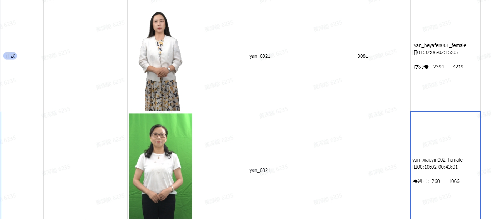

# 服务器

- 查看进程：nvidia-smi

- 服务器
  - ffmpeg -i /data/cyl/1024/yan_heyafen002_female.mp4 -vf "select=not(mod(n\,1))" -vsync 0 /data/cyl/SplitImg/%05d.png

- ffmpeg -i G:\DownLoad\lingxi_female_008_自录美颜1\lingxi_female_008_自录美颜1.mp4 -vf "select=not(mod(n\,1))" -vsync 0 G:\Video_Dispose\lingxi_female_008\%05d.png

- ffmpeg -i G:\Video_Dispose\dianxin_female_002\预处理后-dianxin02.mp4 -vf "select=not(mod(n\,1))" -vsync 0 G:\Video_Dispose\Urgent_Img\%05d.png

## Linux操作

- cd

在Linux或类Unix系统中，cd命令用于更改当前工作目录。两者之间的区别在于路径参数的形式：

cd /dire：这是绝对路径。它将你的当前工作目录更改为根目录的dire目录。无论你当前位于系统中的哪个位置，都会移动到相同的目录。

cd dire：这是相对路径。它会将你的当前工作目录更改为当前目录中的dire目录。它不需要指定完整的路径，因为它已经默认为你在当前目录中。

## 三件事

1. 兴沛 done
2. 对比 需跑mask
3. 整个视频

4. 能哥的两个视频处理 running
   1. 
   2. 第二个视频很难处理, 处理下面横线的时候很容易一整人不见
      1. 慢慢找
   3. 第三个 G:\DownLoad\lingxi_female_008_自录美颜1

兴沛图片

res_lower:  55,40,35
res_upper:  85,255,255

--img_dir
G:\DownLoad\full
--out_dir
./outs
--color
g
--multi_process
0
--upper
67,243,206
--lower
60,170,109

lower: [ 60 170 109]
upper: [ 67 243 206]

python main.py --img_dir /data/log/full --out_dir /data/log/full_Dispose --color g --multi_process 0 --upper 67,243,206 --lower 60,170,109

---

- 能哥

--img_dir
G:\Video_Dispose\SplitImg_002_female
--out_dir
./outs
--color
g
--multi_process
0
--upper
64,169,255
--lower
41,30,60

lower: [41 30 60]
upper: [ 64 169 255]

- python main.py --img_dir /data/log/SplitImg_001_female --out_dir /data/log/Neng_Dispose1 --color g --multi_process 0 --upper 63,198,168 --lower 44,39,58

- 能哥2
  - python main.py --img_dir /data/log/SplitImg_002_female --out_dir /data/log/Neng_Dispose2 --color g --multi_process 0 --upper 70,219,255 --lower 41,47,63

lower: [41 47 63]
upper: [ 70 219 255]

---

- 对比

--img_dir
G:\Video_Dispose\Urgent_Img
--out_dir
./outs
--color
g
--multi_process
0
--upper
69,255,181
--lower
55,74,85

lower: [55 74 85]
upper: [ 69 255 181]

--img_dir
G:\Video_Dispose\Urgent_Img
--out_dir
./outs
--color
g
--multi_process
0
--upper
69,255,181
--lower
55,74,85

---

- 能哥1027

--img_dir
G:\Video_Dispose\lingxi_female_008
--out_dir
./outs
--color
g
--multi_process
0
--upper
88,219,201
--lower
4,7,69

lower: [ 4  7 69]
upper: [ 88 219 201]

- python main.py --img_dir /data/log/lingxi_female_008 --out_dir /data/log/Neng_1027 --color g --multi_process 5 --upper 88,219,201 --lower 4,7,69
