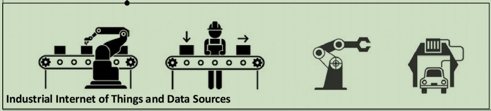
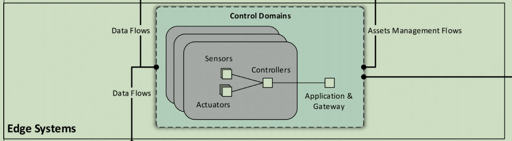
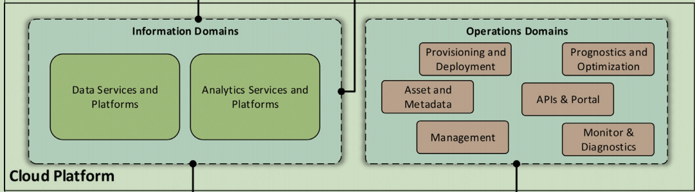
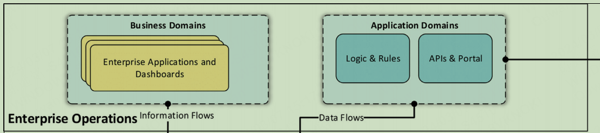
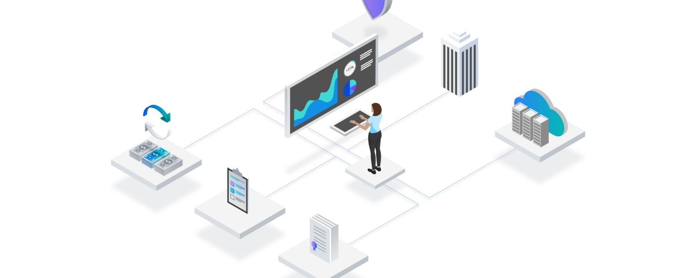
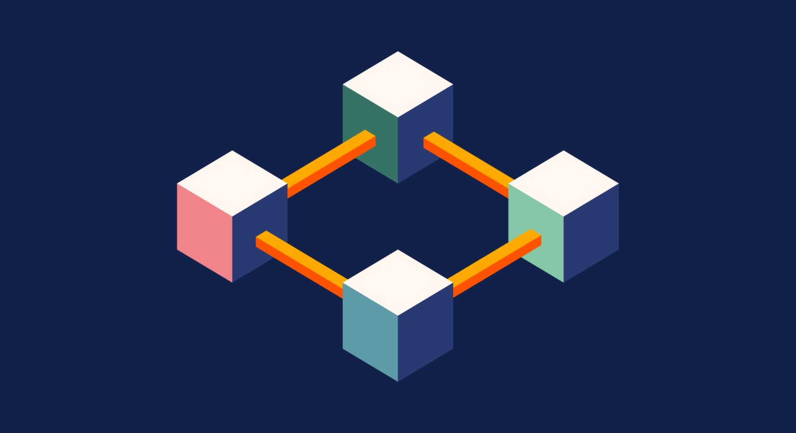
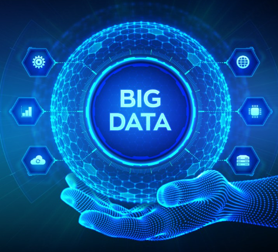
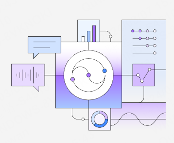
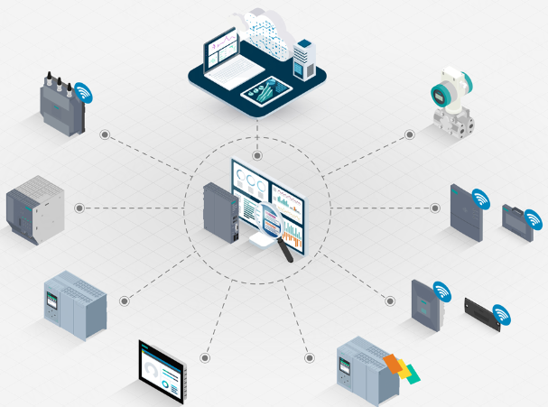
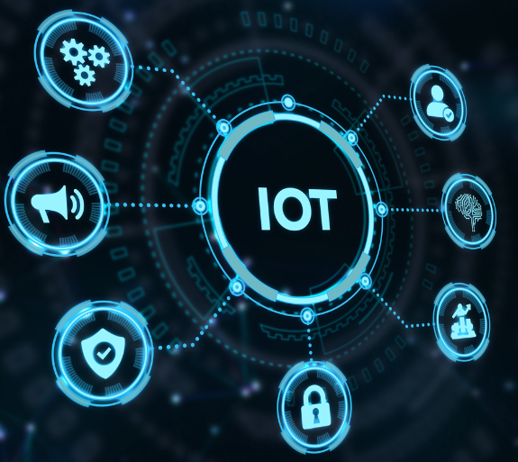

# industrial IoT

- [industrial IoT](#industrial-iot)
  - [why IIOT](#why-iiot)
  - [Definition of IIot](#definition-of-iiot)
  - [IIoT architectures and frameworks](#iiot-architectures-and-frameworks)
  - [Enabling technologies for IIoT](#enabling-technologies-for-iiot)
  - [Challenges](#challenges)
  - [conclusion](#conclusion)

## why IIOT

- Khan W Z, Rehman M H, Zangoti H M, et al. Industrial internet of things: Recent advances, enabling technologies and open challenges[J]. Computers & electrical engineering, 2020, 81: 106522.

- The development of wireless technologies during the past decades `has led to a novel paradigm called the Internet of Things termed as IoT`. it is believed to have a significant impact in the industry by achieving more efficient, optimized monitoring and controlling with reduce cost.
- IoT is expected to bring innovations and benefits to the industry leading to the concept of IIoT.

## Definition of IIot

- Industrial IoT (IIoT) is the network of `intelligent and highly connected industrial components` that are deployed to achieve high production rate with reduced operational costs through real-time monitoring, efficient management and controlling of industrial processes, assets and operational time.

## IIoT architectures and frameworks

1. Layer1:
   1. Industrial Internet of Things and Data Sources
2. Layer2:
   1. Edge Systems
3. Layer3:
   1. Cloud Platform Edge Systems
4. Layer4:
   1. Enterprise Operations

- Layer1
  - This layer is where IIoT devices and industrial data sources are located. They generate continuous streams of data
- Layer2
  - These can include sensors, actuators, and other devices that collect data directly from industrial operations.
- Layer3
  - These systems provide more powerful data processing capabilities, comprehensive analytics, and storage solutions. They empower IIoT applications by allowing for large-scale data analysis, supporting advanced applications such as machine learning and complex data modeling.
- Layer4
  - enterprise applications utilize the data and analytics provided by the cloud systems to make strategic business decisions, visualize operations, manage resources, and optimize processes.

## Enabling technologies for IIoT

1. Internet of things
2. Blockchain technology
3. Cloud computing
4. Big data analytics
5. Artificial intelligence and cyber physical systems

- Internet of things
  - IoT devices `assist in real-time data collection and actuation`.The whole process which is starting from raw material and ends with finish products is monitored using IoT devices
- Blockchain technology
  - sharing the important data with all entities involved in the IIoT system in a secure manner is a very challenging task. `The unique characteristics of blockchain technology like traceability, survivability, trust, tamper resistance and security make it suitable` for IIoT.
- Cloud computing
  - The massive growth of data in IIoT `requires highly distributed high performance computing systems` in order to manage, process, analyze, and store the data. Cloud computing technologies `provide compute, network, and storage services` across all the facilities in an IIoT system
- Big data analytics
  - The devices and systems in IIoT generate massive amount of data streams, resulting the requirement of highly sophisticated high performance computing systems. The data management and processing technologies enable to handle big data near the sensors, in edge servers, and in cloud data centers
- Artificial intelligence
  - n, the intelligence is embedded at `layers in IIoT systems from sensors to devices to edge servers and cloud data centers` by enabling different search, optimization, and prediction algorithms. In order to minimize the human efforts and interventions

## Challenges

1. Efficient Data Management Schemes
2. Collaborations between Heterogeneous IIoT Systems
3. Coexistence of Wireless Technologies and Protocols in IIoT

- Efficient Data Management Schemes
  - 
  -  The increase in data volume due to the widespread use of heterogeneous IIoT devices necessitates efficient data management models. 
- Collaborations between Heterogeneous IIoT Systems
  - 
  -  Integrating multi-vendor and heterogeneous technologies within IIoT systems presents challenges in synchronization, resource sharing, and data privacy.
- Coexistence of Wireless Technologies and Protocols in IIoT
  - 
  - The transition to wireless communication in IIoT brings challenges in ensuring `compatibility among various technologies and protocols`.

## conclusion

- The Industrial IoT (IIoT) system allows the industry to collect and analyze a large amount of data, that can be used and improve the overall performance of the systems for providing new types of services.