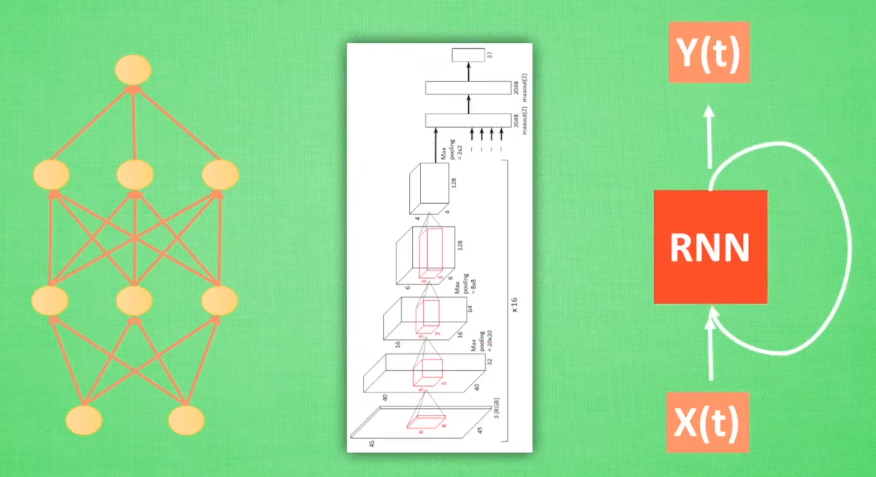
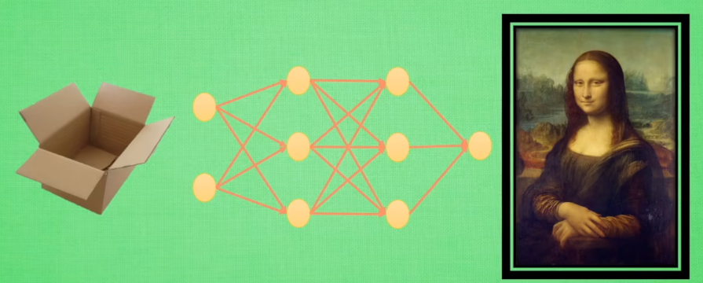
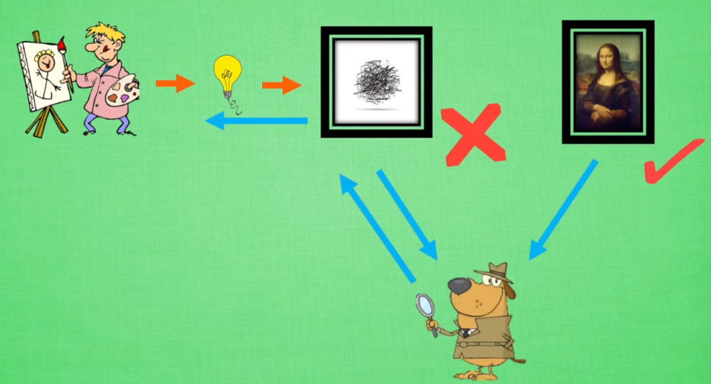
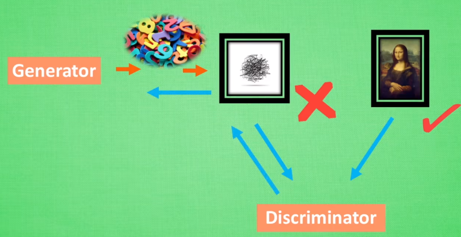
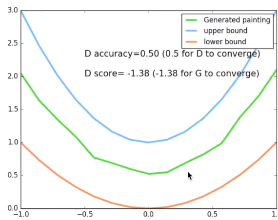
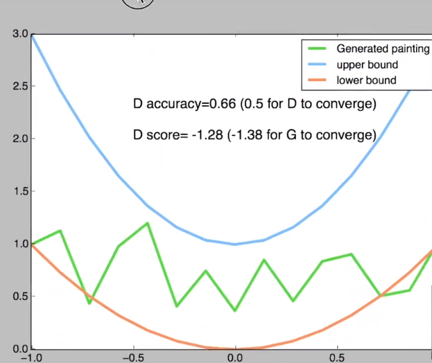
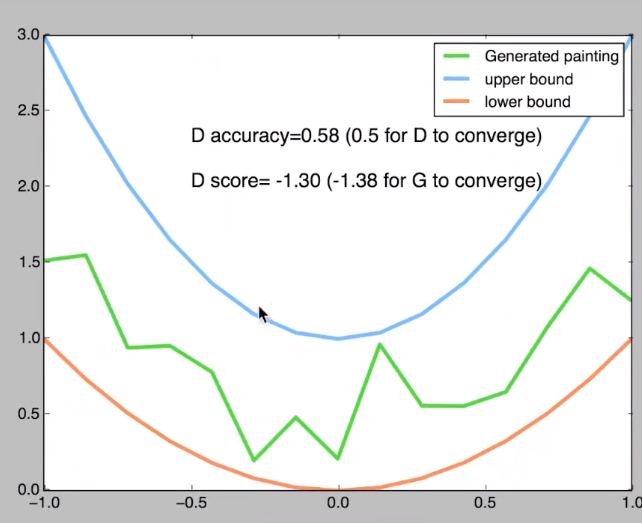
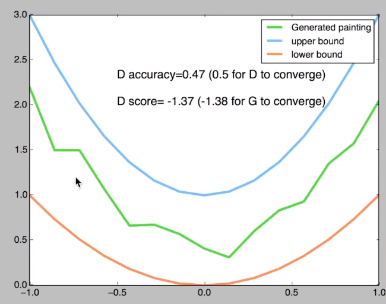
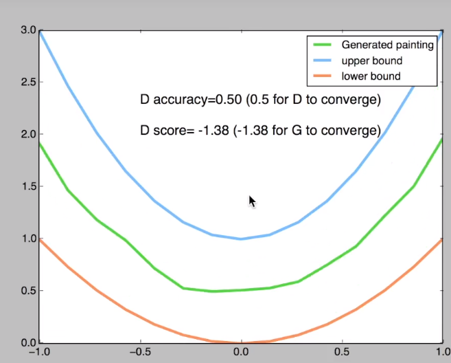
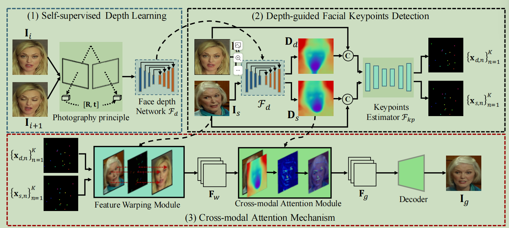

# GAN

## 简介

- What is a generative adversarial network (GAN)?

- A **generative adversarial network (GAN)** is a machine learning (ML) model in which two neural networks **compete with each other** by using deep learning methods to become more accurate in their predictions.
- GANs typically run unsupervised and use a cooperative **zero-sum** game framework to learn, where one person's gain equals another person's loss

## 多种神经网络

- 
- 这些神经网络都是用来输入数据，得到想要的结果，我们看中的是这些神经网络中，很好地将数据与结果通过某种关系联系起来

## GAN网络

- 不是把数据对应上结果，而是凭空捏造结果，这就是我们想要说的生成网络了
- 
- 当然这里的凭空并不是什么都没有的盒子，而是一些随机数。用没有意义的随机数，来生成有意义的作品
- 我们把这个网络称为Generator

## 例子

- 
- Generator可以想象成一个新手画家，它他们依照自己的灵感(随机数)来完成作品。但因为他的作画技术并没有我们想象的好，画出来可能很糟糕，所以需要一个鉴赏家，就是discriminator。它会先被训练，可以输出一个在0~1之间概率，判断作品是著名画家作品的概率。
- 在开始训练时，新手鉴赏家会接收到一些画作，但是他不知道这是新手画家画的，它说出了自己的判断，而我们可以纠正它的判断，新手鉴赏家一边学习如何判断，一边告诉新手画家要怎样作画，新手画家就能学习到如何从自己的灵感，画出更好的数据 

- 
  - generator会根据随机数来生成有意义的数据，discriminator时候会学习如何判断哪些是真实数据，哪些是生成数据，然后将学习到的经验反向传给generator，让generator能够根据随机数生成更像真实数据的数据。
  - 这种数据可以有各种用途，生成景色图片，生成下一帧图片等等

## talk is cheap, show you the code


```py
# 定义一个函数，用来模仿著名艺术家的作品（即真实目标）
def artist_works():
    # 在1到2之间随机选择一个系数a
    a = np.random.uniform(1, 2)
    # 利用二次方程生成画作
    paintings = a * np.power(PAINT_POINTS, 2)
    return paintings
```
- 


```py
# 使用PyTorch定义生成器网络结构
G = nn.Sequential(                      # Generator
    nn.Linear(N_IDEAS, 128),            # 从随机创意中生成128维的数据
    nn.ReLU(),                          # 使用ReLU激活函数
    nn.Linear(128, ART_COMPONENTS),     # 将128维的数据转换成艺术作品的组成部分
)

# 使用PyTorch定义判别器网络结构
D = nn.Sequential(                      # Discriminator
    nn.Linear(ART_COMPONENTS, 128),     # 输入艺术作品的组成部分
    nn.ReLU(),                          # 使用ReLU激活函数
    nn.Linear(128, 1),                  # 将128维的数据转换为一个概率值
    nn.Sigmoid(),                       # 使用Sigmoid激活函数，得出作品是艺术家创作的概率
)

# 训练过程
for step in range(10000):                          # 进行10000步训练
    # 生成64副艺术家作品
    artist_paintings = artist_works()              
    # 生成64副新手画家作品
    G_ideas = torch.randn(BATCH_SIZE, N_IDEAS, requires_grad=True) 
    G_paintings = G(G_ideas)                                       # 使用生成器创建假画作
    # 判断作品是艺术家作品的概率
    prob_artist0 = D(artist_paintings) 
    prob_artist1 = D(G_paintings)
    # 判别器的损失函数
    D_loss = - torch.mean(torch.log(prob_artist0) + torch.log(1. - prob_artist1))  
    # 生成器的损失函数
    G_loss = torch.mean(torch.log(1. - prob_artist1))              
    # 反向传播，step()...            
```

- 
- 
- 
- 

## 论文：Depth-Aware Generative Adversarial Network for Talking Head Video Generation

- Gereration
  - 
