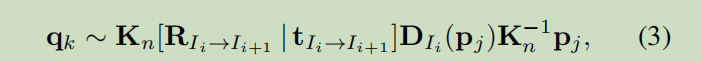
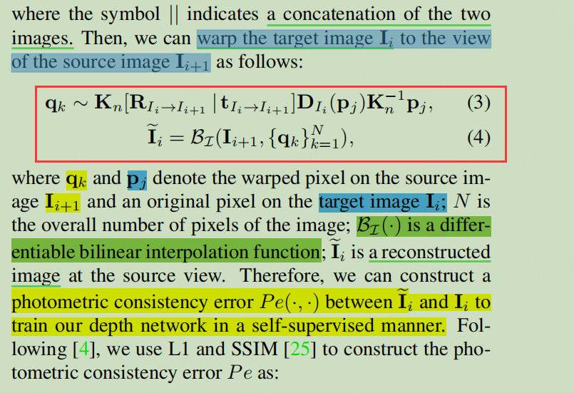

# DaGan

- [DaGan](#dagan)
  - [3.2](#32)
  - [3.4](#34)

## 3.2

- The interpolation function takes as input the next frame in the sequence and a set of N warped pixels to produce an image that approximates the appearance of the source view. This process is part of establishing photometric consistency between frames

- Rotation
  - This refers to the **orientation change of an object** or camera in 3D space
- Translation
  - This refers to the **movement of an object** or camera from one place to another in 3D space
- Image warping
  - is a digital image processing technique that alters/ɒːltərz/ the original shape and/or size of an image. The purpose of warping is to correct distortions introduced by the camera lens or perspective and to transform the image to a desired shape or to align it with another image.
- The formula
  - 
    - generating $q_k$​ is **a standard equation** used in computer vision for **image warping**, particularly in the field of view synthesis and 3D reconstruction.
  - 
    - Bilinear interpolation is necessary because the new pixel positions $q_k​$ will **often not align perfectly** with the grid of pixel positions in the target image. There can be fractional pixel locations, and the interpolation function determines the pixel value for these fractional positions by considering the values of the neighboring pixels. **This process results in a continuous**

## 3.4

- The term "dense"
  - in this context typically refers to the comprehensiveness and richness of the data or information being processed or generated
- kernels
  - In the context of Convolutional Neural Networks (CNNs), "kernels" refer to small, learnable filters
- perform linear projection
  - in the context of the given text refers to a transformation of **the feature maps into a new space** using **linear operations**
  - In neural networks, and particularly in convolutional neural networks (CNNs), a linear projection often means **applying convolutional layers with learnable filters** (kernels) to the input data.
