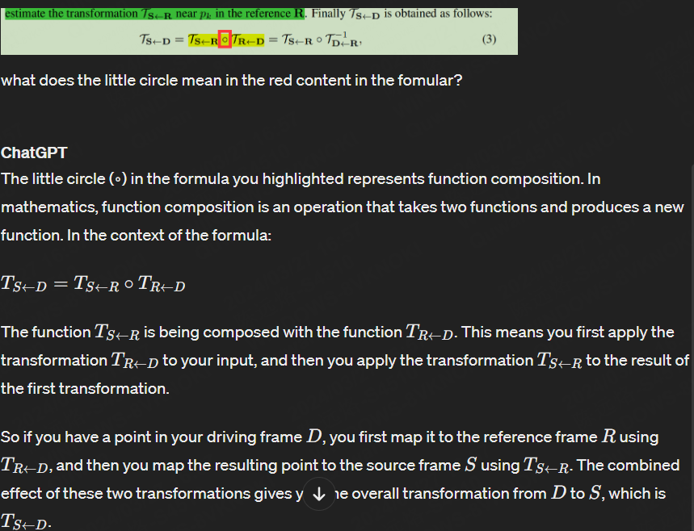

# FOMM

- model occlusion
  - The term "model occlusions" refers to the process of **predicting which areas of an image will be obscured or blocked** from view due to the movement of objects within a scene.
  - By modeling these occlusions, the system can make informed decisions about how to **fill in or 'inpaint' the hidden areas** to maintain a seamless visual experience in the animated image or video.

## 3

- sets of sparse trajectories
  - it means you have multiple trajectories that are each **defined by a series of keypoints tracked over time**
- Keypoint Representation as a Bottleneck
  - This refers to the role of keypoints in **reducing the dimensionality of the data**
  - an encoder-decoder network, the encoder **compresses the input data (in this case, motion information) into a lower-dimensional space**, The bottleneck is the part of the network where this compression happens
- can be moved using the keypoints trajectories
  - This is done by tracking how **keypoints move over time in the driving video** and then applying those same movements to the corresponding keypoints in the source image to create an animated sequence.
- affine transformation
  - is a linear mapping method that preserves points, straight lines, and planes.
  - In the context of image processing, affine transformations include **translation** (moving every point in an object a constant distance in a specified direction), **rotation** (turning the object around a fixed point), scaling (enlarging or shrinking objects), and **shearing** (slanting the shape of an object).

## 3.1

- The backward optical flow
  - Imagine you have a video where a toy car is rolling from left to right across a table.
  - It would analyze the motion by looking at the car's position in a later frame (the driving frame D) and then calculating the motion required to **move it back to its position** in an earlier frame (the source frame S).

## 

- What is a Jacobian?

Formally, the Jacobian matrix of a **vector-valued function** of several variables is the matrix of all first-order partial derivatives of the function. This matrix represents the **best linear approximation** of the function near a given point. In simpler terms, it's a way to capture how a function changes **as you nudge the inputs a little bit, capturing the sensitivity of each output to each input**

### Jacobian Determinant

The determinant of the Jacobian matrix, often simply called the "Jacobian," is particularly useful because it **gives the scaling factor of the transformation described by the function**. When you're transforming coordinates (like from polar to Cartesian coordinates), the Jacobian determinant helps you understand how areas (or volumes) change under this transformation.

- little circle
  - 

### pyramid

"pyramid" refers to a technique often used in image processing and computer vision known as "pyramid representation" or "Gaussian pyramid." It involves **creating a stack of images where each image is a down-sampled version of the previous one**, forming a pyramid-like structure with the original image at the top and progressively smaller images below.