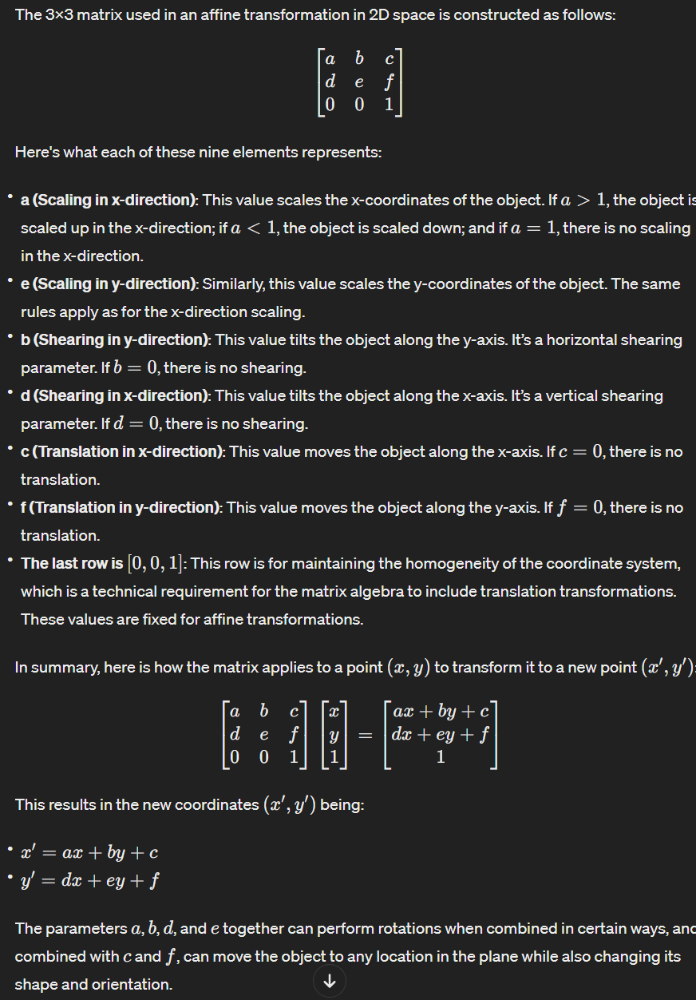
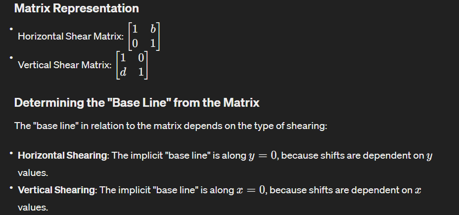
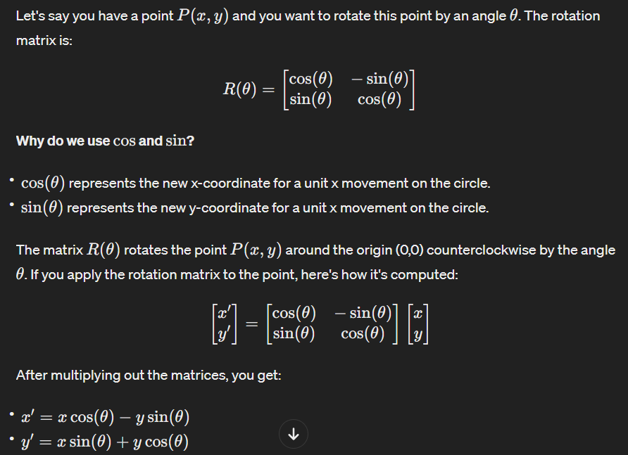

# DINet

## words

- "Affine": in the context of image processing and computer graphics typically refers to a type of transformation that **preserves lines and parallelism** (but not necessarily distances and angles). 

- affine transformation: An affine transformation is any transformation that can be expressed in **the form of matrix multiplication followed by vector addition**.

- coefficients: The coefficients that **define an affine transformation** are known as "affine coefficients."

- maxtrix
  - 

- baseLine
  - 

## question

1. 