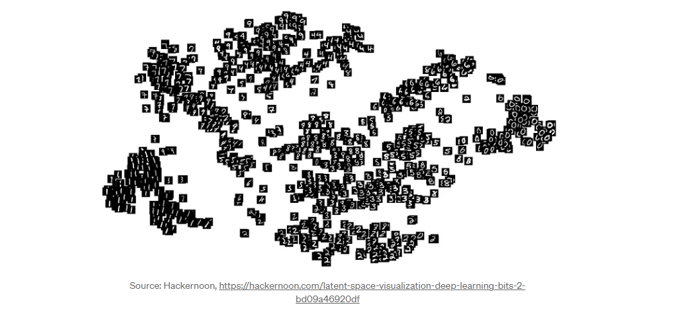

# 印度survey

- <image style="height:80px; background-color:#CDDEC2" src="images/image-2.png"/>

- rule-based techniques
  - 通过事先定义的规则集合来进行问题求解、决策或处理数据
  - 例子
    1.  **规则1：** 如果汽车无法启动，检查电池是否充电。
        
        *   条件：发动机无法启动
        *   结果：检查电池充电状态
    2.  **规则2：** 如果发动机发出嘎吱声，检查发动机皮带是否松动。
        
        *   条件：发动机发出嘎吱声
        *   结果：检查发动机皮带是否紧固
    3.  **规则3：** 如果汽车排气管冒黑烟，检查燃油供应系统。
        
        *   条件：排气管冒黑烟
        *   结果：检查燃油供应系统
    4.  **规则4：** 如果刹车时发出尖锐的声音，检查刹车盘是否磨损。
        
        *   条件：刹车时发出尖锐声音
        *   结果：检查刹车盘是否磨损

- monocular
  - "monocular" 指的是使用单个摄像头（单个视点）进行观察或采集数据。在计算机视觉和图像处理领域，我们将从单个摄像头（或单个相机）获得的数据称为 "monocular" 数据。

    相对于 "monocular"，还有 "stereo" 和 "multiview" 等术语：

    *   **Stereo：** 使用两个摄像头（或相机）采集的数据。通过比较这两个视点之间的差异，可以获得深度信息。
    *   **Multiview：** 使用多个摄像头（或相机）采集的数据。这可以提供更多的角度和信息，有助于更全面地理解场景或对象。

- "潜在空间"（Latent Space）

  - 是指由模型学到的数据的低维表示。在机器学习中，特别是在生成模型中，模型通过学习输入数据的潜在结构，将**高维的输入映射到一个更低维的空间**，这个更低维的空间即为潜在空间。
  - "latent code" 用于表示潜在空间中的点，这些点对应于模型学到的抽象特征。
  - 