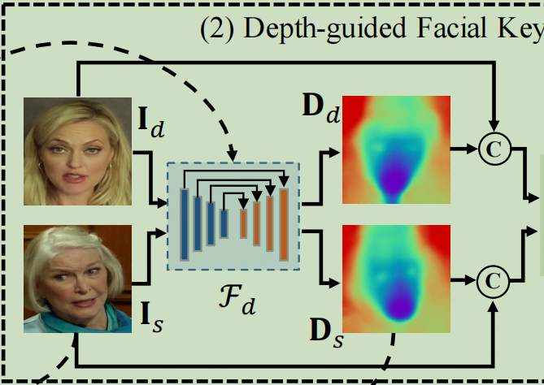
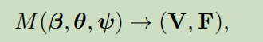

# EaGAN: Emotion-aware Generative Adversarial Network for Talking Head Video Generation

- 名词解释
  - 自学习关键点：预测15个重要的面部关键点，并根据生成图像的质量调整关键点的位置

## Abstrate

- 2D数字人图像生成算法在较为夸张表时，表现差
  - 现有 **深度+图片信息** 关键点自学习检测算法不能处理夸张表情
    - DaGAN的深度信息不够准确
      - 

- 解决办法
  - EMOCA的3D重建技术，要面对夸张表情时，面部关键点表现较好
  - 使用其3D重建而得到的关键点**作为脸部深度信息**
    - 顶点nv=(3,5023)，压缩其到Tensor=(1,1,256,256),融入无监督关键点学习模块

      ```py
      # 压缩代码
      depth_map = torch.zeros((1, 1, 256, 256))
      for i in range(nv_scaled.shape[1]):
          x, y, z = nv_scaled[:, i]
          depth_map[0, 0, y, x] = z / 255.0
      ```

## Introduce

## related work

## Method

- 将3D面部信息，融入 自学习关键点 检测算法
      
  ```py
  # 压缩代码
  depth_map = torch.zeros((1, 1, 256, 256))
  for i in range(nv_scaled.shape[1]):
      x, y, z = nv_scaled[:, i]
      depth_map[0, 0, y, x] = z / 255.0
  ```

- 3D面部信息产生
  - DECA Model
    - 
  - Flame+EMOCA Model
    - 

- 创新点一
  - 使用EMOCA的3D重建技术，获取面部表情的全部关键点，从面部的关键点得到**脸部深度信息**, 融入无监督关键点学习模块
    - 使用脸部深度信息
    - 使用脸部深度信息+图片信息
    - 使用脸部深度信息+DaGAN深度信息+原图片信息
- 创新点二
  - 开发了一个跨模态注意力模块来生成**脸部深度信息感知**注意力图，以引导扭曲的特征Fw用于人脸生成

## experiment

- 评价指标
  - 余弦相似度 CSIM(Cosine Similarity)
    - 余弦相似性通过测量两个向量的夹角的余弦值来度量它们之间的相似性
      - 
      - encoder向量提取
  - 结构相似性指数 SSIM(Structural Similarity Index)
    - 亮度、对比度和结构上的相似度。如果压缩后的图像与原始图像在这些方面非常相似，SSIM值会接近1；如果它们相差很大，SSIM值会接近-1
    - 
  - 峰值信噪比 PSNR(Peak Singal-to-Noise Ratio)
    - PSNR会通过比较原始图像和接收到的图像来评价错误的大小。PSNR值高意味着误差小，图像质量损失较低。
    - 
    - 
  - Never Seen
    - PRMSE is utilized to evaluate the head poses
    - AUCON for expression evaluation
- 指标可以作为一个创新点

## Ablation Study

- w/o 脸部深度信息
- w/o cross-model attention

## conclusion

我们对现有算法DaGAN/FOMM作了改进，我们发现它的深度信息在唇部识别中不足，使用EMOCA模块提供的**3D脸部深度信息**，更好指导了脸部图像生成，并达到了sota效果