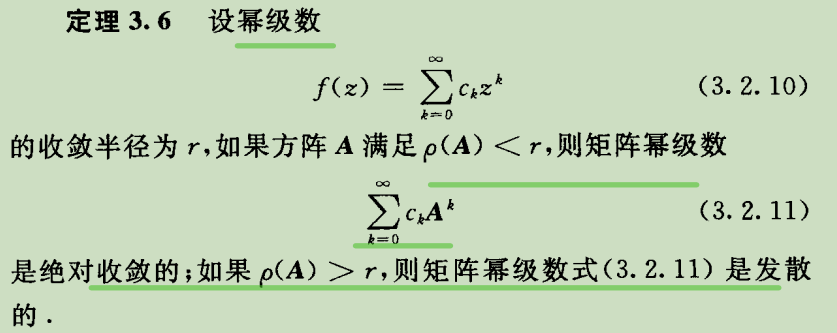
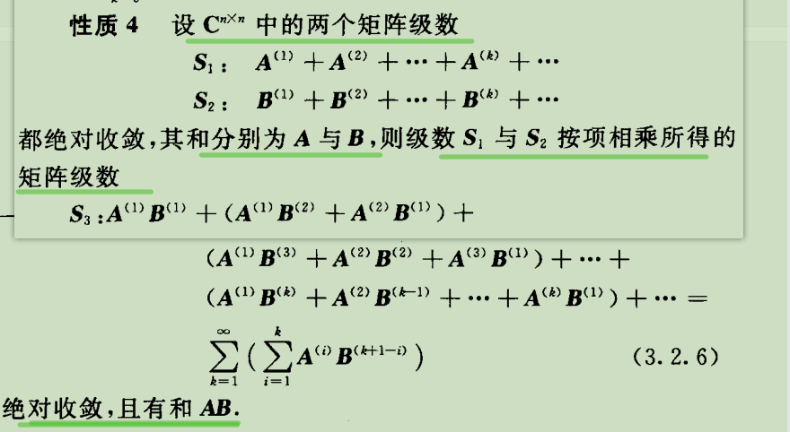
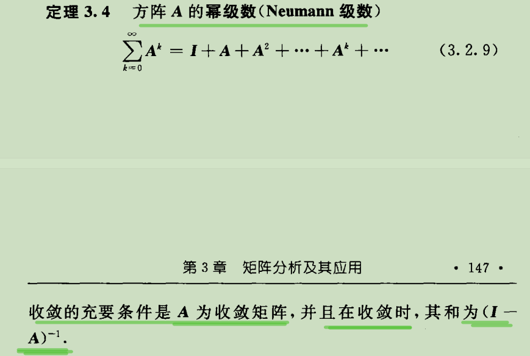

# 一、矩阵函数的定义与性质

定义 3.7 设一元函数$f(z)$能够展开为$z$的幂级数

$$f(z)=\sum_{k=0}^{\infty} c_kz^k(|z|<r)$$

其中，r>0 表示该幂级数的收敛半径·

- 幂级数
  - 幂级数是一种无限级数，其中每一项都是自变量的幂次函数。
  - 幂级数通常用于表示复杂的函数，通过将它们分解成**无限多个幂次项来近似这些函数**。

- 收敛半径R
  - 通过某个公式计算
  - 它确定了幂级数在哪些值的范围内可以收敛（即在这些值处级数的和是有限的）
  - 在复数序列或幂级数中，收敛半径是用来描述序列或级数收敛性的一个概念。对于复数序列或幂级数 $\sum_{n=0}^\infty a_n z^n$，其收敛半径 $R$ 是一个非负实数，满足以下性质：

    当 $|z| < R$ 时，级数绝对收敛。

    当 $|z| > R$ 时，级数发散。

    当 $|z| = R$ 时，级数可能收敛也可能发散。

当$n$阶矩阵$A$的谱径$\rho(A)<r$时，把收敛的矩阵幂级数$\sum_{k=0}^{\infty} c_kA^k$的和称为矩阵函数，记为
为$f(A)$,即

$f(A)=\sum_{k=0}^{\infty} c_kA^k$

- 什么是矩阵的谱径
  - 矩阵的谱径是指矩阵的所有特征值的绝对值的最大值。对于一个$n$阶矩阵$A$，其谱径可以表示为：

    $$\rho(A) = \max_{1 \leq i \leq n}|\lambda_i|$$

- 定理3.6
  - 

函数$e^z = 1 +\frac{z}{1!}+\frac{z^2}{2!}+...$ 在整个复平面上都是收敛的

- 什么是复平面？举例并解释
  - 复平面是指由复数构成的平面。在复平面上，每个点都可以用一个复数表示，该复数由实数部分和虚数部分组成，可以写成 $z=a+bi$ 的形式，其中 $a$ 和 $b$ 是实数。
  - 例如，点 $(2,3)$ 表示的复数就是 $2+3i$。这种表示法使得我们可以在平面上直观地理解复数之间的关系和运算。

- $A = \begin{matrix}
    1 & 1 \\
    0 & 0
\end{matrix}$

    $e^A = I + (e-1)A = \begin{matrix}
        e & e-1 \\
        0 & 1
    \end{matrix}$

    为什么$e^A = I + (e-1)A$

    这个等式是指数函数的矩阵形式展开的结果。在矩阵表达式中，$I$ 表示一个单位矩阵，$A$ 是一个给定的矩阵。

    要理解为什么 $e^A = I + (e-1)A$ 成立，我们需要使用泰勒展开和矩阵幂的定义。

    根据泰勒展开公式，我们有 $e^x = 1 + x + \frac{x^2}{2!} + \frac{x^3}{3!} + ...$。将 $x$ 替换为矩阵 $A$，我们得到

    $e^A = I + A + \frac{A^2}{2!} + \frac{A^3}{3!} + ...$

    在继续展开之前，观察到 $A^2 = A$。

    因此，我们可以将上式简化为：

    $e^A = I + A + \frac{A^2}{2!} + \frac{A^3}{3!} + ... = I + A + \frac{A}{2!} + \frac{A}{3!} + ...$

    $e^A = I + (e-1) A$

    因此，$e^A = I + (e-1) A$ 成立。

- 因此，我们得到 $e=1+1+\frac{1^2}{2!}+\frac{1^3}{3!}+...$。

- 3.2 性质4
  - 

- 如果$AB=BA$，则$e^Ae^B= e^{A+B}$,有$(e^A)^{-1}=e^{-A}$

- 定理 3.4

## 讲课

- The Dragon Boat Festival/ˈfestɪvl/ is-a significant symbol of Chinese/ˌtʃaɪˈniːz/ culture. Each year during this festival, people gather by rivers/ˈrɪvərz/ and lakes/leɪks/ to witness/ˈwɪtnəs/ exciting dragon boat races/ˈreɪsɪz/. This sport has its roots-in ancient China.
- Dragon boats are long wooden vessels/ˈvɛsəlz/ with intricate/ˈɪntrɪkət/ dragon features, symbolizing/ˈsɪmbəlaɪzɪŋ/ good fortune/ˈfɔːtʃən/. A skilled/skɪld/ rowing/roʊɪŋ/ team powers each boat, requiring seamless/ˈsiːmləs/ coordination/kəʊˌɔːdəˈneɪʃən/ for balance and speed. In these races, dragon boats are fiercely/'fɪə(r)sli/ compete/kəmˈpiːt/
- The festival is also famous for ZongZi, delicious rice wrapped/ræpt/-in leaves, symbolizing wishes/ˈwɪʃɪz/ and hopes-of people.
