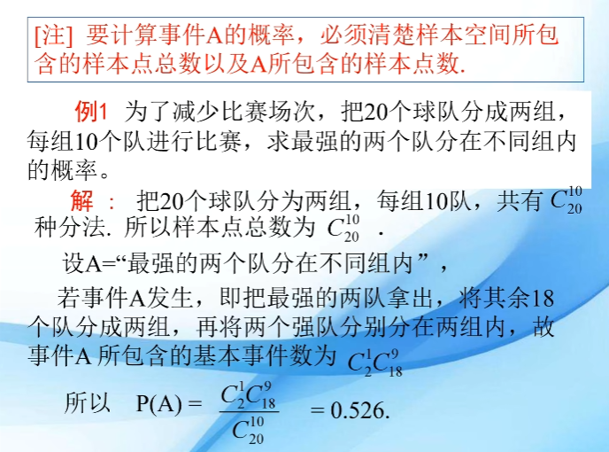
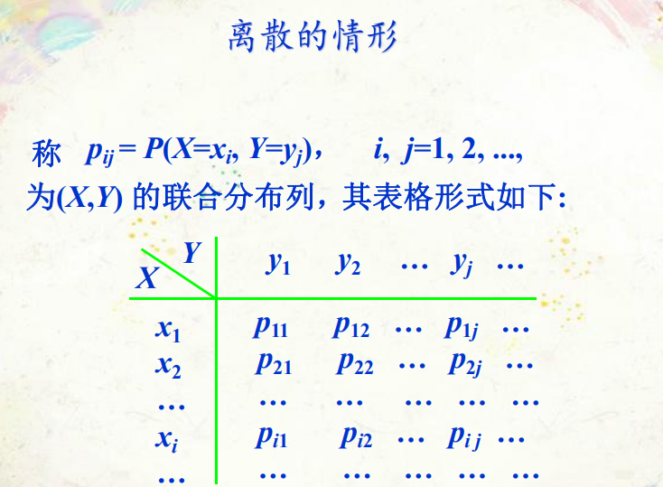
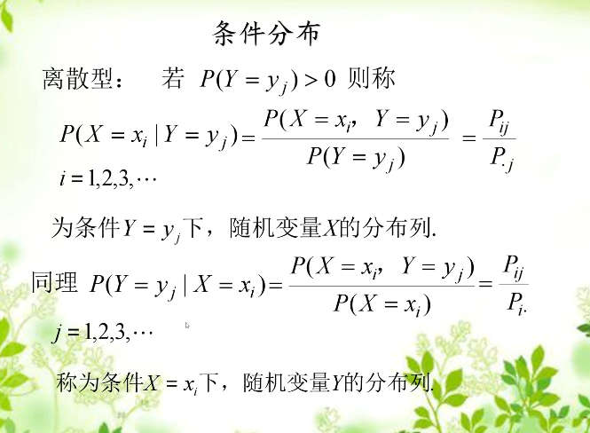
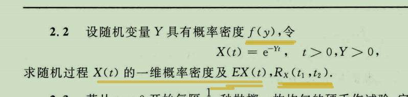
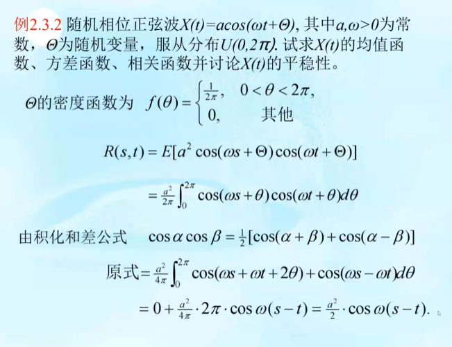
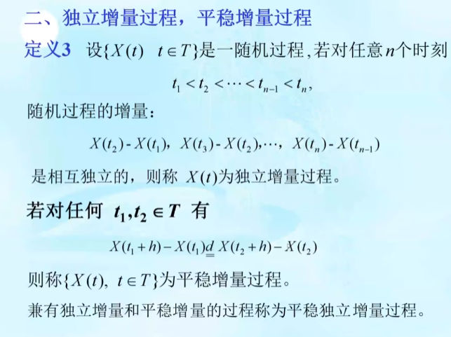
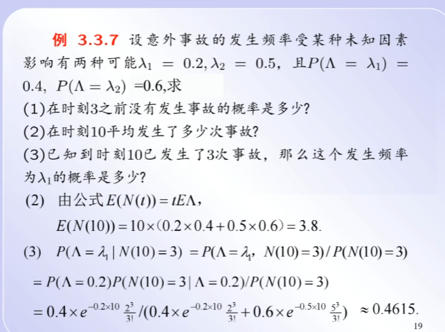
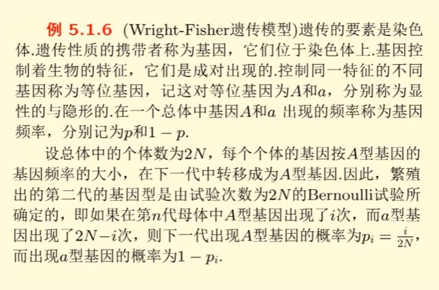
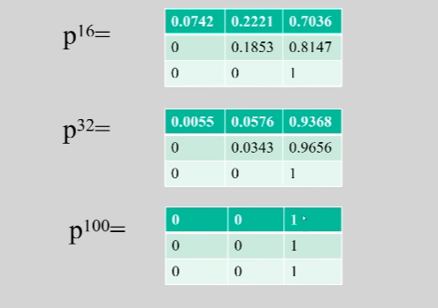
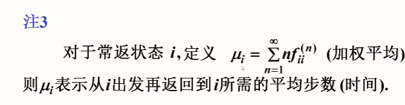

# b课

- [b课](#b课)
  - [预备知识](#预备知识)
    - [分布](#分布)
    - [边缘分布和条件分布](#边缘分布和条件分布)
  - [第2章 随机过程的基本概念和基本类型](#第2章-随机过程的基本概念和基本类型)
    - [随机过程的数字特征的计算](#随机过程的数字特征的计算)
    - [作业](#作业)
  - [第3章 泊松](#第3章-泊松)
    - [Poission过程](#poission过程)
    - [3.2 Poisson过程相联系的若干分布](#32-poisson过程相联系的若干分布)
    - [事情发生时刻的条件分布](#事情发生时刻的条件分布)
    - [3.3 Poisson过程的推广](#33-poisson过程的推广)
  - [Markov](#markov)
  - [C-K](#c-k)
  - [状态的分类及性质](#状态的分类及性质)
    - [5.3 极限定理](#53-极限定理)
    - [平稳分布](#平稳分布)

## 预备知识

- 事件的表示和运算
  - 
- 
  - 

- 古典
  - 
  - 
- 几何
  - 
  - 
  - 
- 不同定义
  - 

- 事件域
  - 
- 概率
  - 
  - 
- 概率的基本性质
  - 

### 分布

- 随机变量
  - 
  - 
  - 
- 随机变量的类型
  - $V(x)= E(X^2)-\mu^2$
  - $V(x)= E[(X-\mu)^2]$
  - 
  - 离散型
    - 两点分布
      - 
    - 二项分布
      - 
      - 
    - Poisson
      - 
      - 
  - 连续型
    - 均匀分布
      - 
      - 
    - 正态分布
      - 
      - 
      - 
      - 
      - 
    - 指数分布
      - 
      - 
    - 帕累托分布
      - 
      - 

### 边缘分布和条件分布

- 多维随机变量
  - 
  - 
  - 
- 边缘分布
  - 
  - 
  - 离散的情形
    - 
    - 
    - 
  - 连续的情形
    - 
- 条件分布
  - 
  - 
  - 条件数学期望
    - 
    - 
    - 重期望公式
      - 随机变量的函数,也是随机变量
      - 
      - 
      - 例子
        - 
        - 

## 第2章 随机过程的基本概念和基本类型

- 定义
  - 
  - 例子
  - 
- 
- 状态空间
  - 对于扔硬币，即0和1
  - 

- 随机过程举例
  - 
  - 
  - 

### 随机过程的数字特征的计算

- 随机过程的数字特征的计算
  - 
  - 例子
    - 和的方差等于方差的和，独立时成立
      - 
    - 乘积的期望都就等于期望的乘积，独立时成立
      - 

### 作业

- 一维概率密度⭐
  - 
- 
- 

## 第3章 泊松

- 平稳过程
  - 
  - 宽平稳
    - 
    - ⭐均值/方差存在$\to$二阶矩过程
    - 例子1
      - 相互独立的随机变量, 乘积的期望等于期望的乘积
      - 
    - 例子2
      - 求函数时，把时间参数当作常数
      - 
      - 
      - 
- 独立增量过程,平稳增量过程
  - 
  - 

### Poission过程

- 计数过程
  - 
  - 
- Poission过程
  - 
  - 例子3.1.1
    - 
  - 例子3.1.2
    - 
- 定义3.2'
  - 

### 3.2 Poisson过程相联系的若干分布

- poisson
  - 
- 指数函数
  - 
  - 无记忆性
    - 

- Poisson过程相联系的若干分布
  - 
  - 
  - 
- 第三個定义
  - 
  - 
  - 例题
    - 

### 事情发生时刻的条件分布

- 
- 顺序统计量
  - 
- 定理3.4
  - 
  - 
  - 例子3.7
    - 
    - 

### 3.3 Poisson过程的推广

- 非齐次Poisson过程（$\lambda$变化
  - 
  - 
- 定义3.3.1
  - 
  - 
  - 
- 复合Poisson过程（增加个数
  - 
  - 例3.3.2
    - 
  - 例3.3.3
    - 
- 定理3.3.2
  - 
  - 例子1
    - 
  - 例子2
    - 
    - 
    - 
- 3.3.3 条件Poisson过程（$\lambda$是
  - 
  - 
  - 定理3.3.3
    - 
  - example
    - 
    - 

## Markov

- 定义  
  - 
- 定义5.1.1
  - 
- 定义5.1.2
  - 
- 转移概率矩阵
  - 
  - 
- 例子5.1.1
  - 
- 例子2
  - 
- 例子3
  - 
- 例子4
  - 
- 例子5
  - 
- 例子6
  - 
  - 
- 定义5.1.5
  - 
- 例子7
  - 
  - 
  - 

## C-K

- C-K
  - 
  - 
- 例子1
  - 
  - 
- 例子2
  - 
  - 
- 例子3
  - 
  - 
  - 

## 状态的分类及性质

- 
- n步转移矩阵
  - 
  - 
  - 
- 定义5.2.1
  - 
  - 
- 定义5.2.2
  - 
- 例子5.2.1
  - 
- 定义5.2.3（周期性
  - 
- 例子5.2.2
  - 
  - 定理
    - 
- 常返性
  - 
  - 注：
    - 
- 
- 例子5.2.3
  - 
  - 
  - 
  - 
- 定理5.2.4
  - 

### 5.3 极限定理

- 
- 例子
  - 
  - 
- 定理5.3.1
  - 
- 定理5.3.2
  - 
- 推论5.3.3
  - 不可约的马尔可夫所有状态都一致
  - 
    - 
- 例子
  - 

### 平稳分布

- 
- 
- 定义5.3.2
  - 
- 定理5.3.3
  - 
- 例子
  - 遍历的markov
    - 状态有限
    - 全部相通
    - 周期为1
  - 
