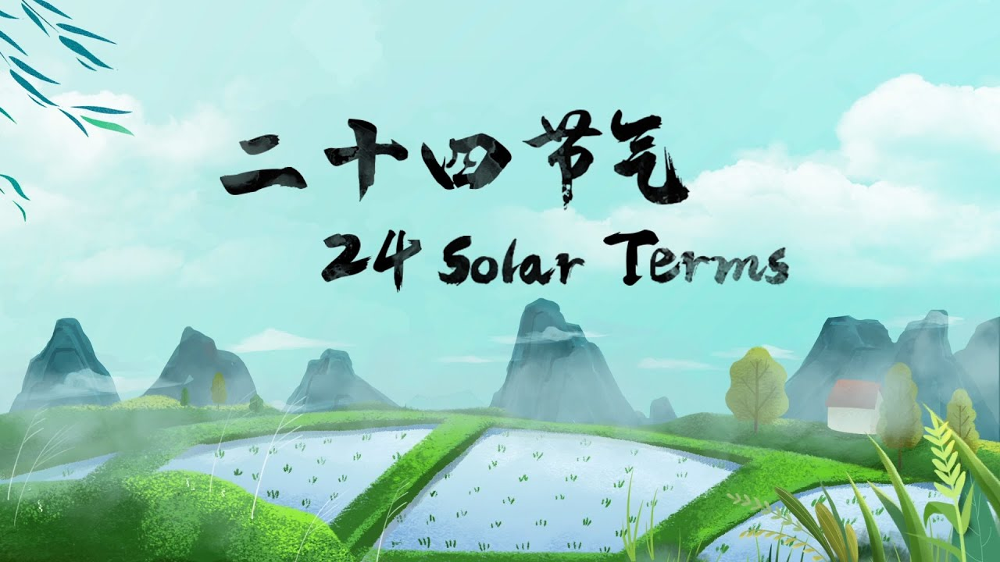
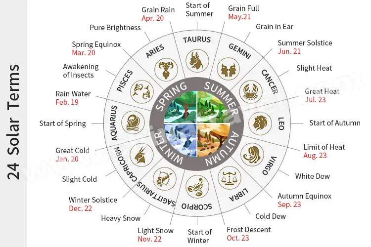
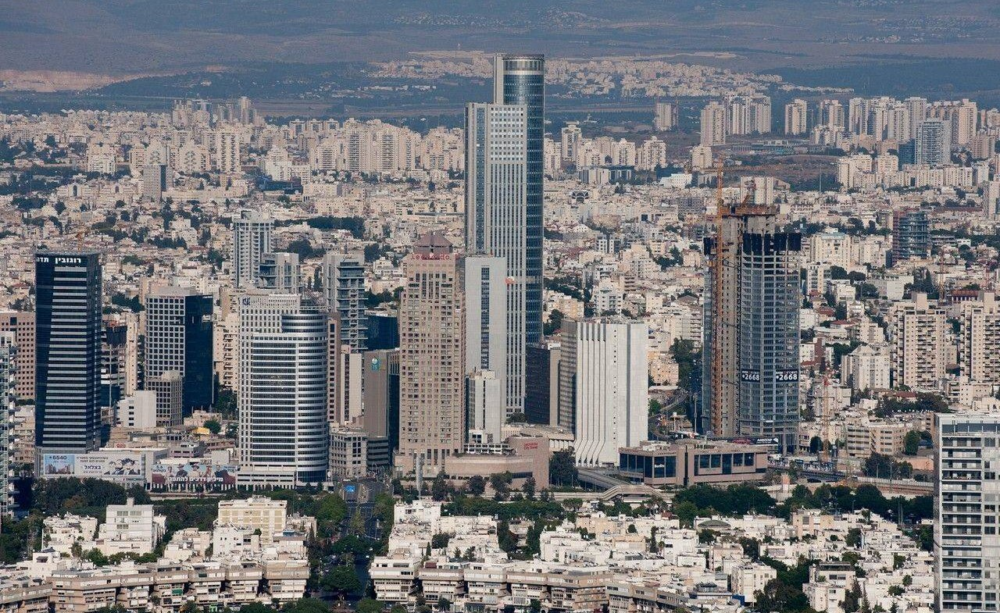
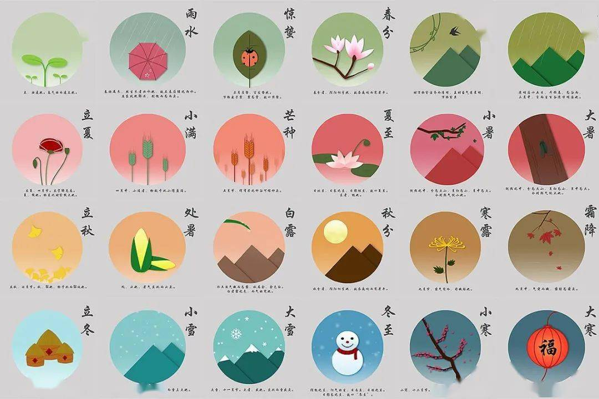

# ppt

- Why is it important to protect (Twenty-four) solar terms?
- Analyze the problem: What are the possible challenges to (Twenty-four) solar terms's survival?
- Provide a solution: What can we do to make it survive? How to draw publicattention and involve them in cultural heritage protection? ls it possibleto revive traditional culture in the new era with the aid of innovative technologies? How can we do it?
- Conclusion:Summarize your proposal

根据上面的内容和下面的要求，帮我生成一个演讲稿，大概150-200words;

## 1 what is 24 solar terms

The “24 solar terms” form an integral part of the Chinese calendar. It is a time knowledge system  built upon the long-term observation of periodic movement of the Sun,

- 

## 2 Why is it important to protect (Twenty-four) solar terms?

(Twenty-four) solar terms represent a profound aspect of our cultural heritage, serving as a celestial calendar deeply rooted in the agricultural traditions of China. Preserving (Twenty-four) solar terms is essential to safeguarding the rich tapestry of our cultural identity.

二十四节气代表着我们文化遗产的深刻部分，是植根于中国农业传统的一种天文历法。保护二十四节气对于维护我们丰富文化认同的多彩图景至关重要。

- 

## 3 Challenges to (Twenty-four) solar terms' Survival

However, these invaluable cultural elements face numerous challenges. Rapid urbanization and industrialization have led to a disconnection from agrarian roots, diminishing the significance of these solar terms.

然而，这些宝贵的文化元素面临着诸多挑战。城市化和工业化的迅速发展导致了与农业根源的脱离，减弱了这些节气的重要性。

## 4 What can we do to make solar terms survive?

To ensure the survival of (Twenty-four) solar terms.

Education plays a important role; integrating teachings about these terms into school curricula fosters awareness and understanding.
Engaging the public through cultural events, festivals, and interactive experiences can reignite interest.

为确保二十四节气的生存，需要采取多方面的方法。教育起着至关重要的作用；将有关这些节气的教学融入学校课程，可以培养人们的认知和理解。通过文化活动、节庆和互动体验，吸引公众参与，可以重新激发兴趣。

## conclusion

In conclusion, by actively promoting awareness, integrating education, we can revitalize the appreciation for (Twenty-four) solar terms.This cultural revival not only ensures the survival of a precious heritage but also fosters a sense of pride and connection among present and future generations.

总之，通过积极推动认知、整合教育以及拥抱技术，我们可以振兴对二十四节气的欣赏。这种文化复兴不仅确保了珍贵遗产的生存，还在当今和未来的世代中培养了自豪感和联系感。

## 稿子

**Good morning, everyone.I'm CYL, Today my presentation theme is 24 solar terms.**

**First, let me introduce what is solar terms.**

- The solar terms is-a time knowledge system which built upon the long-term observation of periodic/ˌpɪəriˈɒdɪk/ movement of the Sun.
- **So why solar terms is so important**?
  - Because it represent-a profound aspect of our cultural heritage/ˈherətɪdʒ/.
  - It is also helpful to enhance our cultural identity.
- However, solar terms face a lot of challenges rigth now. Rapid urbanization and industrialization have diminished the significance of solar terms.
- So, how can we make solar terms survive.
  - The most helpful thing I think-is that we can make-a connection between solar terms and student coarses. Let students know the significance of solar terms.
  - The other helpful thing I think is that our govement can promote the propogation of solar terms concepts. For example, My computer wallpaper Become the picture on the right. That is why I choose this theme.
- In conclusion,solar terms is important. And linking solar terms to student courses, promoting the propogation of solar terms  is helpful for preserving cultural heritage in urbanization and industrialization process.

That is all my presentation. Thank-u
